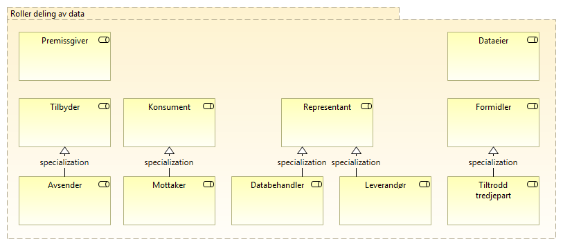

:lang: no
:doctitle: Rollekart for området Datadeling
:keywords: eMelding
:toclevels: 3
include::../plattform_felles/includes/commonincludes.adoc[]

image:../plattform_felles/media/i-arbeid.png[width=45, height=45] _I arbeid (høst 2019)_

Her identifiseres roller som er relevante for temaområdet Datadeling. 

Spesialisering av generelle roller er gjort for å gi mer presise,kontekstspesifikke definisjoner. Eksempel: _Avsender_ er en _datatilbyder_ som sender meldinger. 

Rollene er definert med utgangspunkt i følgende standarder og andre, eksterne kilder:

* EIRA
* The Open Group SOA RA
* OASIS SOA RAF
* Begreper fra Datatilsynet

.Figur: Roller innen området Datadeling

// erik 26/6-19: Det bør vel hete Datatilbyder og Datakonsument (som spesialisering av Tilbyder og Konsument)?  