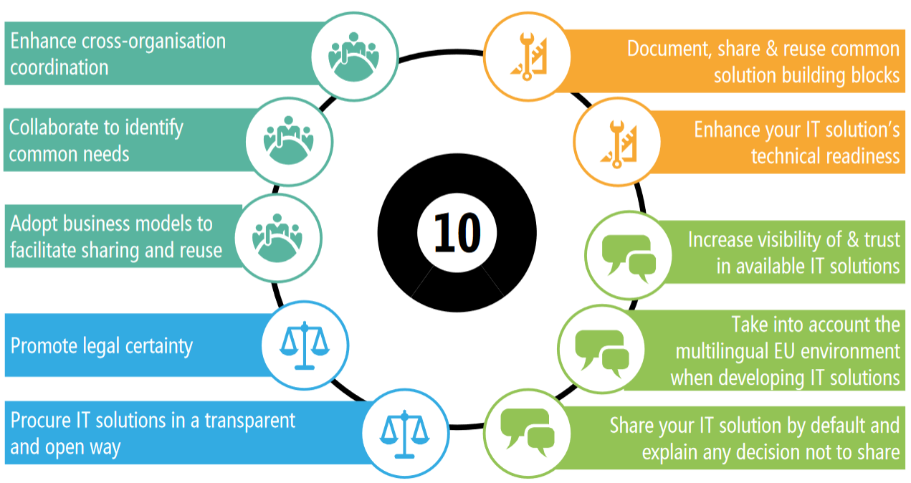
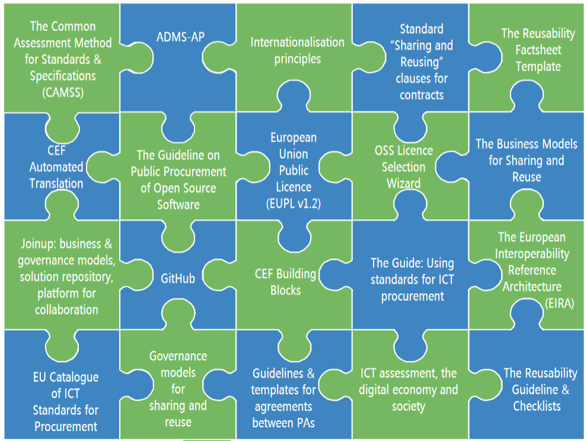

:lang: no
:doctitle: The Sharing and Reuse Framework for IT Solutions (SRF) fra EU/ISA²

include::../plattform_felles/includes/commonincludes.adoc[]

[.lead]
_The Sharing and Reuse Framework for IT Solutions for IT Solutions_ (SRF) gir veiledning og verktøy for å få til gjenbruk av IT-løsninger i offentlig sektor

image::../kunnskap_aktør_eu_sharing-and-reuse-framework/media/srf-icon.png[width=500]

////
////

== Generelt
Under link:https://ec.europa.eu/isa2/actions/promoting-sharing-and-reuse-interoperability-solutions_en[hjemmesiden for Promoting sharing and reuse of IT solutions] finnes generell informasjon og  lenker til mer informasjon. Her gjengis de viktigte lenkene.

Hoveddokument: 

* link:https://joinup.ec.europa.eu/sites/default/files/sharing_and_reuse_of_it_solutions_framework_final.pdf[Sharing and Reuse Framework for IT solutions]

Sharing & Reuse Knowledge Sharing Modules:

* link:https://joinup.ec.europa.eu/sites/default/files/ckeditor_files/files/D03_02%20Generic%20Knowledge%20Sharing%20Module%20v0_21.pdf[Generic Module]
* link:https://joinup.ec.europa.eu/sites/default/files/ckeditor_files/files/D03_02%20Policymakers%20Knowledge%20Sharing%20Module%20v0_21.pdf[Specific Module for Policy Makers]
* link:https://joinup.ec.europa.eu/sites/default/files/ckeditor_files/files/D03_02%20IT%20Managers%20Knowledge%20Sharing%20Module%20v0_21.pdf[Specific Module for IT Managers]

== 10 generiske anbefalinger
Dokumentet link:https://joinup.ec.europa.eu/sites/default/files/sharing_and_reuse_of_it_solutions_framework_final.pdf[Sharing and Reuse Framework for IT solutions]  beskriver følgende 10 hovedgrupper av anbefalinger:

////
. Enhance cross-organisation coordination
. Collaborate to identify common needs
. Adopt business models that facilitate sharing and reuse
. Promote legal certainty
. Procure IT solutions in a transparent and open way
. Document, share and reuse common solutions building blocks
. Enhance your IT solutions’s technical readiness
. Increase visibility of and trust in available IT solutions
. Take into account the multilingual EU environment when developing IT solutions
. Share your solution by default and explain any decision not to share.
////

== 20 supporting instruments
Følgende figur finnes på side 16 i https://joinup.ec.europa.eu/sites/default/files/inline-files/D03_02%20Generic%20Knowledge%20Sharing%20Module%20v0_21.pdf, og gir klikkbare lenker fra hver puslespillbrikke til mer informasjon.

image:../plattform_felles/media/i-arbeid.png[width=75, height=75] Uferdig innhold
