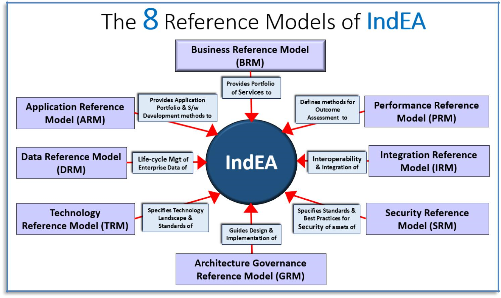

= The 8 Reference Models of IndEA 
IndEa har flere (8) ulike perspektiver og tilhørende referansemodeller. For hver slik referansemodell finnes en taksonomi, samt diverse annen informasjon. 

Legg merke til at interoperabilitet og integrasjon inngår som ett av flere perspektiver i det totale rammeverket. Dette kan sies å tilsvare European Interoperability Framework (EIF) som perspektiv inn i f.eks. TOGAF som et overordnet rammeverk.

