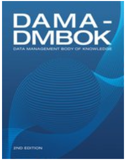

:lang: no
:doctitle: Data Management Book of Knowledge (DMBOK2)
:keywords: Informasjonsforvaltning, Dataforvaltning

include::../nab_felles/includes/commonincludes.adoc[]

[.lead]
Data Management Body of Knowledge (2nd Edition) fra DAMA er et omfattende verk om data- og informasjonsforvaltning, Utgitt 2017-07-10.

 

== Hvordan få fatt i denne boken?

DAMA-DMBOK: Data Management Body of Knowledge (2nd Edition) kan kjøpes via https://technicspub.com/dmbok/, enten av hver enkelt eller samlet for din virksomhet (enterprise license). Den er også tilgjengelig på link:https://techbus.safaribooksonline.com/book/databases/business-intelligence/9781634622479[Safari Books].

An accessible, authoritative reference book written by leading thinkers in the field and extensively
reviewed by DAMA members, DMBOK2 brings together materials that comprehensively describe
the challenges of data management and how to meet them by:

* Defining a set of guiding principles for data management and describing how these principles
can be applied within data management functional areas.

* Providing a functional framework for the implementation of enterprise data management, including widely adopted practices, methods and techniques, functions, roles, deliverables and
metrics.

* Establishing a common vocabulary for data management concepts and serving as the basis for
best practices for data management professionals

== Bokens innholdfortegnelse (to øverste nivåer)

*CHAPTER 1 Data Management*

1. Introduction
2. Essential Concepts

    2.1 Data
    2.2 Data and Information
    2.3 Data as an Organizational Asset
    2.4 Data Management Principles
    2.5 Data Management Challenges
    2.6 Data Management Strategy

3. Data Management Frameworks

    3.1 Strategic Alignment Model
    3.2 The Amsterdam Information Model
    3.3 The DAMA-DMBOK Framework
    3.4 DMBOK Pyramid (Aiken)
    3.5 DAMA Data Management Framework Evolved

4. DAMA and the DMBOK

5. Works Cited / Recommended

*CHAPTER 2 Data Handling Ethics*

1. Introduction

2. Business Drivers

3. Essential Concepts

    3.1 Ethical Principles for Data
    3.2 Principles Behind Data Privacy Law
    3.3 Online Data in an Ethical Context
    3.4 Risks of Unethical Data Handling Practices
    3.5 Establishing an Ethical Data Culture
    3.6 Data Ethics and Governance

4. Works Cited / Recommended

*CHAPTER 3 Data Governance*****

1. Introduction

    1.1 Business Drivers
    1.2 Goals and Principles
    1.3 Essential Concepts

2. Activities

    2.1 Define Data Governance for the Organization
    2.2 Perform Readiness Assessment
    2.3 Perform Discovery and Business Alignment
    2.4 Develop Organizational Touch Points
    2.5 Develop Data Governance Strategy
    2.6 Define the DG Operating Framework
    2.7 Develop Goals, Principles, and Policies
    2.8 Underwrite Data Management Projects
    2.9 Engage Change Management
    2.10 Engage in Issue Management
    2.11 Assess Regulatory Compliance Requirements
    2.12 Implement Data Governance
    2.13 Sponsor Data Standards and Procedures
    2.14 Develop a Business Glossary
    2.15 Coordinate with Architecture Groups
    2.16 Sponsor Data Asset Valuation
    2.17 Embed Data Governance

3. Tools and Techniques

4. Implementation Guidelines

5. Metrics

6. Works Cited / Recommended

*CHAPTER 4 Data Architecture*

1. Introduction

    1.1 Business Drivers
    1.2 Data Architecture Outcomes and Practices
    1.3 Essential Concepts

2. Activities

    2.1 Establish Data Architecture Practice
    2.2 Integrate with Enterprise Architecture

3. Tools

4. Techniques

5. Implementation Guidelines

6. Data Architecture Governance

7. Works Cited / Recommended

*CHAPTER 5 Data Modeling and Design*

1. Introduction

    1.1 Business Drivers
    1.2 Goals and Principles
    1.3 Essential Concepts

2. Activities

    2.1 Plan for Data Modeling
    2.2 Build the Data Model
    2.3 Review the Data Models
    2.4 Maintain the Data Models

3. Tools

4. Best Practices

5. Data Model Governance

    5.1 Data Model and Design Quality Management
    5.2 Data Modeling Metrics

6. Works Cited / Recommended

*CHAPTER 6 Data Storage and Operations*

1. Introduction

    1.1 Business Drivers
    1.2 Goals and Principles
    1.3 Essential Concepts

2. Activities

    2.1 Manage Database Technology
    2.2 Manage Databases

3. Tools

4. Techniques

5. Implementation Guidelines

6. Data Storage and Operations Governance

7. Works Cited / Recommended

*CHAPTER 7 Data Security*

1. Introduction

    1.1 Business Drivers
    1.2 Goals and Principles
    1.3 Essential Concepts

2. Activities

    2.1 Identify Data Security Requirements
    2.2 Define Data Security Policy
    2.3 Define Data Security Standards

3. Tools

4. Techniques

    4.1 CRUD Matrix Usage
    4.2 Immediate Security Patch Deployment
    4.3 Data Security Attributes in Metadata
    4.4 Metrics
    4.5 Security Needs in Project Requirements
    4.6 Efficient Search of Encrypted Data
    4.7 Document Sanitization

5. Implementation Guidelines

    5.1 Readiness Assessment / Risk Assessment
    5.2 Organization and Cultural Change
    5.3 Visibility into User Data Entitlement
    5.4 Data Security in an Outsourced World
    5.5 Data Security in Cloud Environments

6. Data Security Governance

7. Works Cited / Recommended

*CHAPTER 8 Data Integration and Interoperability*

1. Introduction

    1.1 Business Drivers
    1.2 Goals and Principles
    1.3 Essential Concepts

2. Data Integration Activities

    2.1 Plan and Analyze
    2.2 Design Data Integration Solutions
    2.3 Develop Data Integration Solutions
    2.4 Implement and Monitor

3. Tools

4. Techniques

5. Implementation Guidelines

6. DII Governance

7. Works Cited / Recommended

*CHAPTER 9 Document and Content Management*

1. Introduction

    1.1 Business Drivers
    1.2 Goals and Principles
    1.3 Essential Concepts

2. Activities

    2.1 Plan for Lifecycle Management
    2.2 Manage the Lifecycle
    2.3 Publish and Deliver Content

3. Tools

    3.1 Enterprise Content Management Systems
    3.2 Collaboration Tools
    3.3 Controlled Vocabulary and Metadata Tools
    3.4 Standard Markup and Exchange Formats
    3.5 E-discovery Technology

4. Techniques

5. Implementation Guidelines

    5.1 Readiness Assessment / Risk Assessment
    5.2 Organization and Cultural Change

6. Documents and Content Governance

    6.1 Information Governance Frameworks
    6.2 Proliferation of Information
    6.3 Govern for Quality Content
    6.4 Metrics

7. Works Cited / Recommended

*CHAPTER 10 Reference and Master Data*

1. Introduction

    1.1 Business Drivers
    1.2 Goals and Principles
    1.3 Essential Concepts

2. Activities

    2.1 MDM Activities
    2.2 Reference Data Activities

3. Tools and Techniques

4. Implementation Guidelines

5. Organization and Cultural Change

6. Reference and Master Data Governance

7. Works Cited / Recommended

*CHAPTER 11 Data Warehousing and Business Intelligence*

1. Introduction

    1.1 Business Drivers
    1.2 Goals and Principles
    1.3 Essential Concepts

2. Activities

    2.1 Understand Requirements
    2.2 Define and Maintain the DW/BI Architecture
    2.3 Develop the Data Warehouse and Data Marts
    2.4 Populate the Data Warehouse
    2.5 Implement the Business Intelligence Portfolio
    2.6 Maintain Data Products

3. Tools

    3.1 Metadata Repository
    3.2 Data Integration Tools
    3.3 Business Intelligence Tools Types

4. Techniques

5. Implementation Guidelines

6. DW/BI Governance

    6.1 Enabling Business Acceptance
    6.2 Customer / User Satisfaction
    6.3 Service Level Agreements
    6.4 Reporting Strategy
    6.5 Metrics

7. Works Cited / Recommended

*CHAPTER 12 Metadata Management*

1. Introduction

    1.1 Business Drivers
    1.2 Goals and Principles
    1.3 Essential Concepts

2. Activities

    2.1 Define Metadata Strategy
    2.2 Understand Metadata Requirements
    2.3 Define Metadata Architecture
    2.4 Create and Maintain Metadata
    2.5 Query, Report, and Analyze Metadata

3. Tools

4. Techniques

5. Implementation Guidelines

6. Metadata Governance

7. Works Cited / Recommended

**CHAPTER 13 Data Quality**

1. Introduction

    1.1 Business Drivers
    1.2 Goals and Principles
    1.3 Essential Concepts

2. Activities

    2.1 Define High Quality Data
    2.2 Define a Data Quality Strategy
    2.3 Identify Critical Data and Business Rules
    2.4 Perform an Initial Data Quality Assessment
    2.5 Identify and Prioritize Potential Improvements
    2.6 Define Goals for Data Quality Improvement
    2.7 Develop and Deploy Data Quality Operations

3. Tools

4. Techniques

    4.1 Preventive Actions
    4.2 Corrective Actions
    4.3 Quality Check and Audit Code Modules
    4.4 Effective Data Quality Metrics
    4.5 Statistical Process Control
    4.6 Root Cause Analysis
    
5. Implementation Guidelines

6. Data Quality and Data Governance

7. Works Cited / Recommended

*CHAPTER 14 Big Data and Data Science*

1. Introduction

    1.1 Business Drivers
    1.2 Principles
    1.3 Essential Concepts

2. Activities

    2.1 Define Big Data Strategy and Business Needs
    2.2 Choose Data Sources
    2.3 Acquire and Ingest Data Sources
    2.4 Develop Data Hypotheses and Methods
    2.5 Integrate / Align Data for Analysis
    2.6 Explore Data Using Models
    2.7 Deploy and Monitor

3. Tools

    3.1 MPP Shared-nothing Technologies and Architecture
    3.2 Distributed File-based Databases
    3.3 In-database Algorithms
    3.4 Big Data Cloud Solutions
    3.5 Statistical Computing and Graphical Languages
    3.6 Data Visualization Tools

4. Techniques

5. Implementation Guidelines

6. Big Data and Data Science Governance

    6.1 Visualization Channels Management
    6.2 Data Science and Visualization Standards
    6.3 Data Security
    6.4 Metadata
    6.5 Data Quality
    6.6 Metrics

7. Works Cited / Recommended

*CHAPTER 15 Data Management Maturity Assessment*

1. Introduction

    1.1 Business Drivers
    1.2 Goals and Principles
    1.3 Essential Concepts

2. Activities

    2.1 Plan Assessment Activities
    2.2 Perform Maturity Assessment
    2.3 Interpret Results
    2.4 Create a Targeted Program for Improvements
    2.5 Re-assess Maturity

3. Tools

4. Techniques

5. Guidelines for a DMMA

6. Maturity Management Governance

7. Works Cited / Recommended

*CHAPTER 16 Data Management Organization and Role Expectations*

1. Introduction

2. Understand Existing Organization and Cultural Norms

3. Data Management Organizational Constructs

    3.1 Decentralized Operating Model
    3.2 Network Operating Model
    3.3 Centralized Operating Model
    3.4 Hybrid Operating Model
    3.5 Federated Operating Model
    3.6 Identifying the Best Model for an Organization
    3.7 DMO Alternatives and Design Considerations

4. Critical Success Factors

5. Build the Data Management Organization

6. Interactions Between the DMO and Other Data-oriented Bodies

    6.1 The Chief Data Officer
    6.2 Data Governance
    6.3 Data Quality
    6.4 Enterprise Architecture
    6.5 Managing a Global Organization

7. Data Management Roles

8. Works Cited / Recommended

*CHAPTER 17 Data Management and Organizational Change Management*

1. Introduction

2. Laws of Change

3. Not Managing a Change: Managing a Transition

4. Kotter’s Eight Errors of Change Management

    4.1 Error #1: Allowing Too Much Complacency
    4.2 Error #2: Failing to Create a Sufficiently Powerful Guiding Coalition
    4.3 Error #3: Underestimating the Power of Vision
    4.4 Error #4: Under Communicating the Vision by a Factor of 10, 100, or 1000
    4.5 Error #5: Permitting Obstacles to Block the Vision
    4.6 Error #6: Failing to Create Short-Term Wins
    4.7 Error #7: Declaring Victory Too Soon
    4.8 Error # 8: Neglecting to Anchor Changes Firmly in the Corporate Culture

5. Kotter’s Eight Stage Process for Major Change

    5.1 Establishing a Sense of Urgency
    5.2 The Guiding Coalition
    5.3 Developing a Vision and Strategy
    5.4 Communicating the Change Vision

6. The Formula for Change

7. Diffusion of Innovations and Sustaining Change

8. Sustaining Change

9. Communicating Data Management Value

10. Works Cited / Recommended

Acknowledgements

Index
