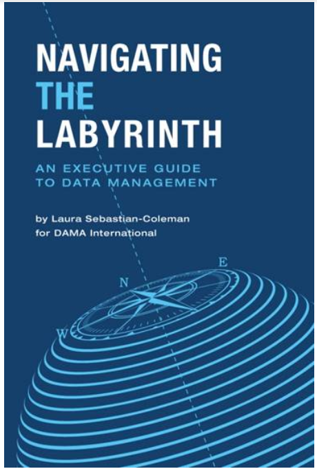
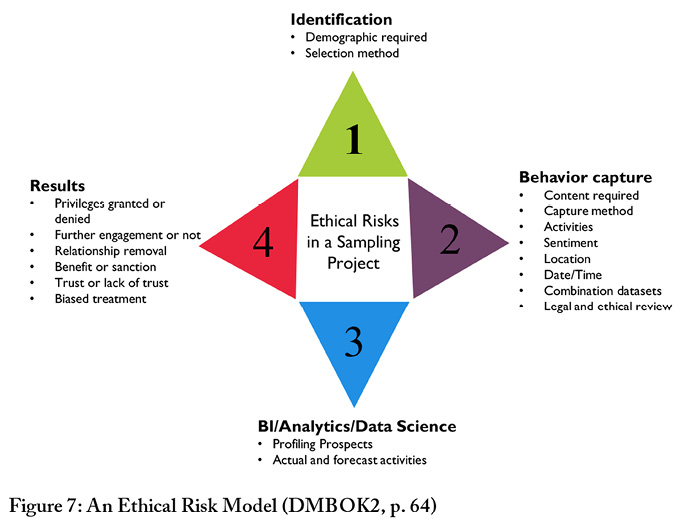
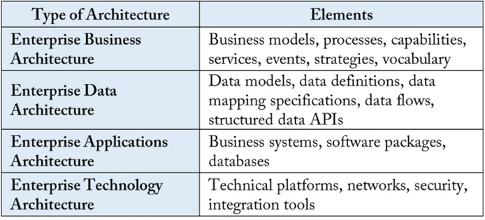
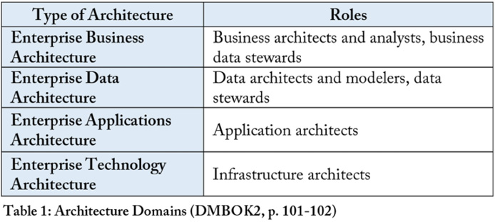

:lang: no
:doctitle: Navigating the Labyrinth: An Executive Guide to Data Management
:keywords: Informasjonsforvaltning, Dataforvaltning

include::../nab_felles/includes/commonincludes.adoc[]

[.lead]
Navigating the Labyrinth is a concise guide to data management, providing an executive’s overview to the DMBOK2. Utgitt 2018-06-01.

////
////

//image:../nab_felles/media/i-arbeid.png[width=75, height=75] Uferdig innhold - første versjon er fremdeles i arbeid

:numbered!:

== Hvordan få fatt i denne boken?
_Navigating the Labyrinth: An Executive Guide to Data Management_ kan  kjøpes via https://technicspub.com/dmbok/, enten av hver enkelt eller samlet for din virksomhet (enterprise license). Den er også tilgjengelig på link:https://www.oreilly.com/library/view/navigating-the-labyrinth/9781634623919/[Safari Books].

== Bokens introduksjonskapittel
You’ve sensed it, you’ve read it, you’ve seen it. Reliable, well-managed data is critical to organizational success in the twenty-first century. Whatever sector you work in – financial services, health care, insurance, manufacturing, technology, retail, education, and beyond – your organization requires data to transact business and serve customers. This data not only fuels your business processes; it also provides you the business intelligence needed to measure organizational success. As importantly, the data your organization produces can be mined for insights about current operations—insights you can apply to improve your processes and advance your organization’s strategy.

But reliable data is not produced by accident. In today’s complex world, well-managed data depends on planning and design, governance of business and technical processes, and the commitment of your organization to high-quality results. It also means ensuring that information about customers, products, and business operations is kept safe and secure, so that it cannot be used for criminal or malicious purposes.

Reliable data depends on successful execution of the functions and activities that comprise the field of data management. These are described in detail in DAMA International’s Data Management Body of Knowledge (known as the DMBOK2). Understanding the breadth and depth of functions that make up data management can be daunting. At first glance, they can appear quite complicated (see Figure 1).

Navigating the Labyrinth: An Executive Guide to Data Management gives you a perspective that reduces this complexity. Based on the DMBOK2, it provides a high-level overview of how data should be managed to support organizational success. It also explains what can get in the way of this success. Understanding the principles and best practices for data management will help you identify and act on your organization’s opportunities to get more value from its data

The first four chapters provide an overview of data management:

* Chapter 1: The Importance of Managing Data – Explains what data management is, and how managing data as an asset can help your organization.
* Chapter 2: Data Management Challenges – Outlines why managing data differs from managing other assets and resources.
* Chapter 3: DAMA’s Data Management Principles – Explains principles of effective data management that will help you overcome the challenges presented by data; introduces the concept of evolving your organization’s data management practices based on a maturity model.
* Chapter 4: Data Ethics – Describes the principles underlying an ethical approach to data management; explains how this approach to data handling can help prevent your organization’s data from being used in ways that harm your customers, your reputation, or the wider community.

The next four chapters review the mechanics of managing the data lifecycle:

* Chapter 5: Data Governance – Explains the role of data governance in providing oversight for data; highlights the ways an organization can implement governance practices to make better operational and strategic decisions about data.
* Chapter 6: Planning and Design in the Data Lifecycle – Describes the role of architecture and data modeling in data management, and the importance of planning and design in managing the overall lifecycle of data.
* Chapter 7: Enabling and Maintaining Data – Provides and overview of activities related to obtaining, integrating, and storing data and enabling its currency and access over time. These activities include applying design concepts to create reliable, performant, and secure warehouses, marts, and other data storage environments, where different types of data can be integrated and made available for a wide range of uses.
* Chapter 8: Using and Enhancing Data – Describes the ways that data can be used to create new data to bring value to an organization. Data enhancement adds both value and complexity to the data lifecycle. It requires organizations to plan for and cultivate the organic growth of data.

The following three chapters cover the foundational activities required to help build trust in data and ensure the organization can get value from its data over time:

* Chapter 9: Data Protection, Privacy, Security and Risk Management – Describes how to manage risks related to data, especially those connected with potential breaches or malicious uses of data.
* Chapter 10: Metadata Management – Provides an overview of how to manage Metadata, that critical sub-set of data which contains the knowledge required to use and maintain the rest of your data.
* Chapter 11: Data Quality Management – Presents techniques for ensuring that your organization’s data is fit for its intended purposes and enables your organization to meet its strategic goals. These techniques apply the principles of product management to data, and are aligned with the principles of data management described in Chapter 3.

Each chapter concludes with assertions about what you need to know about these topics. Chapter 12 What to do Now concludes the book with an approach to re-directing your organization’s data management practices through a current state assessment, a defined roadmap, and a commitment to organizational change management.

DAMA recognizes that to most executives, data management can seem obscure, complicated, and highly technical. You don’t have time to learn all the detail or cut through the hype. But if your organization depends on data – and most organizations do – then you have a critical role to play in enabling success. Reliable data management takes organizational commitment, and organizational commitment comes from leadership. DAMA hopes that by navigating the labyrinth of data management, you can develop opportunities for your organization to get more value from its data. This book will explain the fundamentals and help you understand why they are important, so you can focus attention on how to build trust in your organization’s data through efficient and effective practices.

== Omtale av utvalgte deler

=== Chapter 1 The Importance of Managing Data

==== Data management vs. technology management

Data management is the development, execution, and supervision of plans, policies, programs, and practices that deliver, control, protect, and enhance the value of data and information assets, throughout their lifecycle.

You may think, “Isn’t that what our information technology department already does?” Unfortunately, no. IT usually does not focus on data. IT focuses technology, technological processes, the people who build applications, and the tools they use to do so. Historically, IT has not focused on the data that is created by or stored in the applications it builds. If anything, IT has tended to be dismissive of the data itself (because IT professes to have no control over data) – despite the fact that many data management functions are part of IT.

Though data management is highly dependent on technology and intersects with technology management, it involves separate activities that are independent from specific technical tools and processes.

Given this definition, what does data management actually involve? What does it mean to manage data effectively? Like all forms of management, data management involves planning and coordinating resources and activities in order to meet organizational objectives. The activities themselves range from the highly technical, like ensuring that large databases are accessible, performant, and secure, to the highly strategic, like determining how to expand market share through innovative uses of data. These management activities must strive to make high-quality, reliable data available to the organization, while ensuring this data is accessible to authorized users and protected from misuse.

==== Data management activities

Data management activities can be understood in groups: some focus on governance to ensure the organization makes sound, consistent decisions about data; others are foundational and focus on enabling the management, maintenance, and use of data over time; and some focus on managing the data lifecycle, from obtaining data through disposing of it (see Figure 2).

Governance activities help control data development and reduce risks associated with data use, while at the same time, enabling an organization to leverage data strategically. These activities establish a system of decision rights and responsibilities for data, so that an organization can make consistent decisions across business verticals.2 Governance activities include things like:
Defining data strategy
Setting policy
Stewarding data
Defining the value of data to the organization
Preparing the organization to get more value from its data by
Maturing its data management practices
Evolving the organization’s mindset around data though culture change
Lifecycle activities focus on planning and designing for data, enabling its use, ensuring it is effectively maintained, and actually using it. Use of data often results in enhancements and innovations, which have their own lifecycle requirements. Lifecycle activities include:
Data Architecture
Data Modeling
Building and managing data warehouses and marts
Integrating data for use by business intelligence analysts and data scientists
Managing the lifecycle of highly critical shared data, like Reference Data and Master Data
Foundational activities are required for consistent management of data over time. Integral to the entire data lifecycle, these activities include:
Ensuring data is protected
Managing Metadata, the knowledge required to understand and use data
Managing the quality of data
Foundational activities must be accounted for as part of planning and design, and they must be carried out operationally. These activities are also supported by and integral to the success of governance structures.

==== Data management knowledge areas

The work of data management is carried out by people working in data management functions or knowledge areas, which require different skills and expertise (see Figure 3)

DAMA International has defined eleven knowledge areas:

. Data Governance provides direction and oversight for data management activities and functions by establishing a system of decision rights and responsibilities for data. These rights and responsibilities should account for the needs of the enterprise as a whole.
. Data Architecture defines the blueprint for managing data assets by aligning with organizational strategy and establishing designs to meet strategic data requirements.
. Data Modeling and Design is the process of discovering, analyzing, representing, and communicating data requirements in a precise form called the data model.
. Data Storage and Operations includes the design, implementation, and support of stored data to maximize its value. Operations provide support throughout the data lifecycle from planning for to disposal of data.
. Data Security ensures that data privacy and confidentiality are maintained, that data is not breached, and that data is accessed appropriately.
. Data Integration & Interoperability includes processes related to the movement and consolidation of data within and between data stores, applications, and organizations.
. Document and Content Management includes planning, implementation, and control activities to manage the lifecycle of data and information found in a range of unstructured media, especially documents needed to support legal and regulatory compliance requirements.
. Reference and Master Data Management includes ongoing reconciliation and maintenance of core critical shared data to enable consistent use across systems of the most accurate, timely, and relevant version of truth about essential business entities.
. Data Warehousing and Business Intelligence includes the planning, implementation, and control processes to manage decision support data and to enable knowledge workers to get value from data via analysis and reporting.
. Metadata Management includes planning, implementation, and control activities to enable access to high-quality, integrated Metadata, including definitions, models, data flows, and other information critical to understanding data and the systems through which it is created, maintained, and accessed.
. Data Quality Management includes the planning and implementation of quality management techniques to measure, assess, and improve the fitness of data for use within an organization.

These knowledge areas represent activities at the core of data management. Any organization trying to get value from its data must engage in them. But they are also evolving. Changes in our capacity to create and use data mean that other concepts could also be considered data management “knowledge areas” (such as data ethics, data science, Big Data management, and emergent technologies).

...

...

=== Chapter 2 Data Management Challenges

==== Data management means managing data’s lifecycle

One reason people conflate data management with technology management is that they often see data only in one place: the application from which they access it. They do not recognize that data can be separate from the applications where it is created or stored and that data has a lifecycle. The data lifecycle is based on the product lifecycle. It focuses on ensuring that data is created, moved, and maintained in ways that make it is usable by the people and processes that require it. Even though data and technology are intertwined, the data lifecycle should not be confused with the systems development lifecycle (SDLC), which focuses on completing projects on time and within budget.

Conceptually, the data lifecycle is easy to describe (see Figure 4). It includes processes that create or obtain data, those that move, transform, and store it and enable it to be maintained and shared, and those that use or apply it, as well as those that dispose of it.6 Data is rarely static. Throughout its lifecycle, data may be cleansed, transformed, merged, enhanced, or aggregated. Data often moves horizontally within organization. As data is used or enhanced, new data is created, so the lifecycle has internal iterations and the ‘same’ data may have different lifecycle requirements in different parts of an organization.

Complexity is added to the concept of the data lifecycle by the fact that different kinds of data have different lifecycle requirements. For example, transactional data can be controlled largely through enforcement of basic rules, while Master Data requires curation. Still some principles apply to the lifecycle of any data:

Creation and usage are the most critical points in the data lifecycle7: Data management must be executed with an understanding of how data is produced, or obtained, as well as how data is used. It costs money to produce data. Data is valuable only when it is consumed or applied.
Data quality must be managed throughout the data lifecycle: Because the quality of data can be impacted by a range of lifecycle events, quality must be planned for as part of the data lifecycle. It is not an add-on, or something to be ‘done later.’
Metadata quality must be managed through the data lifecycle: Metadata is a type of data that is used to describe other data. As such, it is critical to all data management functions. Metadata is often created as part of the lifecycle of other data and should be seen as a product (rather than a by-product) of that lifecycle. Metadata quality must be managed in the same way as the quality of other data.
Data Security must be managed throughout the data lifecycle: Data management includes ensuring that data is secure and that risks associated with data are mitigated. Data that requires protection must be protected throughout its lifecycle, from creation to disposal.
Data management efforts should focus on the most critical data: Organizations produce a lot of data, much of which is never actually used.8 Trying to manage every piece of data is neither possible nor desirable. Lifecycle management requires focusing on an organization’s most critical data and minimizing data ROT (i.e., data that is redundant, obsolete, or trivial).

image:./media/the-data-lifecycle.png[width=400, height=400]

=== Chapter 4 Data Ethics

=== Chapter 5 Data Governance

=== Chapter 6 Planning and Design in Data Lifecycle Management

==== Enterprise Architecture
Data Lifecycle management activities focus on planning and designing for data, enabling data use and maintenance, and actually using data to meet organizational goals (see Figure 1). Data architects and data modelers plan and design for data.

This chapter will describe:

* The role of enterprise architecture in planning and designing for the organization
* The critical function of data architecture within data management
* The goals and artifacts associated with data modeling

Architecture refers to an organized arrangement of component elements intended to optimize the function, performance, feasibility, cost, and aesthetics of an overall structure or system. The term architecture has been adopted to describe several facets of information systems design. Even in small organizations, information technology is complicated. Architectural artifacts and documentation which depict systems and data flows show people how systems, processes, and data work together. A strategic approach to architecture allows an organization to make better decisions about its systems and data.

Architecture practice is carried out at different levels within an organization (including enterprise, domain, or project) and with different areas of focus (e.g., infrastructure, application, or data). Table 1 describes and compares architectural domains. Architects from different domains must address development requirements collaboratively, as each domain influences the other domains.

A well-managed enterprise architecture practice can help an organization understand the current state of its systems, promote desirable change toward future state, enable regulatory compliance, and improve effectiveness. Effective management of data and the systems in which data is stored and used is a common goal of the breadth of architecture disciplines.

...

...

The Zachman framework summarizes the answers to a simple set of questions (i.e., what, how, where, who, when, why) that might be asked by stakeholders with different perspectives:

* The executive perspective (business context): Lists of business elements defining scope in identification models.
* The business management perspective (business concepts): Clarification of the relationships between business concepts defined by Executive Leaders as Owners in definition models.
* The architect perspective (business logic): System logical models detailing system requirements and unconstrained design represented by Architects as 
Designers in representation models.
* The engineer perspective (business physics): Physical models optimizing the design for implementation for specific use under the constraints of specific technology, people, costs, and timeframes specified by Engineers as Builders in specification models.
* The technician perspective (component assemblies): A technology-specific, out-of-context view of how components are assembled and operate configured by Technicians as Implementers in configuration models.
* The user perspective (operations classes): Actual functioning instances used by Workers as Participants. There are no models in this perspective.
The framework then identifies what kinds of architecture artifacts are required to answer these fundamental questions.

...

...

=== Chapter 7 Enabling and Maintaining Data

==== Big data storage

Big Data and data science are connected to significant technological changes that have allowed people to generate, store, and analyze larger and larger amounts of data and to use that data to predict and influence behavior, as well as to gain insight on a range of important subjects, such as health care practices, natural resource management, and economic development.

Early efforts to define the meaning of Big Data characterized it in terms of the Three V’s: Volume, Velocity, Variety.34 As more organizations start to leverage the potential of Big Data, the list of V’s has expanded:

* Volume: Refers to the amount of data. Big Data often has thousands of entities or elements in billions of records.
* Velocity: Refers to the speed at which data is captured, generated, or shared. Big Data is often generated and can also be distributed and even analyzed in real-time.
* Variety / Variability: Refers to the forms in which data is captured or delivered. Big Data comes requires storage of multiple formats. Data structure is often inconsistent within or across data sets.
* Viscosity: Refers to how difficult the data is to use or integrate.
* Volatility: Refers to how often data changes and therefore how long the data is useful.
* Veracity: Refers to how trustworthy the data is.

Taking advantage of Big Data requires changes in technology and business processes and in the way that data is managed. Most data warehouses are based on relational models. Big Data is not generally organized in a relational model. Data warehousing depends on the concept of ETL (extract, transform, load). Big Data solutions, like data lakes, depend on the concept of ELT – loading and then transforming. This means much of the upfront work required for integration is not done for Big Data as it is for creating a data warehouse based on a data model. For some organizations and for some uses of data, this approach works, but for others, there is a need to focus on preparing data for use.

The speed and volume of data present challenges that require different approaches to critical aspects of data management, not only data integration, but also Metadata Management, and data quality assessment, and data storage (e.g., on site, in a data center, or in the cloud).

The promise of Big Data – that it will provide a different kind of insight – depends on being able to manage Big Data. In many ways, because of the wide variation in sources and formats, Big Data management requires more discipline than relational data management. Each of the V’s presents the opportunity for chaos.

Principles related to Big Data management have yet to fully form, but one is very clear: organizations should carefully manage Metadata related to Big Data sources in order to have an accurate inventory of data files, their origins, and their value. Some people have questioned whether there is a need to manage the quality of Big Data, but the question itself reflects a lack of understanding of the definition of quality – fitness for purpose. Bigness, in and of itself, does not make data fit for purpose. Big Data also represents new ethical and security risks that need to be accounted for by data governance organizations (see Chapter 4).

Big Data can be used for a range of activities, from data mining to machine learning and predictive analytics. But to get there, an organization must have a starting point and a strategy. An organization’s Big Data strategy needs to be aligned with and support its overall business strategy. It should evaluate:

* What problems the organization is trying to solve. What it needs analytics for: An organization may determine that the data is to be used to understand the business or the business environment; to prove ideas about the value of new products; to explore a hypothesis; or to invent a new way to do business. It is important to establish a gating and check point process to evaluate the value and feasibility of initiatives.
* What data sources to use or acquire: Internal sources may be easy to use, but may also be limited in scope. External sources may be useful, but are outside operational control (managed by others, or not controlled by anyone, as in the case of social media). Many vendors are competing as data brokers and often multiple sources exist for the desired data sets. Acquiring data that integrates with existing ingestion items can reduce overall investment costs.
* The timeliness and scope of the data to provision: Many elements can be provided in real-time feeds, snapshots at a point in time, or even integrated and summarized. Low latency data is ideal, but often comes at the expense of machine learning capabilities – there is a huge difference between computational algorithms directed to data-at-rest versus streaming. Do not minimize the level of integration required for downstream usage.
* The impact on and relation to other data structures: You may need to make changes to structure or content in other data structures to make them suitable for integration with Big Data sets.
* Influences to existing modeled data: Including extending the knowledge on customers, products, and marketing approaches.

The strategy will drive the scope and timing of organization’s Big Data capability roadmap.

Many organizations are integrating Big Data into their overall data management environment (see Figure 21). Data moves from source systems into a staging area, where it may be cleansed and enriched. It is then integrated and stored in the data warehouse (DW) and/or an operational data store (ODS). From the DW, users may access data via marts or cubes, and utilize it for various kinds of reporting. Big Data goes through a similar process, but with a significant difference: while most warehouses integrate data before landing it in tables, Big Data solutions ingest data before integrating it. Big Data BI may include predictive analytics and data mining, as well as more traditional forms of reporting.

=== Chapter 8 Using and Enhancing Data

=== Chapter 9 Data Protection, Privacy, Security, and Risk Management

=== Chapter 10 Metadata Management

=== Chapter 11 Data Quality Management

=== Chapter 12 What to do Now
