////
Guide to the below header attributes:

    lang: en; no
    difi_orig_language: en; no
    difi_translation_status: -; missing; incomplete; OK 
    keywords_en: comma separated list of english keywords (no controlled vocabulary); TBD
    keywords_no: comma separated list of Norwegian keywords (no controlled vocabulary); TBD  
    
Note: The _lang_ value may be overridden by a command line parameter.
////

:lang: en
:difi_orig_language: en
:doctitle_en: English Document Title
:doctitle_no: Norsk dokumenttittel
:difi_translation_status: -
:keywords_en: TBD
:keywords_no: TBD
:toclevels: 2
:difi_doctype: Basic Book Template

// The above parameters are processed by scripts included by the following statement
include::../plattform_felles/includes/commonincludes.adoc[]

// ****************
// NORWEGIAN
// ****************
ifeval::["{lang}" == "no"]

[.lead]
Kort, innledende tekst for denne boken

== Introduksjon
include::./intro_abpmp-cbok.adoc[]

== Kapittel 2 
// Inkluder kapittel-filer eller skriv direkte her 

// ****************
endif::[]
// ****************

// ****************
// ENGLISH
ifeval::["{lang}" == "en"]
// ****************

[.lead]
//Preamble goes here...

== Introduction
include::./intro_abpmp-cbok.adoc[]

== Seleced illustrations
// Further chapters to go here - include files or  write directly here 

.Silos in Functionally-Managed Organizations
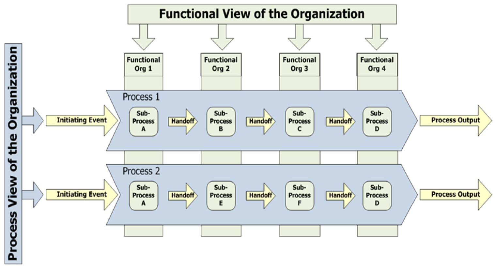

.Enterprise Capability Architecture
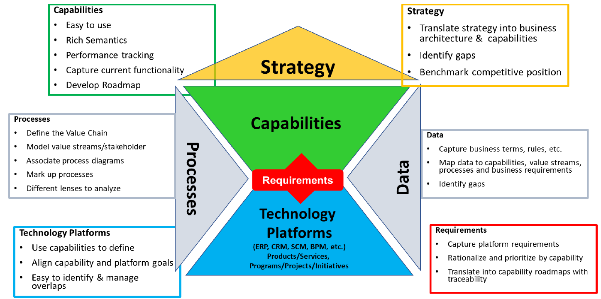

.BPM Life Cycle Framework
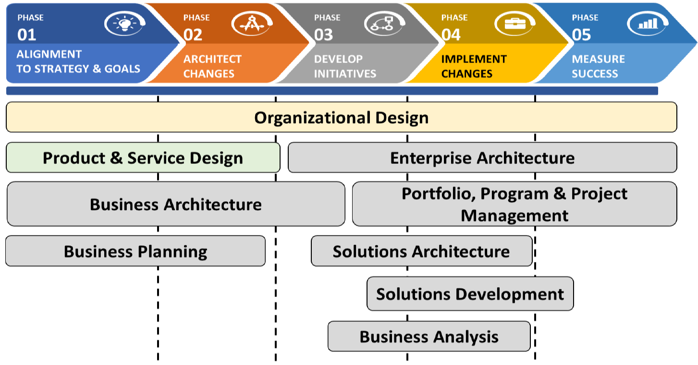

.kunnskap_bok_abpmp-cbok/media/BPM Application Architecture
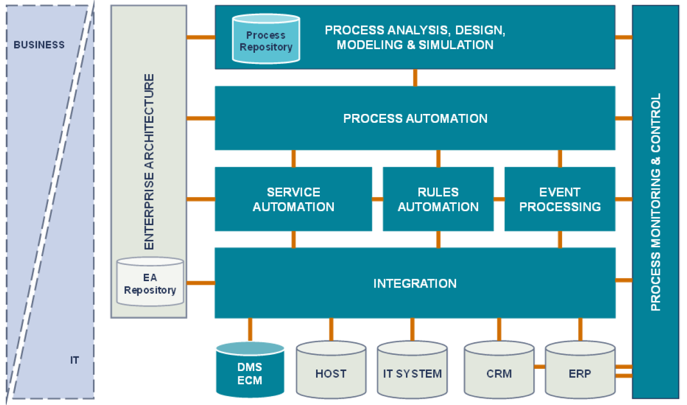

.BPM Technical Architecture Platform
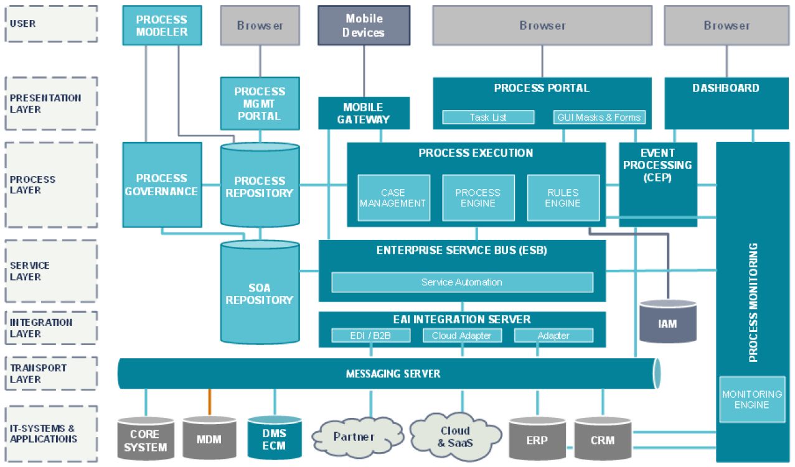

.Business Process and Capability Decomposition
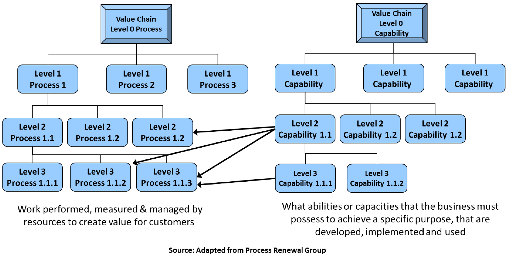

.Five Phases of BPM Life Cycle
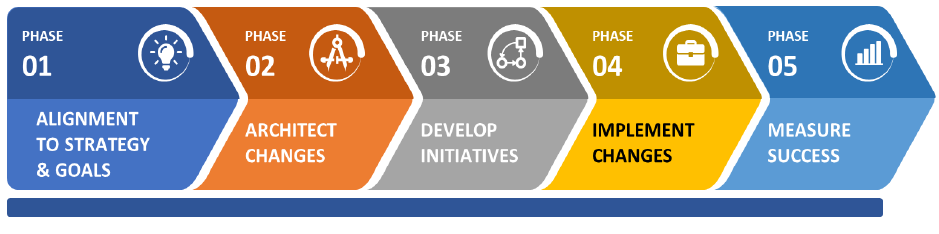

.BPM Life Cycle Framework

.Work Patterns of Knowledge Workers
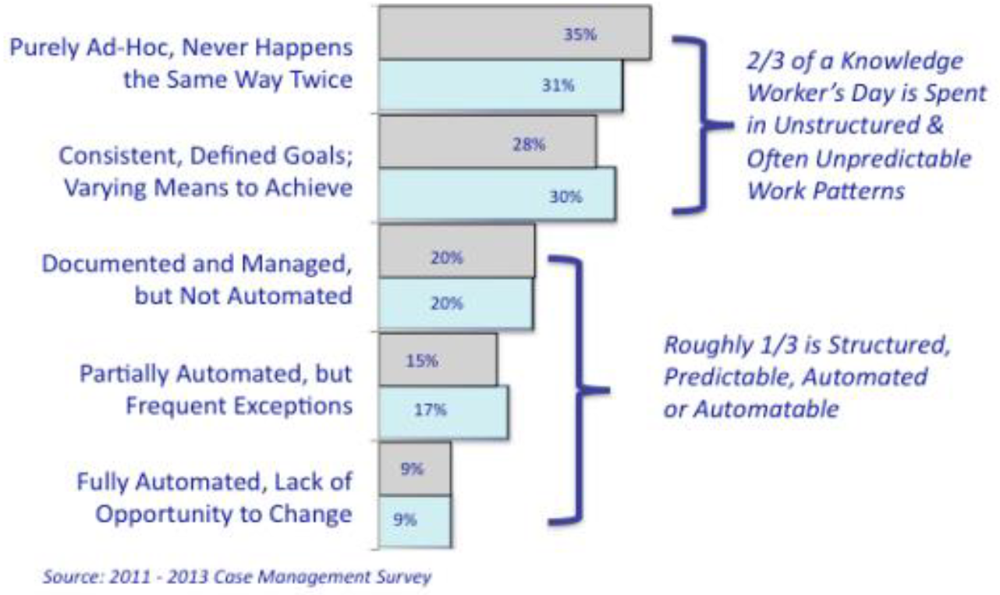

.Process Mining
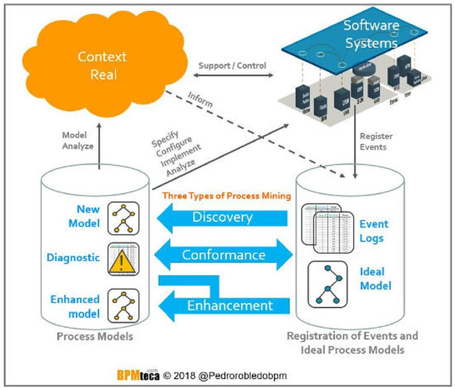

.IoT Reference Architecture (Munasinghe 2017)
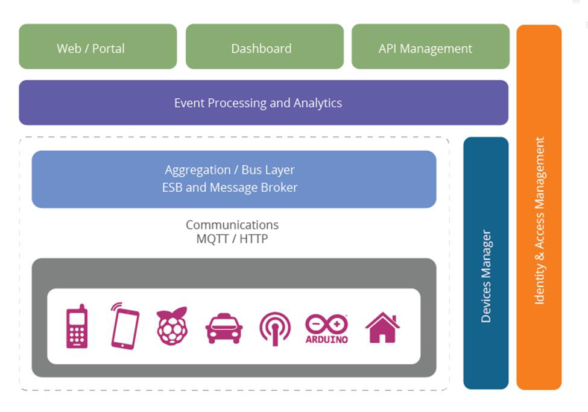

.Evolution of iBPMS
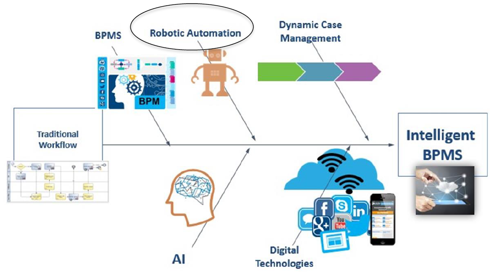

.A Dynamic Case Management System
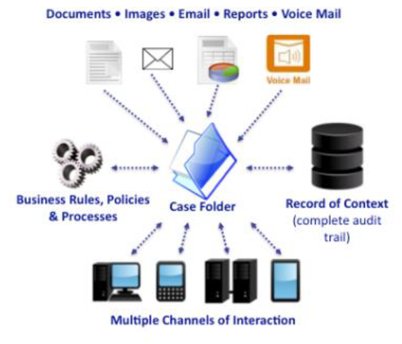

////
.Title
image::../kunnskap_bok_abpmp-cbok/media/.png[]
////

// ****************
endif::[]
// ****************
