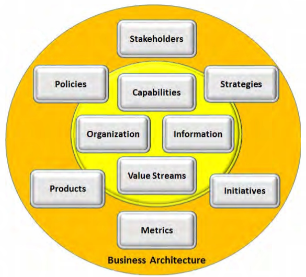

:lang: en
:doctitle: Bizbok

include::../plattform_felles/includes/commonincludes.adoc[]

[.lead]
The BIZBOK@ Guide provides an industry 
standard framework for business architecture practitioners and individuals who wish to use 
business architecture to address business challenges. 

////
////

== About BIZBOK
The Guide to the Business Architecture Body of Knowledge@ (BIZBOK@ Guide) is a product of the Business Architecture Guild, a not-for-profit....

The BIZBOK@ Guide is a practical guide with 
best practices, gleaned from numerous companies and business architecture leaders.

It is a comprehensive, yet 
user-friendly handbook for the growing number of organizations embracing this important 
discipline. 

The BIZBOK@ Guide is practitioner-driven, representing a 
collective and growing body of contributions from business architecture practitioners across a 
variety of industries worldwide. 

...

...

.BIZBOK@ Guide

NOTE: More to come here soon!

