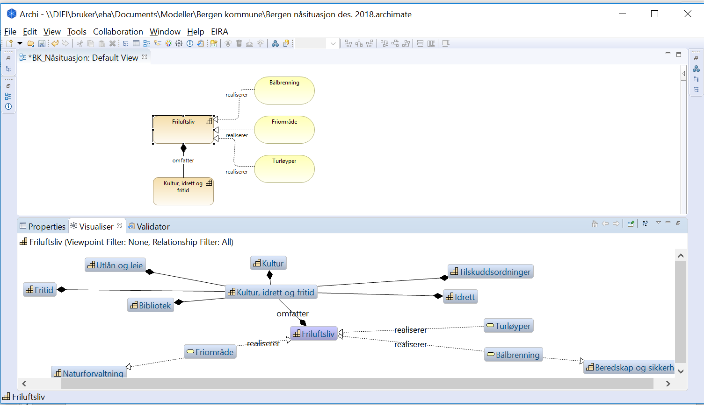

:lang: no
:doctitle: Praktiske øvelser

include::../plattform_felles/includes/commonincludes.adoc[]

[.lead]

. *Installer Archi og Collaboration plugin*
+
Se link:https://doc.difi.no/nasjonal-arkitektur/praktiske-tips/#_installer_archi_og_plugin[]. 

. *Importer kurs-modellene.*
+
Følg oppskriften under https://doc.difi.no/nasjonal-arkitektur/praktiske-tips/#_importer_github_repository, men oppgi https://github.com/difi/nasjonal_arkitektur/archi-kurs-1. 
+
WARNING: Husk å sette Preferences slik at du har kontroll på hvor på harddisken din resultatet havner.
    
. *Tilpass Default Figures under Preferences*
+
Se link:https://doc.difi.no/nasjonal-arkitektur/praktiske-tips/#_installer_archi_og_plugin[].

. *Modeller "Hei verden!" - dvs. deg selv i verden.*
+
* Bruk "din" mappe under __Views__. 
+
* Ta med minst følgende tre objekter og knytt disse sammen på en måte som du selv velger: Verden, Difi og deg. Hvilke Archimate-konsepter og relasjoner passer? Ta eventuelt med flere objekter og relasjoner som beskriver deg i forhold til resten av verden om du ligger foran i løypa. F.eks. hvilke oppgaver du har i Difi, hvilke app-er du bruker eller forholdet til noen i familien.
+
* Sett navn på relasjonene (f.eks. "ansatt i" mellom deg og Difi).
+
* For relasjonene, endre _Text Position_ til _Source_ under __Propeties, Apperance__.

. *Åpne og ta en titt på modellene fra Bergen Kommune?*
+
* Kopier archimate-modellen fra Bergen Kommune til din lokale harddisk og åpne i Archi. Du finner filen link:https://1drv.ms/f/s!Ao0VyYhs1XdLi5xG2870DDxx_qEJ9g[her].
+
* Finn _Friluftsliv_ under Strategy i Models-panelet og bruk _Visualiser-vinduet_ med Depth=2 til å vise direkte og indirekte relasjoner.
+
* Lag et view som inneholder _Friluftsliv_ og alle direkte relaterte objekter. Få det til å se slik ut:
+

+
* Refleksjon: Hva kunne vi ønsket mer av verktøyet her?

