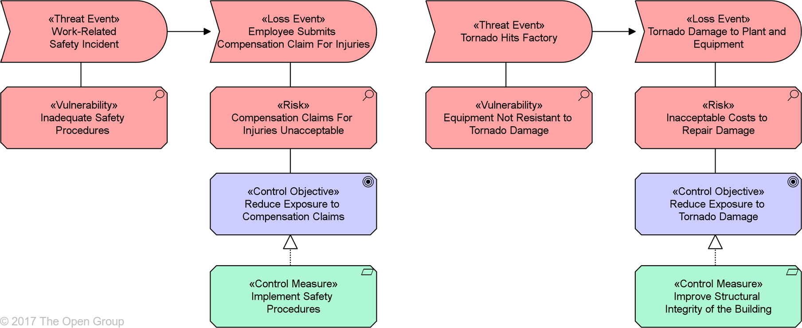

:lang: no
:doctitle: Temaer
include::../nab_felles/includes/commonincludes.adoc[]
[.lead]

== Introduksjon - innledende betratninger
=== Hva er Archimate?
"The ArchiMate Specification, an Open Group Standard, is an open and independent modeling language for Enterprise Architecture that is supported by different tool vendors and consulting firms. The ArchiMate language enables Enterprise Architects to describe, analyze, and visualize the relationships among architecture domains in an unambiguous way."

Se også: 

* Forholdet mellom Archimate og andre språk.
* Osv.

=== Om Archimate vs. andre standarder
Om metamodeller
Forholdet tli BPMN og UML

=== Hvorfor modellere - generelt?
* Konsistent dokumentasjon (database, referanseintegritet)
* Tilpasning av visninger til ulike interessenter
* Prosesserbar informasjon - automatisering og analyse
* Se sammenhenger på tvers - direkte og indirekte - hvordan alt henger sammen
* Ett bilde sier mer enn 1000 ord?
* Verktøystøtte - tilgangsstyring, versjonsstyring, ...

=== Hva skal vi i Difi modellere?
Hva er behovene for arkitekturmodeller i SDS? FDF? ANS? Utredning og analyse? Andre?

=== Er Archimate vanskeligere å lese enn andre modellspråk og notasjoner?
Tja - ikke nødvendigvis. God kommunikasjon er en kunstart. A Fool with a Tool is Still a Fool;) Det hjelper å være bevisst g følge gode prinsipper for strukturering grafisk layout. En kan også la seg hjelpe av verktøy for å forenkle modeller og grafikk.

=== Er det begrensninger i Archimate?
Arhimate-standarden er innrettet på å dekke 80% av det behovet som (virksomhets-)arkitekter har for å modellere, men kan med noe verktøystøtte utvides og skreddersys til å dekke mye mer.

WARNING: Archimate som sådan har ikke støtte for kataloger. Til dette kreves særskilt verktøystøtte (utover det f.eks. Archi har). 

NOTE: En historie fra virkeligheten: På Entercard ble det tilrettelagt for å bruke egne utvidelser av Archimate også til datamodellering, løsningsdesign,  risikomodellering, infrastruktur, kompetansestyring, begrepsdefinisjoner, konsekvensanalyse m.m. 

== Verktøy
=== Hvorfor verktøy (innledningsvis)
* Effektiv input, f.eks. gjennom matriser
* Generering av grafiske visninger
Konsistens
Funksjonalitet...

=== Utvidelser og tilpasning av Archimate

== Utvalgte "konsepter"
=== Tjenesteorientering

=== Prosess vs. funksjon

=== Retning på piler:
https://bizzdesign.com/blog/archimate-relationships-point-in-the-same-direction-as-the-enterprise/

=== Arkitektur vs. løsning
https://bizzdesign.com/blog/archimate-relationships-point-in-the-same-direction-as-the-enterprise/

=== Abstraksjon

==== Konseptuell, logisk, fysisk
Ref. Archimate 3.01:
+       
A third distinction is between conceptual, logical, and physical abstraction levels. This has its roots in data modeling: conceptual elements represent the information the business finds relevant; logical elements provide logical structure to this information for manipulation by information systems; physical elements describe the storage of this information; for example, in the form of files or database tables. In the ArchiMate language, this corresponds with business objects, data objects, and artifacts, and the realization relationships between them.

The distinction between logical and physical elements has also been carried over to the description of applications. The TOGAF Content Metamodel [4] describes logical and physical data, application, and technology components. Logical components are implementation or product-independent encapsulations of data or functionality, whereas physical components are tangible software components, devices, etc. The distinction within the TOGAF framework between Architecture Building Blocks (ABBs) and Solution Building Blocks (SBBs) is very similar. This distinction is again useful in progressing Enterprise Architectures from high-level, abstract descriptions to tangible, implementation-level designs. Note that building blocks may contain multiple elements, which are typically modeled using the grouping notation in the ArchiMate language.

The ArchiMate language has *[blue]#three ways#* of modeling such abstractions. 

1. First, as described in [6], *[blue]#behavior elements#* such as application and technology functions can be used to model [blue]#logical components#, since they represent implementation-independent encapsulations of functionality. The corresponding [blue]#physical components# can then be modeled using *[blue]#active structure elements#* such as application components and nodes, assigned to the behavior elements. 

2. Second, the ArchiMate language supports the concept of **[blue]#realization#**. This can best be described by working with the Technology Layer upwards. The Technology Layer defines the physical artifacts and software that realize an application component. It also provides a mapping to other physical concepts such as devices, networks, etc., needed for the realization of an information system. The realization relationship is also used to model more abstract kinds of realization, such as that between a (more specific) requirement and a (more generic) principle, where fulfillment of the requirement implies adherence to the principle. Realization is also allowed between application components and between nodes. This way you can model a physical application or technology component realizing a logical application or technology component, respectively. 

3. Third, __logical and physical application components can be defined as specializations of the application component element__, as described in Chapter 15 (see also the examples in Section 15.2.2). The same holds for the logical and physical technology components of the TOGAF Content Metamodel, which can be defined as specializations of the node element (see Section 15.2.3).

=== Instanser
#The ArchiMate language intentionally does not support a difference between types and instances#. At the Enterprise Architecture abstraction level, it is more common to model types and/or exemplars rather than instances. Similarly, a business process in the ArchiMate language does not describe an individual instance (i.e., one execution of that process). In most cases, a business object is therefore used to model an object type (cf. a UML class), of which several instances may exist within the organization. For instance, each execution of an insurance application process may result in a specific instance of the insurance policy business object, but that is not modeled in the Enterprise Architecture.

WARNING: Erik: Det kan diskuteres om det er smart å utelukke muligheten til å dokumentere instanser! Det er f.eks. interessant å analysere hvor mange instanser av en applikasjon som finnes, hvor mange brukere som bruker hvilke funksjoner osv. Dette kan selvsagt fanges og analyseres i andre verktøy, men det kan være hensiktsmessig å samle "alt" på en konsistent måte i ett verktøy. 

NOTE: 

=== Derived connections

=== Tilpasning og utvidelser (extensions)
==== Egne symboler
==== Attributter
==== Spesialiserte objekter

=== Modelleringskonvensjoner
==== Navnekonvensjoner
==== Attributter
==== Spesielt om prosessmodellering
==== Spesielt om datamodellering

=== Eksempler

== Temaer for viderekomne
=== Risikomodelinger
Kan gjøre som en utvidelse av Archimate, f.eks. slik:

Kilde:
http://pubs.opengroup.org/architecture/archimate3-doc/chap15.html#_Toc489946142

NOTE: Dette er støttet på en god måte av  Bizzdesign Studio, slik at en slipper å finne opp kruttet. 

Se også:

* Bizzdesign blogg
* The Open Group White Paper
* Eksempler fra GDPR-arbeidet på RR
* Kjør Bizzdesign demo?

=== Archimate sammen med andre standarder

* BPMN look-alike med Archimate
* ER-diagrammer som Archmate + kardinalitet

=== Mer om verktøy 

