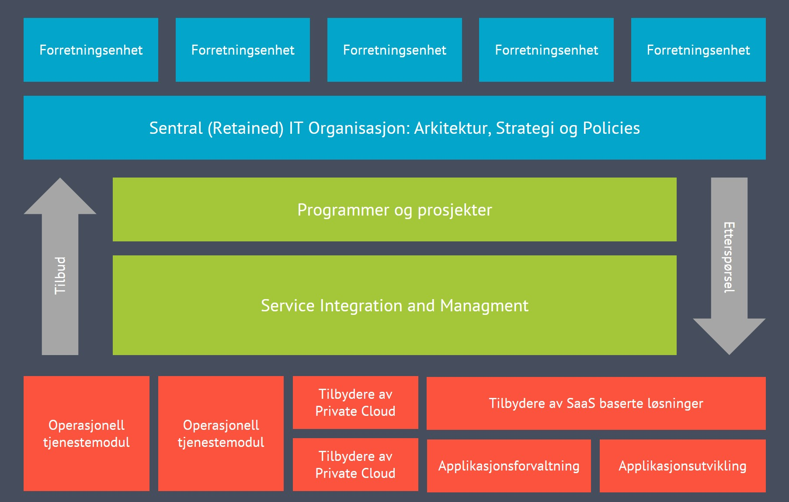

:lang: no
:doctitle: SIAM - Service Integration and Management
:keywords: SIAM, Service Integration and Management

include::../nab_felles/includes/commonincludes.adoc[]

[.lead]
The SIAM Foundation Body of Knowledge from Scopism Ltd defines SIAM as ″a management methodology that can be applied in an environment that includes services sourced from a number of service providers″.

image:../nab_felles/media/i-arbeid.png[width=75, height=75]Uferdig innhold - første versjon er fremdeles i arbeid

////
////

:numbered!:

== Generelt
Ref. https://en.wikipedia.org/wiki/Service_integration_and_management:
Service Integration and Management (SIAM) is an approach to managing multiple suppliers of services (business services as well as information technology services) and integrating them to provide a single business-facing IT organisation. It aims at seamlessly integrating interdependent services from various internal and external service providers into end-to-end services in order to meet business requirements

Ref. https://www.syscomworld.com/no/hva-er-siam-og-hva-bor-du-vite/: 

SIAM er et konsept/metodikk for styring og kontroll av IT-tjenestene. SIAM er ikke nytt og har ulike navn som f.eks multisourcing services integration (MSI) og «ligger på toppen av» f.eks ITIL og Cobit.

SIAM er ikke et verktøy eller produkt, men en samlebetegnelse på hvordan man kan integrere interne tjenester med én eller flere eksterne leverandører, måle disse og ha en overordnet kontroll. SIAM-modellen er ulik fra organisasjon til organisasjon, og endres ikke ved bytte av en leverandør.

Forrester, et globalt analysebyrå, konstaterer følgende: «For å gjøre multisourcing-oppsett effektive må kunder få leverandørene til å jobbe sammen, både kommersielt og et operasjonelt. Integrasjonslaget, prosessene, verktøyene, servicenivåavtalene, og relaterte strukturer, er kritiske suksessfaktorer for disse oppsettene.» Store selskap må først og fremst adressere tre ting:

    * Sourcing
    * Vendor Management
    * Service Management

Som figuren nedenfor viser: SIAM handler ikke bare om å splitte tidligere outsourcede, eller internt leverte, aktiviteter inn til egne moduler – det inkluderer også tredjepartstjenester som SaaS og Cloud. Organisasjoner som ikke har outsourcet, men har en mix av in-house, SaaS og skytjenester har også et behov for å styre porteføljen av tjenestetilbydere for å levere en sømløs IT leveranse til brukerne/kundene.

Kilde: ServiceNow 
