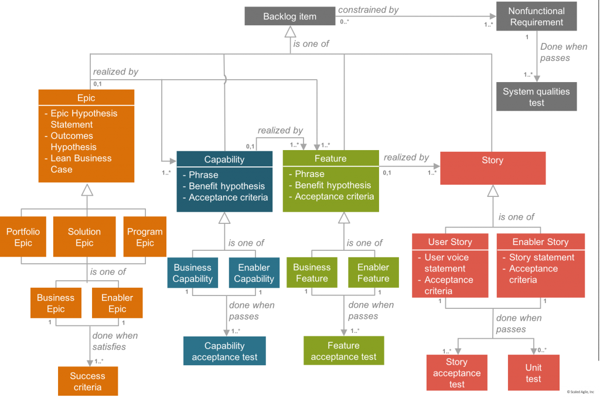
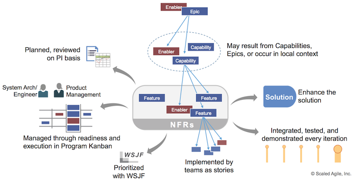
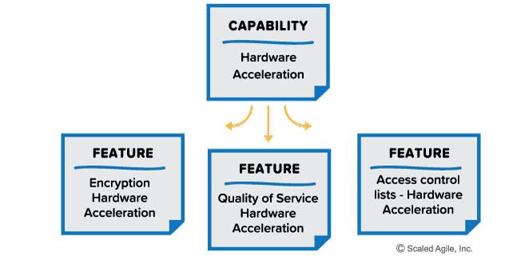
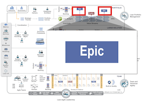

:lang: no
:doctitle: SAFe - Scaled Agile Framework for Lean Enterprises
//:keywords: ...

include::../plattform_felles/includes/commonincludes.adoc[]

[.lead]
NOTE: Innholdet her er er en del av et link:../kunnskap_[kunnskapsbibliotek], etablert av Difi i tilknytning til link:../nab_/[Nasjonalt arkitekturbibliotek]. 

image:../kunnskap_rammeverk_safe/media/safe-logo.png[]

== Introduksjon til SAFe
include::../kunnskap_rammeverk_safe/intro-safe.adoc[]

:lang: no
:doctitle: SAFe on Requirements  
include::../plattform_felles/includes/commonincludes.adoc[]

image:../kunnskap_rammeverk_safe/media/safe-logo.png[]

== Safe Requirements Model
Quotes from https://www.scaledagileframework.com/safe-requirements-model/:

To support bringing the benefits of Lean and Agile development to larger enterprises—or to smaller businesses building more complex systems—SAFe provides a scalable requirements model that demonstrates a way to express system behaviors: Epics, Capabilities, Features, Stories, Nonfunctional Requirements (NFRs), and more. As shown in Figure 1, each of these work items is expressed in different ways.

//[.lead]
//_SAFE_ ...

If the model appears complex, that’s because contemporary software and systems development at scale is complicated, even with Agile methods. If an element is not needed, then it need not be used. However, teams and programs that are building world-class enterprise solutions of the highest possible quality can probably apply most of these elements.

== SAFe on Features and Capabilities
Quotes from https://www.scaledagileframework.com/features-and-capabilities/:

#A Feature is a service that fulfills a stakeholder need#. Each feature includes a benefit hypothesis and acceptance criteria, and is sized or split as necessary to be delivered by a single Agile Release Train (ART) in a Program Increment (PI).

#A Capability is a higher-level solution behavior# that typically spans multiple ARTs. Capabilities are #sized and split into multiple features# to facilitate their implementation in a single PI.

[red]#Avoid defining features with the ‘user story voice’ format that’s designed to support one user role; features typically provide functionality for multiple user roles.#

Figure 1 shows that #solutions are developed using features#. Each reflects a service provided by the system that fulfills some important stakeholder need. They are maintained in the Program Backlog and are sized to fit in a PI so that each delivers new value. Features can originate from either the local context of the ART or they may result from splitting Epics or capabilities. The Program and Solution Kanban systems support the flow of features and capabilities, where they progress through the funnel, analyzing, backlog, implementing, validating, deployment, and release states. This process provides reasoned economic analysis, technical impact, and strategy for incremental implementation. Product Management and System Architect/Engineering own the features and enablers, respectively. #Nonfunctional Requirements (NFRs)# define system attributes such as #security, reliability, performance, maintainability, scalability, and usability#. #NFRs serve as constraints or restrictions on the design# of the system across the different backlogs. Features are prioritized using Weighted Shortest Job First (WSJF) and are planned and reviewed at PI boundaries. They are split into Stories, and are implemented, integrated, tested, and demonstrated as the functionality becomes available.

#Capabilities must be decomposed into features to be implemented#. They, #in turn, are split into stories# consumable by teams within an iteration. SAFe provides ten patterns for splitting work, as described in Leffingwell [1], chapter 6. Workflow steps Business rule variations Major effort Simple/complex Variations in data Data methods Deferring system qualities Operations Use-case scenarios Breaking out a spike Figure 4 illustrates splitting a capability into features.

            
            
== SAFe on Epics
Quotes from  https://www.scaledagileframework.com/epic/:

Epics are the containers that capture and manage the most significant initiatives that occur within a portfolio. Epics and the Value Streams they affect are the primary concern of the Portfolio level. Business epics directly deliver business value, while enabler epics are used to advance the Architectural Runway to support upcoming business epics.

== Agile Architecture in SAFe

See https://www.scaledagileframework.com/agile-architecture/.

