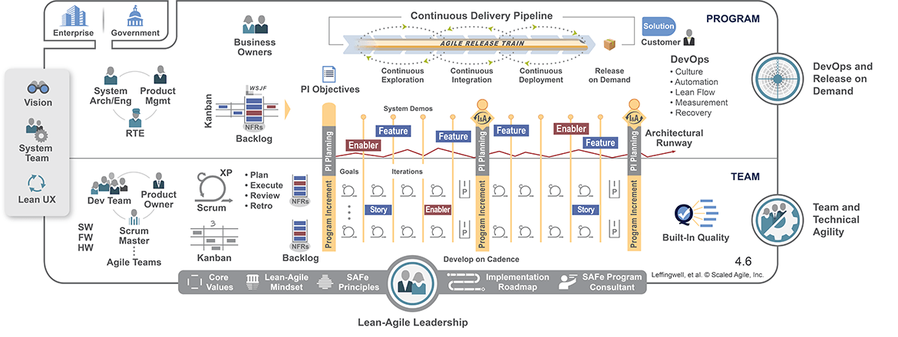
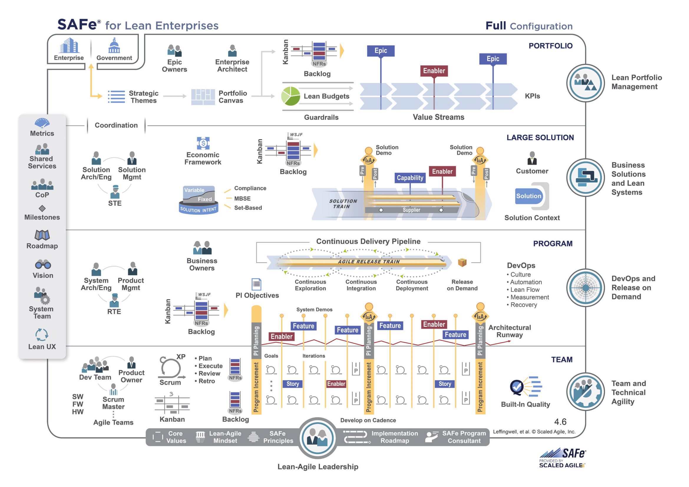

:lang: no
:doctitle: Introduksjon til SAFE
include::../plattform_felles/includes/commonincludes.adoc[]

//

//[.lead]
//_SAFE_ er ...

////
////

SAFe® for Lean Enterprises is a knowledge base of proven, integrated principles, practices, and competencies for Lean, Agile, and DevOps.

The Framework is supported by the SAFe Community Platform, Customer Success Team, and an extensive network of 200+ Scaled Agile Partners providing platform, training, consulting, and implementation services in almost every region of the world. And while every business situation is unique, we have found that the SAFe Implementation Roadmap always delivers results. 

Essential SAFe, https://www.scaledagileframework.com/essential-safe/

Full SAFe, https://www.scaledagileframework.com/safe-for-lean-enterprises/

