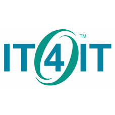
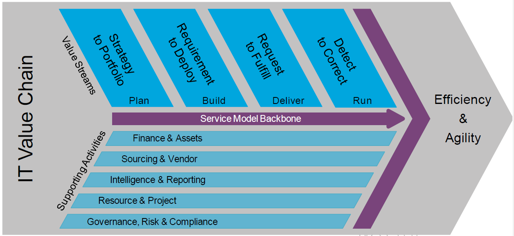

:lang: no
:doctitle: The OpenGroup's IT4IT
:keywords: Utviklingsmetodikk

include::../plattform_felles/includes/commonincludes.adoc[]

[.lead]
IT4IT fra The Open Group er en standard referansearkitektur for verdikjedene i utvikling og og forvaltning av IT-tjenester. Standarden kan ses som et overbygg til andre standarder og praksiser, slik som f.eks. TOGAF, ITIL, CobIT, Prince2 (og  Prosjektveiviseren).

// :imagesdir@: ../nab_felles/media

image:../plattform_felles/media/i-arbeid.png[width=75, height=75] Første versjon av denne omtalen er fremdeles i arbeid - men kanskje du finner noe nyttig?

////
////

== Målgrupper
* Arkitekter: ...
* Prosjektledere: ...
* Andre: ...

== Hva er IT4IT?
The Open Group IT4IT Reference Architecture is a standard reference architecture and value chain-based operating model for managing the business of IT. It uses a value chain approach to create a model of the functions that IT performs to help organizations identify the activities that contribute to business competitiveness. This value chain framework, called the IT Value Chain and specified in this document as part of the IT4IT Reference Architecture, applies this concept to IT by defining an integrated IT management framework focusing on the lifecycle of services. It identifies the key things that IT must do – and do well. It allows IT to achieve the same level of business predictability and efficiency that supply chain management has allowed for the business, and was designed by practitioners to be industry, product, and vendor-independent.

== Hvorfor bør jeg kjenne til IT4IT?
IT4IT er et forsøk på å etablere et overbygg over andre standarder og praksiser rundt tjenesteutvikling, som en felles referanseramme og med noen verdiøkende elementer i forhold til hva som finnes fra før. 

Begrepsavklaringer og tydeligjøring av konseptene rundt "tjenesteorientering" er viktige bidrag.

Om "alle" ville samles om denne standarden og det tilhørende begrepsapparatet, kunne det blitt lettere å dra lasset sammen?

Om flere av oss "kan" og forstår IT4IT, har vi kanskje en felles referanse som kan bygge bro mellom ulike fagdisipliner? 

Verdt å forsøke?

== Hvor kan jeg finne ut mer  om IT4IT?
The Open group har publisert flere dokumenter om IT4IT. Hjemmesiden for standarden er her: link:https://publications.opengroup.org/standards/it4it[The Open Group IT4IT™ Reference Architecture, version 2.1].

Det finnes en link:http://pubs.opengroup.org/it4it/refarch21/[online (html) versjon av standarden], i tillegg til flere nedlastbare pdf-dokumenter.  

Du må være registrert bruker hos The Open group for å laste ned noe som helst derfra. Deler av materialet er dessuten kun tilgjengelig for betalende medlemmer.

For å gjøre det lettere for deg, er det laget en samling av ferdige nedlastede filer som finnes under en  
link:https://1drv.ms/f/s!Ao0VyYhs1XdLjRog4ZXc_PapOLq0[Onedrive-mappe for IT4IT]. Av innholdet i denne mappen nevnes:

. link:https://1drv.ms/b/s!Ao0VyYhs1XdLhcxqlL-5tehh79pm8g[IT4IT™ Reference Architecture 2.1.pdf] (2018)
+
Dokumentasjon av den standardiserte IT4IT  referansearkitekturen.

. link:https://1drv.ms/b/s!Ao0VyYhs1XdLjxnbmKmcNoiWQsZp[Defining IT Service for IT4IT.pdf] (2015)
+
Svært presise begrepsavklaringer rundt "tjenestebegrepet", med eksempler og drøftinger som  underbygger konklusjonene. 

. link:https://1drv.ms/b/s!Ao0VyYhs1XdLibASLWqxxcnPMtE6sw[Seamless Service Delivery and the IT4IT Standard.pdf] (2018)
+
Dette er en "oppskrift" for utvikling av tverrgående, sammenhengende og enhetlige tjenester;)

. link:https://1drv.ms/b/s!Ao0VyYhs1XdLhcxqlL-5tehh79pm8g[Service Brokering with the IT4IT™ Standard.pdf] (2018)
+
The objective of this Guide is to describe a proven approach to implementation of a service brokering model based on the IT4IT standard, with both manual and automated access to services. This Guide also demonstrates the recursive nature of the IT4IT framework in a multi-sourcing environment. In other words, it describes how the IT4IT standard implementation of each company interacts with the ones of the others to deliver a service to the user, regardless of how it is actually sourced. It also highlights that a service can consist of the integration of multiple services, some of which may be proposed in the service Offer Catalog in their own right.

. link:https://1drv.ms/u/s!Ao0VyYhs1XdLjx1OzjSZS9CC1KD4[IT4IT-archi.archimate] (2015)
+
Archimate-modeller av IT4IT, dvs. det som standarden omtaler som de formelle vs. de uformelle modellene. Her finnes f.eks. konseptuelle datamodeller som er nyttige for å få oversikt og forstå konseptene.
+
NB: Dette er fra en tidligere versjon av IT4IT (da dette var åpent tilgjengelig), og er ikke nødvendigvis 100% opdatert. Det er også en svakhet at det benyttes en tidligere versjon av Archimate.

Andre anbefalte kilder:

i)  http://www.vanharen.net/blog/it-management/it4it-in-3-minutes/

ii) ... 

== Noen innblikk og "smakebiter"

NOTE: Dette er ment som "smakebiter" for å vekke interesse, ikke som en dekkende introduksjon til temaet.

=== De fire verdistrømmene

osv.

image:../plattform_felles/media/i-arbeid.png[width=75, height=75] I arbeid 
