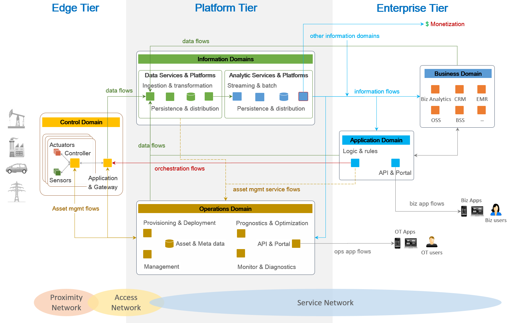

:lang: no
:doctitle: The Industrial Internet of Things Reference Architecture (IIRA IIoT)
include::../plattform_felles/includes/commonincludes.adoc[]

[.lead]
_The Industrial Internet of Things Reference Architecture (IIRA IIoT)_ is the foundational framework for all other technical documents and technical activities of The Industrial Internet Consortium.

////
////

== Introduksjon
This standards-based architectural template and methodology enables Industrial Internet of Things (IIoT) system architects to design their own systems based on a common framework and concepts.

Figur: Arkitekturmodell fra IIRA som viser arkitekturlagog funksjonsområder[tree,file=""]
--
Notebooks
`--TeamsNotebook(Shared).url
--r. 

== Videre informasjon

Dokumentasjon av IIRA finnes under https://www.iiconsortium.org/IIRA.htm

