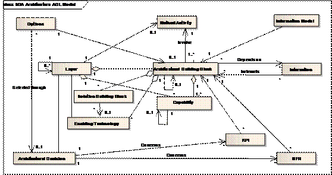
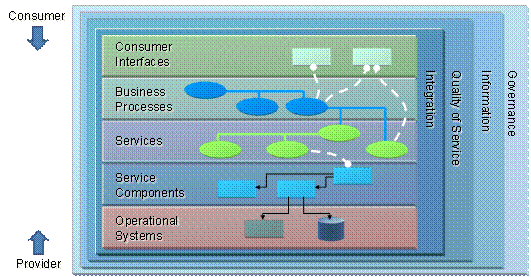
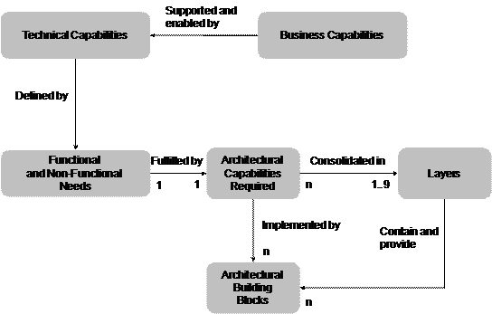
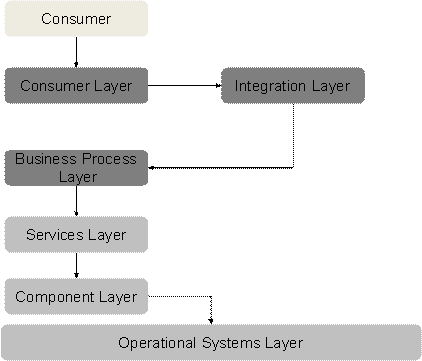

:lang: en
:doctitle: The Open Group SOA Reference Architecture (TOG SOA RA)
include::../plattform_felles/includes/commonincludes.adoc[]

[.lead]
The SOA RA gives guidelines and options for making architectural, design, and implementation decisions in the implementation of solutions. The goal is to provide a blueprint for creating or evaluating architecture.

////
////

== Introduction to SOA RA

include::../kunnskap_referansearkitektur_tog-soa-ra/intro-tog-soa-ra.adoc[]

//== Service-Oriented Architecture Ontology

== SOA RA Metamodel

.Figure: SOA RA Metamodel

== SOA RA Layers
.Figure: Logical Solution View of the SOA RA

== Capabilities and the SOA RA
=== General
A capability, as defined by The Open Group, is: “an ability that an organization, person, or system possesses”

.Figure: Relationships among Requirements, Capabilities, Building Blocks, and Layers

.Figure: Typical Interactions among the Layers of the SOA RA, Capabilities, Building Blocks, and Layers

=== Operational Systems Layer

There are multiple categories of capabilities that the Operational Systems Layer needs to support. These categories of capabilities are:

==== Service Delivery:

This category of capabilities is required for delivery of the functional elements of services. This includes the finding of the components implementing the services, the wrapping and the composition/ decomposition of the underlying services, and the implementation of the services.

Capabilities:

Ability to locate components implementing services
Ability to host applications and functionality to deliver service features
Ability to host databases needed for service implementation
Ability to host legacy systems needed for service implementation
Ability to act as a broker between services requests and invoking implementations
Ability to map service functional requirements to underlying or legacy solution
Ability to compose service function from underlying services and implementation of services
Ability to wrap custom and legacy platforms for service implementation
Ability to find Service Component associated with Solution Building Blocks
Ability to delegate request or invoke Solution Component for service
Runtime Environment
Ability to support operating systems platforms
Ability to support runtime hosting platforms
Ability to support runtimes of software needed to run service implementation
Ability to support runtimes and software needed to deploy service implementations
Ability to run supporting ABBs and Solution Building Blocks from other layers of the SOA RA
Ability to support the software environment in which the Solution Component runs
Virtualization and Infrastructure Services
Ability to provide infrastructure needed by runtime infrastructure
Ability to provide infrastructure in a virtualized manner to platforms
Ability to provide infrastructure in a virtualized manner to service implementation
Ability to manage infrastructure and virtualized infrastructure
Ability to provide a single point of control for security of the Operational Systems Layer

==== Runtime Environment: 

This category of capabilities is required for providing a runtime environment representing runtime infrastructure for SOA. This includes capabilities to support both the components required to support service functionality and those required to actually run the components and building blocks of the SOA RA itself. This includes capabilities for the hardware, operating system components and the Solution Building Blocks, which are the runtime instances or realizations of the ABBs of all layers in the SOA RA that have been selected for inclusion in a particular operating environment.

Capabilities:

==== Virtualization and Infrastructure Services: 

This category of capabilities provides underlying infrastructure such as computing power, network, storage, etc. in native or a virtualized manner.
This layer features the following capabilities:

Capabilities:

=== References:

. link:http://www.opengroup.org/soa/source-book/soa_refarch/p6.htm[Capabilities and the SOA RA].
