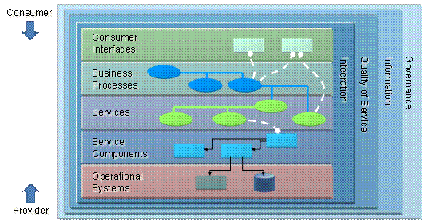
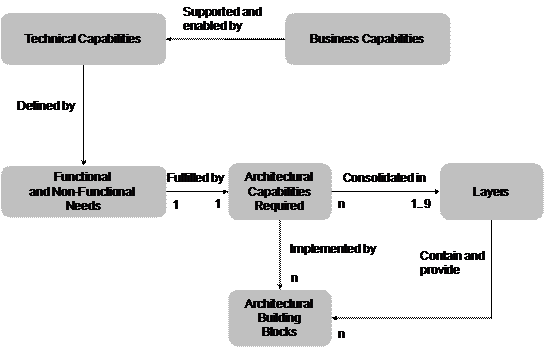

:lang: en
:doctitle: Introduction to The Open Group SOA Reference Architecture (TOG SOA RA)
include::../plattform_felles/includes/commonincludes.adoc[]

////
////

The link:http://www.opengroup.org/soa/source-book/soa_refarch/index.htm[SOA RA] is part of the link:http://www.opengroup.org/soa/source-book/intro/index.htm[SOA Source Book], published by link:https://www.opengroup.org/[The Open Group].

//== Service-Oriented Architecture Ontology

The SOA RA defines a set of logical Layers, the    Capabilities within each layer, the relationships between Capabilities and the mapping to Building Blocks.

.Figure: Logical Solution View of the SOA RA

The most important concepts and how they relate is illustrated by the following figure.

.Figure: Relationships among Requirements, Capabilities, Building Blocks, and Layers

NOTE: A capability, as defined by The Open Group, is: “an ability that an organization, person, or system possesses”

