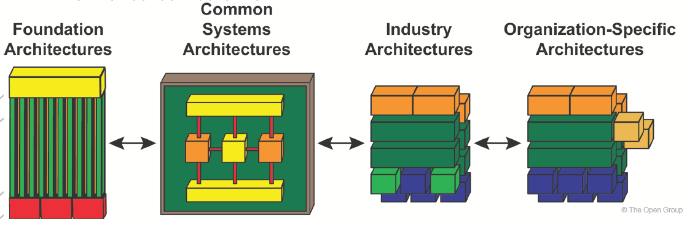

:lang: no
:doctitle: Arkitekturkontinuum
:keywords: Togaf

include::../plattform_felles/includes/commonincludes.adoc[]

[.lead] 
TOGAF bruker ordet "continuum" i kontekst av virksomheter, arkitekturer og løsninger. Det finnes et tilsvarende ord på norsk, men betydningen er ukjent for mange. Hva menes?

== Om begrepet kontinuum 
I kontekst av TOGAF og virksomhetsarkitektur, dreier begrepet _kontinuum_  seg om den glidende overgangen fra generiske til spesifikke arkitekturer og løsninger, samt om en grovkornet klassifisering av arkitekturer innenfor dette bildet.

NOTE: Store Norske Leksikon sier blant annet følgende om ordet kontinuum; ref. https://snl.no/kontinuum: Kontinuum er et sammenhengende hele eller en sammenhengende mengde; noe som er vedvarende eller fortløpende, en kontinuitet.
I matematikk er et kontinuum en mengde der man kan gjøre bruk av grensebetraktninger.

NOTE: På norsk kan ordet spektrum i en utvidet forstand fungere bedre for mange. Om dette sier Store Norske Leksikon blant annet følgende; ref. https://snl.no/spektrum_-_fremstilling: I et kontinuerlig spektrum kan størrelsen anta alle mulige verdier innen et bestemt område. I et diskontinuerlig spektrum forekommer bare bestemte verdier av størrelsen.

== Arkitekturkontinuum - glidende overgang fra generiske til spesifikke arkitekturer

TOGAF 9.2 illustrerer den glidende overgangen fra generiske til spesifikke arkitekturer som vist i følgende figur:
 

// #img-togaf-architecture-continuum-summary] 
.Arkitekturkontinuum - overgang fra generiske til spesifikke arkitekturer

== Inndeling av arkitekturkontinuum for klassifisering av arkitekturer
TOGAF 9.2 gjør en inndeling av det totale bildet i fire _delmengder_ som egner seg for å klassifisering av arkitekturer:

.Klassifisering i grunnleggende, felles (nasjonale), industri- (sektorspesifikke) og organisasjonsspesifikke arkitekturer

Eksempler:

* Grunnleggende arkitekturer _(en: foundation architecture)_: F.eks. EIRA, #ref. TBD#. 

* Felles arkitekturer: Nasjonale referansearkitekturer, f.eks. innen datadeling.

* Industriarkitekturer: Sektorspesfisikke arkitekturer, f.eks. innen helsesektoren.

* Organisasjonsspesifikke arkitekturer: F.eks. #TBD#.  

== Virksomhetskontimuum - arkitekturer,  løsninger og kontekst

.TOGAF Enterprise Continuum

TOGAF Enterprise Continuum som klassifisering for arkitekturbiblioteket:

