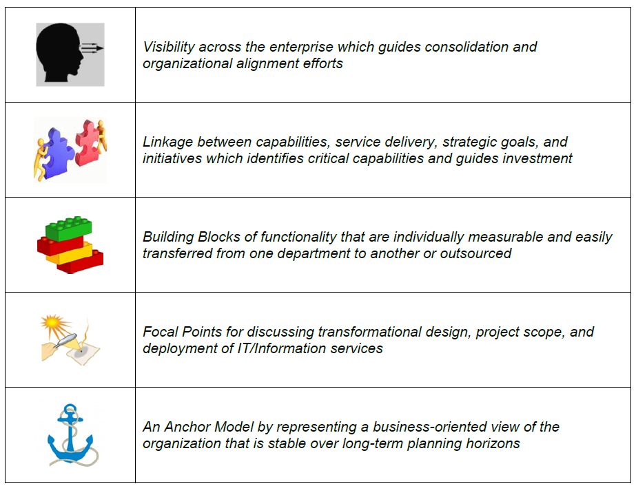
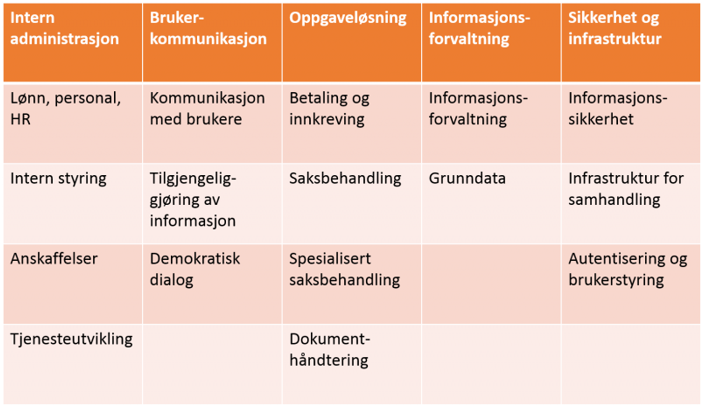
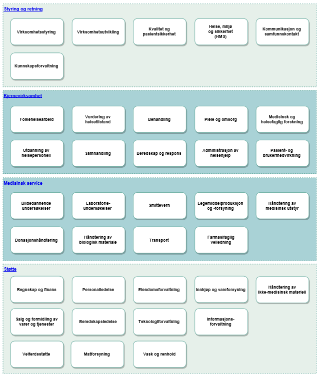
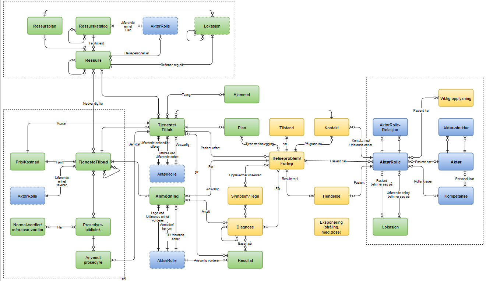
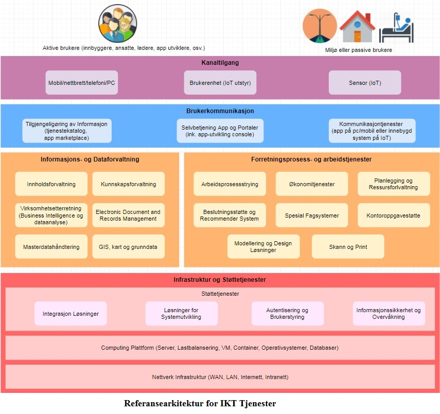
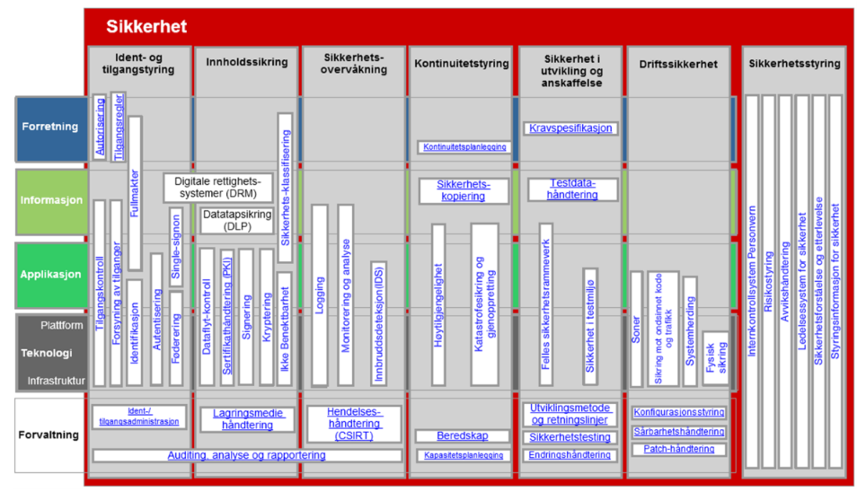
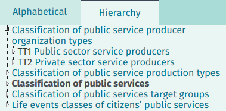
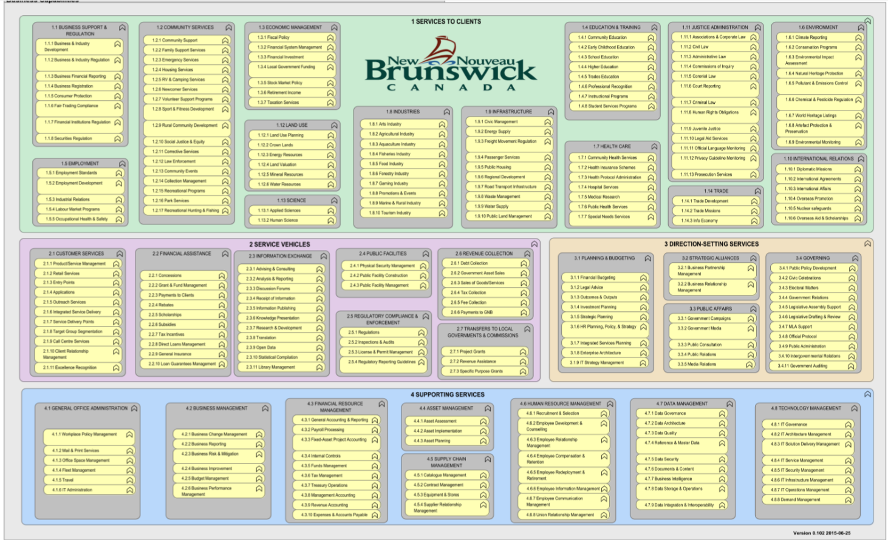

= Klassifikasjonssystemer - hvem, hva, hvorfor
Erik Hagen, Difi

_Merk: Anbefalinger og øvrig innhold i dette notatet står inntil videre for underegnedes regning, og representerer ikke nødvendigvis Difis syn._

:toc: left

== Overordnet sammendrag

Et nasjonalt arkitekturbibliotek behøver en standardisert, fast struktur som sikrer konsistens og enkel gjenfinning, noe som vil bli stadig viktigere etterhvert som arkitekturlandskapet vokser og må integreres på tvers av mange aktører. For dette behøves klassifisering med separate taksonomier for tjenester/prosesser, IT-systemer, data og kapabiliteter. En slik standardisert klassifisering tjener samtidig flere formål, og vil kunne fungere som en viktig katalysator for samhandling og innovasjon, både innen sektorer og på tvers av sektorer.

Det finnes en rekke standarder og systemer med ulike tilnærminger og detaljeringsnivåer, både nasjonalt og internasjonalt, uten at det per i dag finnes noe fullgodt system for dette i tverrsektoriell sammenheng i Norge. Legg merke til at det her dreier seg om behov som ikke uten videre dekkes av mer generelle vokabularer, slik som f.eks. LOS (Difi), Eurovoc (EU) eller den planlagte, nasjonale begrepskatalogen (Altinn). En helt annen sak er at informasjonselementer i arkitekturbiblioteket godt kan tagges med slike, diverse, begreper i tillegg til den standardbaserte, faste klassifiseringen.

Kort oppsummert er formålet: Etablere struktur, felles språk og standarder som fremmer interoperabilitet, eierstyring, sammenhengende tjenester, automatisering, forenkling, felles tjenester, gjenbruk, viderebruk, samordning, top-down behovskartlegging, porteføljestyring og felles dokumentasjon i et nasjonalt arkitekturbibliotek; alt dette som bidrag til kostnadseffektivitet, effektiv samhandling, innovasjon og digital transformasjon.

For at dette skal fungere etter hensikten, behøves en viss detaljeringsgrad. Slik dette er gjort av enkelte andre land, opererer en f.eks. med flere hundre spesifikke sluttbrukertjenester for borgere og virksomheter på laveste nivå. Det sier seg selv at det vil være en krevende oppgave å etablere et velfungerende slikt rammeverk på tvers av «alle» sektorer og virksomheter.

Hva er «riktig» ambisjonsnivå og tilnærming nå, per 2018 i Norge?

Dette notatet konkluderer med følgende anbefalinger:

* Start snarest arbeidet med å etablere tverrsektorielle klassifikasjonssystemer i Norge, der en henter inspirasjon og innhold fra andre land som ligger foran i utviklingen (eks. New Zealand). Dette må gjøres i et tverrsektorielt samarbeid der blant andre kommunal sektor og helsesektoren er med. Bidrag fra privat sektor bør vurderes.
* Søk internasjonalt samarbeid rundt dette med arkitekturmiljøer i utvalgte land (eks. Danmark), eventuelt gjennom deltakelse i etablerte samarbeidsfora (eks. Digital 7).
* Delta i internasjonalt standardiseringsarbeid rundt Goverment as a Platform eller tilsvarende (eks. The Open Group).

== Innledning

Hensikten med dette notatet er å gi innspill til diskusjoner rundt behov, omfang og tilnærming til videre arbeid med etablering av et _standardisert, tverrsektorielt klassifikasjonssystem i Norge._

Primær målgruppe er virksomhetsarkitekter.

Klassifikasjonssystemer regnes i dette notatet som en type referansearkitektur. https://www.difi.no/fagomrader-og-tjenester/digitalisering-og-samordning/nasjonal-arkitektur/samhandlingsarkitektur#Norsk%20arkitekturrammeverk%20for%20samhandling[Norsk arkitekturrammeverk for samhandling] beskriver konseptene rundt et Arkitekturbibliotek, der blant annet Standarder og Referansebibliotek (med referansearkitekturer) inngår.

Notatet gir (utkast til) en oversikt over relevante, eksisterende klassifikasjons-systemer, samt hvilke organisasjoner som arbeider med utvikling og standardisering. Det gis også betraktninger rundt visjon, formål, omfang, detaljeringsnivå og tilnærming; og det er tatt med omtale av noen aktuelle temaer og sammenhenger.

Merk: Oversiktene som gis i dette notatet vil ikke være «komplette» Temaet er svært omfattende, og med uklare grenseoppganger til andre temaer. Oversiktene bør arbeides videre med, enten i nye versjoner av dette notatet, eller på andre måter.

Relaterte temaer og sammenhenger som berøres i dette notatet som bakgrunnsmateriale for felles forståelse:

* Kapabilitetsbasert analyse og planlegging
* Tjenestemodellering
* Forholdet til tjenestekatalog, datakatalog
* Forholdet til virksomhetsarkitektur
* Forretningsarkitektur vs. virksomhetsarkitektur
* Government as a platform
* Behovskartlegging og prioritering
* Offentlige produkter og tjenester vs. private produkter og tjenester

== Begrepsapparat i dette notatet

[cols=",",options="header",]
|======================
|*Begrep* |*Forklaring*
|Kapabilitet |
|Referansearkitektur |
|… |
|======================

Kommer her: Sentrale begreper i Archimate.

== Betraktninger som innspill til debatt

=== Visjon

Gjenstår! Foreløpige stikkord:

* Government as a platform
* …

=== Formål

==== Oppsummering

Formål sagt i en (lang) setning: Etablere struktur, felles språk og standarder som fremmer interoperabilitet, sammenhengende tjenester, felles tjenester, automatisering, gjenfinning, gjenbruk, viderebruk, forenkling, benchmarking, samordning, behovskartlegging, porteføljestyring og felles dokumentasjon i et nasjonalt arkitekturbibliotek; alt dette som bidrag til bedre kostnadseffektivitet og mer effektiv samhandling, innovasjon og digital transformasjon.

Formål sagt på en side (i arbeid):

* Strukturering av arkitekturbiblioteker, med egne taksonomier for tjenester/prosesser, IT-systemer, data og kapabiliteter.
* Effektiv utvikling og innovasjon gjennom et minimum av struktur
* Kostnadseffektivitet gjennom å fjerne redundans og få til effektiv utvikling og innovasjon
* Effektiv samhandling gjennom standarder og referansearkitekturer
* Viderebruk av _fellestjenester_ (eller fellesløsninger/felleskomponenter) gjennom felles oversikt, søk og gjenfinning
* Gjenbruk av _felles løsninger_ gjennom identifikasjon av eksisterende eller planlagte løsninger
* Interoperabilitet og sammenhengende tjenester gjennom redusert kompleksitet (dvs. enklere å oppnå)
* Redusert kompleksitet gjennom redusert redundans
* Identifikasjon av redundans innen og på tvers av virksomheter, for å angi muligheter for kostnadsreduksjon, samarbeid, fellestjenester og gjenbruk i virksomhetenes IT-porteføljer
* Styring gjennom definisjon av eierskap til tjenester, data og kapabiliteter
* Samordning gjennom identifikasjon av gap i funksjonalitet innen og på tvers av virksomheter, for å få øye på investeringsbehov for å forbedre brukerrettede tjenester og relaterte støttefunksjoner (på ulike nivåer - virksomheter, klynger, sektorer).

* Ytelsesmålinger og sammenlikninger med andre (benchmarking) gjennom standardiserte KPI-er…

* …

==== Formål ref. Difis tidligere arbeid med funksjonsområder

Ref. https://www.difi.no/fagomrader-og-tjenester/digitalisering-og-samordning/nasjonal-arkitektur/klassifisering-av-it-losninger[https://www.difi.no/fagomrader-og-tjenester/digitalisering-og-samordning/nasjonal-arkitektur/klassifisering-av-it-losninger]: (uthevinger lagt på her):

Formålet med å lage et felles språk for klassifisering av IT-løsninger er å legge bedre til rette for gjenbruk av løsninger på tvers av offentlig sektor.

Felleskomponentene er norsk forvaltnings mest sentral fellesløsninger. Men *felles løsninger* - bevisst skrevet i to ord - slik det blir brukt her, favner bredere. I prinsippet er det snakk om en *løsning som kan gjenbrukes av en annen offentlig virksomhet*

_Felles IKT-løsninger for å dekke like behov er et viktig effektiviseringstiltak. (...) Fellesløsninger kan sees på som byggeklosser som offentlige virksomheter kan dra nytte av i sine digitale tjenester. Løsningene utvikles en gang og er tilgjengelige for alle. (...) Ved å bruke fellesløsninger kan offentlige virksomheter gjenbruke både funksjonalitet og informasjon. Samtidig kan bruk av fellesløsninger bidra til at tjenestene blir mer gjenkjennbare for brukerne. _

_Digital agenda for Norge, Meld. St. 27 (2015-2016), s. 73-74._

Som sitatet fra stortingsmeldingen Digital agenda for Norge viser, ønsker regjeringen mer gjenbruk av it-løsninger i offentlig sektor. Men en *forutsetning for at dette skal lykkes er at de som gjennomfører digitaliseringsprosjekter får bedre oversikt over hvilke løsninger som er felles eller gjenbrukbare*.

En slik klassifisering som vi foreslår her vil på sikt innebære at de som har ansvar for digitaliseringsprosjekter vil kunne *slå opp i en katalog for å finne gjenbrukbare løsninger* også i sine egne prosjekter. *Dette vil føre til mindre duplisering av løsninger, og dermed mer effektiv ressursbruk for det offentlige*.

==== Formål ref. New Zealand

Fritt oversatt fra ref. ….

===== Fra executive summary

Klassifikasjonsrammeverket omfatter et sett av referansetaksonomier som beskriver og kategoriserer aktiva og funksjonalitet på en felles, tverrsektoriell måte. Disse referansetaksonomiene brukes til

a.  Felles begrepsapparat
* Forutsetning for interoperabilitet på alle nivåer (EIF), samt mellom tjenester, informasjon, systemkomponenter og teknologikomponenter.
* Redusere kompleksitet ved å abstrahere, organisere og forenkle kompleks informasjon.
* Forbedre konsistens og sammenheng mellom tverrsektorielle tjenester, fellestjenester og felles kapabiliteter.
* Gi konsistente beskrivelser og visninger av operasjonelle og tekniske tjenester med som det ofte er behov for.
b.  Forbedre effekt, utnyttelse og kostnadseffektivitet av IKT på tvers av hele forvaltningen:
* Identifisere muligheter for gjenbruk av felles løsninger.
* Støtte utvikling og leveranser av sammenhengende og interoperable byggeklosser
* Støtte arbeid med informasjonsforvaltning og datadeling

===== Forøvrig

Elementer og begreper i taksonomien danner grunnlag for å utvikle spesifikke referansearkitekturer og mønstre, samt for å definere kapabiliteter. Referansearkitekturer og mønstre egner seg i tur bedre for å bli anvendt på tvers av sektorer når begrepene fra referansetaksonomiene er brukt på en konsistent måte.

Bruksområder:

* Identifikasjon av redundans innen og på tvers av virksomheter, for å angi muligheter for kostnadsreduksjon, samarbeid, fellestjenester og gjenbruk i virksomhetenes IT-porteføljer.
* Identifikasjon av gap i funksjonalitet innen og på tvers av virksomheter, for å få øye på investeringsbehov for å forbedre brukerrettede tjenester og relaterte støttefunksjoner på ulike nivåer (virksomheter, klynger, sektorer).
* Mapping av tjenester og kapabiliteter på tvers av sektorer, klynger og virksomheter.

==== Formål ref. Western Australian Government

==== Formål ref. APQC

Ref. https://www.apqc.org/pcf[https://www.apqc.org/pcf]:

Fritt oversatt:

* Felles språk for kommunikasjon og samhandling
* Definer arbeidsprosesser komplett og uten redundans
* Ytelsesmålinger og sammenlikninger med andre (benchmarking)
* Understøtter innholdsforvaltning
* Understøtter prosessforbedring

==== Formål ref. Government of New Brunswick, Canada

Government of new Brunswick har dokumentert en Business Capability Reference Model, i ref. XXXXXXXXXXXXXX datert 27. juli 2015. Dette dokumentet grunngir arbeidet med denne referansemodellen slik:

Forretningsorientert kapabilitetsmodellering (BCM) er antitesen på den historisk utdaterte, silobaserte forvaltningsmodellen, gjennom å tilby et klarere bilde av hver enkelt kapabilitet (sammensatt av mennesker, prosesser og teknologi) som tillater virksomhetene å eksekvere bedre på sine strategier. Ikke hvordan …………………………………………………………………………………………………

_Business Capabilities Modelling (BCM) is the antithesis of the siloed model of governments past, because it offers a clearer view of each individual capability (composed of people, process, and technology) that allows the organization to better execute on its strategy. Not how we do things, nor why: an assembly of all the “whats” that we do. BCM is a revolutionary and powerful approach for aggregating strengths and spotting gaps in the capabilities we need to fulfill our mandate to serve the people of New Brunswick, particularly in a rapidly changing environment. BCM makes us agile and responsive to any new needs of our clients and stakeholders, because we have an inventory of the tools we can use to serve them. We know what’s in the toolbox – and can quickly identify what’s missing as a new challenge arises. _

_…_

_…_

_A Business Capability is a particular ability of an enterprise to achieve a specific purpose or outcome. It describes what the business does that creates value for customers without consideration of who does it or how it is carried out. The concept originated from early studies on value chains and has most recently been promoted by Gartner, IBM, Microsoft, Business Architecture Guild and others. Perhaps its most valuable application has been in providing the linkage between the strategic intentions of an enterprise and the various resources employed to achieve them. In particular, where many of those resources relate to Information technology, it has provided a business focus that effectively engages non-IT stakeholders. In essence, it has "raised the game" from the traditional view of maximizing value through effective resource management to that of maintaining a strategic portfolio of capabilities. _

_In terms of contemporary approaches to Enterprise Architecture, Business Capability Management has been positioned as a key activity in the development of both the Vision and Business Architecture layers. More specifically, it has been adopted by many as a mature approach to Phase A and B of the TOGAF Architecture Development Method as depicted in the illustration above. _

_…_

_…_

_While the development of a Business Capability Map is important, the value to the enterprise is in the assessment of its capabilities and how well they support the strategic objectives. This has been summed up very effectively by Larry Bossidy and Ram Charan in their In their ground-breaking 2002 book, “Execution, The Discipline of Getting Things Done”:_

* Synlighet på tvers for å få øye på muligheter for konsolidering og samordning
* Sammenheng mellom kapabiliteter, tjenesteleveranser, strategiske mål og initiativer, for å identifisere kritiske kapabiliteter og rettlede investeringer
* Byggeklosser av funksjonalitet som er individuelt håndterbare og som enkelt kan overføres mellom aktører eller outsources.
* Instrumenter «Fokale punkt» for å diskutere transformasjonsdesign, prosjektomfang og utplassering av IKT-tjenester.
* Ankerfeste for langsiktige planleggingshorisonter, i form av stabile, funksjonelle (forretningsorienterte) representasjoner av virksomheten (kapabiliteskart).

==== Formål ref. BIAN

==== Formål ref. …

=== Omfang, detaljeringsnivå og avgrensing

Gjenstår! Foreløpige stikkord:

* Offentlige og private tjenester må langt på vei ses under ett,– privatisering skjer. Og motsatt – enkelte oppgaver overtas av det offentlige
* Det behøves detaljering til et nivå som gir konkret mening, f.eks. ref. New Zealands tre nivåer

=== Prinsipper og krav til klassifikasjonssystemer

Gjenstår! Foreløpige stikkord:

* Sjekk prinsipper fra New Zealand, Western Australia
* Konkret krav: Ta utgangspunkt i omfang

Erik:

6 Ways to Organize Your Architecture Models Part 1

http://blog.bizzdesign.com/6-ways-to-organize-your-architecture-models-part-1[http://blog.bizzdesign.com/6-ways-to-organize-your-architecture-models-part-1]

6 Ways to Organize Your Architecture Models Part 2

http://blog.bizzdesign.com/6-ways-to-organize-your-architecture-models-part-2[http://blog.bizzdesign.com/6-ways-to-organize-your-architecture-models-part-2]

For the technology part of the architecture, a business-oriented structure often makes less sense, as much of the technical infrastructure of an enterprise cuts across business or information domains

It’s important to note that the process for creating these models is very different. *When describing the current state*, it is often easiest to *start with what is called ‘structure’ in the ArchiMate modeling language*: the organization, applications, software platforms and devices that are readily visible in your enterprise. From there, you can look at their behavior: the processes, services and functions provided by these structure elements. In a next step, you might then look for commonalities and opportunities for synergy or rationalization, just as an example.

*When designing a future-state architecture*, however, you will often work the other way around: *first you define the services* you require to solve your business problem, then you outline the processes and functions that need to provide the services. Once that is complete, only then do you decide on the structure elements that will perform this behavior and deliver these services. This avoids the common trap of constraining your possible design solutions by the structures you know (i.e. components, systems, products, etc.), especially early on in the design process.

=== Tilnærming

Gjenstår! Foreløpige stikkord:

* Tverrsektorielt samarbeid
* Internasjonalt samarbeid
* Deltakelse i eksisterende fora
* Deltakelse i internasjonalt standardiseringsarbeid

== Relaterte temaer og sammenhenger

=== Government as a platform

https://www.computerweekly.com/opinion/Time-to-get-mapping-how-a-blind-government-can-develop-sight[https://www.computerweekly.com/opinion/Time-to-get-mapping-how-a-blind-government-can-develop-sight]

=== Business process interoperability

Ref. https://en.wikipedia.org/wiki/Business_process_interoperability[https://en.wikipedia.org/wiki/Business_process_interoperability]

Business process interoperability (BPI) is a property referring to the ability of diverse business processes to work together, to so called "inter-operate" It is a state that exists when a business process can meet a specific objective automatically utilizing essential human labor only. Typically, BPI is present when a process conforms to standards that enable it to achieve its objective regardless of ownership, location, make, version or design of the computer systems used.

Fritt oversatt:

Maksimal automatisering av arbeidsprosesser forutsetter prosessinteroperabilitet der samspillende prosesser hver for seg opererer i henhold til standarder som definerer resultatet uavhengig av løsninger eller teknologi.

Ref. http://i.gov.ph/policies/draft/pegif-business-process-interoperability-framework/[http://i.gov.ph/policies/draft/pegif-business-process-interoperability-framework/] (Filippinene, 2016):

Achieving inter-agency interoperability is a daunting but not impossible endeavor.

_Prinsipp 5:_

_The collaborating agencies must adopt a common standard_ – Compatibility is necessary for interoperability. This goes beyond technological standards, agencies must adopt common practices, vocabularies and objectives for their system. Following a common standard allows the group to efficiently and harmoniously work together. These standards must be made available to the whole-of-government, in the spirit of collaboration and transparency. Agencies must refer to the other PeGIF documents for the standards used in the Philippine government, such as the Technical Standards Catalog and the methods for achieving Information Interoperability.

=== Tjenestemodellering

=== Kapabilitetsbasert planlegging

Relevans: …

Ref, Marc Lankhorst (Bizzdesign):

* http://blog.bizzdesign.com/archimate-3-strategy-concepts-and-capability-based-planning[http://blog.bizzdesign.com/archimate-3-strategy-concepts-and-capability-based-planning]
* http://blog.bizzdesign.com/archimate-3.0-capability-mapping[http://blog.bizzdesign.com/archimate-3.0-capability-mapping]
* http://blog.bizzdesign.com/archimate-3.0-capability-analysis[http://blog.bizzdesign.com/archimate-3.0-capability-analysis]
* http://blog.bizzdesign.com/archimate-3.0-capability-realization[http://blog.bizzdesign.com/archimate-3.0-capability-realization]

Relatert stoff fra Marc Lankhorst:

* http://blog.bizzdesign.com/why-adding-a-value-stream-element-to-archimate-is-key[http://blog.bizzdesign.com/why-adding-a-value-stream-element-to-archimate-is-key]
* http://blog.bizzdesign.com/why-business-outcome-journey-maps-area-useful-technique-for-business-architects[http://blog.bizzdesign.com/why-business-outcome-journey-maps-area-useful-technique-for-business-architects]

=== Offentlige produkter og tjenester vs. private produkter og tjenester

=== Behovskartlegging og prioritering

=== Forholdet til tjenestekatalog, datakatalog og begrepskatalog

=== Forholdet til virksomhetsarkitektur

=== Forretningsarkitektur vs. Virksomhetsarkitektur

Business Architecture: Putting “Business” into Enterprise Architecture ref. 
http://c.ymcdn.com/sites/www.businessarchitectureguild.org/resource/resmgr/Putting_Business_into_Busine.pdf[http://c.ymcdn.com/sites/www.businessarchitectureguild.org/resource/resmgr/Putting_Business_into_Busine.pdf]

image:./media/image3.emf[image,width=415,height=216]

Forretningsarkitektur ref. Wikipedia:

Wikipedia gir en interessant framstilling av forretningsarkitektur, ref. https://en.wikipedia.org/w/index.php?title=Business_architecture&oldid=824427986[https://en.wikipedia.org/w/index.php?title=Business_architecture&oldid=824427986] (permanent lenke februar 2018)……

Fra BIZBOK:

image:./media/image4.emf[image,width=514,height=335]

== Aktører

=== Norske offentlig for samordning ogsamarbeid

==== Difi

==== Standardiseringsrådet

==== Skate

==== KS

==== Direktoratet for eHelse

==== Nasjonal IKT

==== Kommunesamarbeid

==== Trondheim Kommune

==== …

=== Internasjonale offentlige samarbeid

==== The Digital 7

Generelt

Ref. https://en.wikipedia.org/wiki/Digital_5[https://en.wikipedia.org/wiki/Digital_5]

The Digital 7 or D7 (previously called Digital 5, or D5), is a network of leading digital governments with the goal of strengthening the digital economy.[1] The members are bonded by the principle of openness; they are focused on changing government's relationship with technology by adopting open standards and open-source software as well as making digital government more effective. They intend to bring in digital skills in-house and encourage short-term contracts with small and medium business suppliers. Discussions at their inaugural meetup included connectivity, teaching children to code, and open markets.[2] The group will meet annually to showcase digital accomplishments by governments around the world.

Relevans

Uklart. Gjenstår: Sjekk nærmere?

==== The Nordic Institute for Interoperability Solutions (NIIS)

Generelt

https://www.niis.org/[https://www.niis.org/]

The Nordic Institute for Interoperability Solutions (NIIS) is an association founded jointly by Finland and Estonia. Its mission is to develop e-governance solutions, kicking off with the X-Road technology used nationwide in the Estonian X-tee and in the Finnish Suomi.fi Data Exchange Layer service.

NIIS is both a network and cooperation platform, and executioner of IT developments in members’ common interests. The institute focuses on practical collaboration, sharing of experience and promoting innovation. The operating model of the institute is something quite unique in the world

Relevans

NIIS som «operating model» er interessant, men dekker https://en.wikipedia.org/wiki/X-Road[X-Road] semantisk interoperabilitet? Gjenstår: Sjekk!

=== Internasjonale standardiseringsaktører

==== EU

EU-standarder:

EIF og EIRA

CEF…

==== UN/FN

==== The Open Group

==== W3C

==== OMG

==== OASIS

==== ISO

=== Internasjonale, ideelle organisasjoner

==== ABPMP

==== IIBA - International Institute of Business Analysis

http://www.iiba.org/[http://www.iiba.org/]

IIBA® is the non-profit professional association dedicated to the field of business analysis. Through a global network, IIBA connects over 29,000+ Members and more than 300 Corporate Members and 120 Chapters. As the voice of the business analysis community, IIBA supports the recognition of the profession and discipline and works to maintain the global standard for the practices and certification.

==== The Business Architecture Guild

https://en.wikipedia.org/w/index.php?title=Business_architecture&oldid=824427986#Industry_reference_models[https://en.wikipedia.org/w/index.php?title=Business_architecture&oldid=824427986#Industry_reference_models]

The primary purpose of the Business Architecture Guildhttps://en.wikipedia.org/w/index.php?title=Business_architecture&oldid=824427986#cite_note-BAG-15[^[15]^] is "to promote best practices and expand the knowledge-base of the business architecture discipline." The Guild is a not for profit, international membership organization for practitioners and others interested in the developing the field of business architecture. With members on six continents, a strong Advisory Board and a growing number of business partners, the Guild positions itself as a focal point for the evolving practices and disciplines of business architecture.

Founded in late 2010, the Guild opened up membership in the fall of 2011 based on the initial release of A Guide to the Business Architecture Body of Knowledge(R) (BIZBOK(R) Guide).

==== IHE - Integrating the Healthcare Enterprise

Ref. http://www.ihe.net/[http://www.ihe.net/]:

IHE is an initiative by healthcare professionals and industry to improve the way computer systems in healthcare share information. IHE promotes the coordinated use of established standards such as DICOM and HL7 to address specific clinical needs in support of optimal patient care. Systems developed in accordance with IHE communicate with one another better, are easier to implement, and enable care providers to use information more effectively.

Ref. https://kilden.sykehusene.no/display/AR/Internasjonale+standarder+i+helsesektoren#Internasjonalestandarderihelsesektoren-IHE-IntegratingtheHealthcareEnterprise[https://kilden.sykehusene.no/display/AR/Internasjonale+standarder+i+helsesektoren#Internasjonalestandarderihelsesektoren-IHE-IntegratingtheHealthcareEnterprise]:

IHE har opprinnelse i det amerikanske radiologimiljøet, er et felles initiativ fra helsevesenet og leverandører for å forbedre hvordan ulike systemer kan utveksle opplysninger. IHE fremmer bruken av etablerte standarder for å løse spesifikke kliniske behov for å få til optimal pasientbehandling. IHE utarbeider forskjellige detaljerte rammeverk som skal gjøre det lettere å implementere standarder. IHE har i stor grad prioritert DICOM- og HL7-standarder, men de prinsippene de arbeider etter er universelle. I Europa benyttes de også for andre typer standarder.

Innenfor IHE har integrasjonsprofiler stått sentralt. Disse utarbeides av brukere og leverandører i samarbeid, og gir retningslinjer for hvordan systemer skal implementeres og konfigureres for å kunne ”snakke sammen” på en standardisert måte. IHE’s integrasjons-profiler er innrettet mot reelle problemområder, basert på arbeidsflyt og informasjons¬utveksling. Integrasjonsprofilene illustrerer kravene til arbeidsflyt og utveksling av klinisk informasjon mellom IT-systemene, og viser hvilken informasjon som må utveksles mellom systemene/applikasjonene for å sikre effektive løsninger og konsistente data. Integrasjonsprofilene er organisert i domener:

* Cardiology - Kardiologi
* Eye Care - Øyebehandling
* IT Infrastructure – IT infrastruktur
* Laboratory - Laboratorie
* Pathology - Patologi
* Patient Care Coordination – Koordinering av pasientbehandling 
* Patient Care Devices - Pasientbehandling
* Quality - Kvalitet
* Radiation Oncology - Strålebehandling 
* Radiology - Radiologi

Sentralt i IHEs arbeid står arrangementet "Connectathon" hvor leverandører stiller opp med sine systemer og gjennomfører omfattende interoperabilitetstesting basert på integrasjonsprofiler. Resultatet av disse testene publiseres, og leverandørene kan i sin markedsføring referere til resultatene. IHE er imidlertid ingen sertifiseringsorganisasjon som godkjenner systemer.

"Connectathon" er et meget bra konsept som må videreføres/kopieres når man skal verifisere om leverandører følger norske implementeringsguider for meldinger og teknologibinding.

IHE anbefales brukt der hvor det er god match mellom IHE’s integrasjonsprofiler og det funksjonelle området som skal løses. For IHE’s profiler som tas i bruk må det utarbeides nasjonale retningslinjer for meldinger samt utarbeides eksempler på bruk av disse. 

=== Analysebyråer

==== Gartner

Gjenstår: Sjekk følgende Gartner-artikler:

1.  https://www.gartner.com/doc/3869282?ref=SiteSearch&sthkw=government%20services%20classification%20framework&fnl=search&srcId=1-3478922254[Improving Data Security Governance Using Classification Tools] (2018)
2.  https://www.gartner.com/doc/3738022?ref=SiteSearch&sthkw=government%20services%20classification%20framework&fnl=search&srcId=1-3478922254[Market Guide for Enterprise Business Process Analysis] (2017)
3.  https://www.gartner.com/doc/3843668?ref=SiteSearch&sthkw=government%20reference%20architecture&fnl=search&srcId=1-3478922254[Transitioning to Digital Government Primer for 2018]
4.  https://www.gartner.com/doc/3767963?ref=SiteSearch&sthkw=government%20services%20classification%20framework&fnl=search&srcId=1-3478922254[Federal Enterprise Architecture-Reference Model Overview] (2011)
5.  https://www.gartner.com/doc/3850365?ref=SiteSearch&sthkw=government%20reference%20architecture&fnl=search&srcId=1-3478922254[Digital Government 2030: Planning for an Uncertain Future] (2018)
6.  https://www.gartner.com/doc/3766875?ref=SiteSearch&sthkw=government%20services%20classification%20framework&fnl=search&srcId=1-3478922254[Compendium of Business Capability Models (PDF)] (2013)
7.  https://www.gartner.com/doc/3835863?ref=SiteSearch&sthkw=government%20reference%20architecture&fnl=search&srcId=1-3478922254[Create a Data Reference Architecture to Enable Self-Service BI]
8.  https://www.gartner.com/doc/3796464?ref=SiteSearch&sthkw=government%20reference%20architecture&fnl=search&srcId=1-3478922254[The Global Impact of Industrie 4.0 Enables and Accelerates Worldwide Digital Business Success] (2017)
9.  https://www.gartner.com/doc/3772086?ref=SiteSearch&sthkw=government%20services%20classification%20framework&fnl=search&srcId=1-3478922254[Hype Cycle for Enterprise Architecture, 2017]

=== Konsulentselskaper og verktøyleverandører

Flere konsulentselskaper og verktøyleverandører har utviklet egne klassifikasjonsrammeverk, som det kan være interessant å hente «inspirasjon» fra.

Noen aktuelle slike:

* Accenture
* Capgemini
* Software AG (tidligere IDS Scheer)
* IBM
* Oracle

Gjenstår: Sjekk ut disse? Husk spesielt arbeid i Capgemini Norge rundt «standardkommunen»; ref. Atle Bergfjord, Capgemini

== Standarder og referansemodeller

=== Norske standarder og referansemodeller

==== Funksjonsområder ref. Difi anno 2016

Generelt

https://www.difi.no/fagomrader-og-tjenester/digitalisering-og-samordning/nasjonal-arkitektur/klassifisering-av-it-losninger[https://www.difi.no/fagomrader-og-tjenester/digitalisering-og-samordning/nasjonal-arkitektur/klassifisering-av-it-losninger]

Struktur

==== KS/Kommuneforlagets Nasjonal tjenestekatalog (NTK)

Generelt

Dokumentet https://1drv.ms/b/s!Ao0VyYhs1XdLhc5BNElaF8e1M1CGEw[Om innholdet i NTK] sier: _Ved å samle alle de utadrettede tjenestene og oppgavene som knytter seg til det brede spekteret av lover og forskrifter som styrer kommunal og offentlig virksomhet, skaper vi en unik oversikt som du ikke vil finne andre steder. Nasjonal tjenestekatalog (NTK) er en database som inneholder beskrivelser av de tjenester som forvaltningen yter sine innbyggere. NTK representerer i første rekke et innhold som kommunen kan abonnere på og bruke for å publisere tjenestebeskrivelser koblet med lokal informasjon på sin egen nettside. Slik blir katalogen et oppslagsverk for innbygger, servicekontor og saksbehandler._

Innholdsmal for tjenestebeskrivelser

Struktur

Kommuneforlagets tjenestekatalog (krever pålogging): http://www.nasjonaltjenestekatalog.no/[http://www.nasjonaltjenestekatalog.no/]

Eksempel på bruk av Kommuneforlagets tjenestekatalog (Askim kommune har lagt ut katalogen eksakt slik de får den fra Kommuneforlaget: https://www.askim.kommune.no/alle-tjenester.197258.no.html[https://www.askim.kommune.no/alle-tjenester.197258.no.html]

Strukturen følger LOS

tjenestebeskrivelsene inn i totalt 14 hovedtemaer som igjen er inndelt i undertema og emneord, til sammen tre nivåer

Arbeid

Barn og familie

Bolig og eiendom

Forbrukerspørsmål

Helse

Individ og samfunn

Innvandring og integrering

Kultur, idrett og fritid

Natur og miljø

Næring

Omsorg, trygd og sosiale tjenester

Rettslige spørsmål

Skatter og avgifter

Skole og utdanning

Trafikk, reiser og samferdsel

Vurdering

Nasjonal tjenestekatalog (NTK) inneholder svært mye verdifull informasjon som egner seg for gjenbruk

==== LOS, Difi

Generelt

https://www.difi.no/rapport/2008/05/los-teknisk-oversikt-og-eksempel-pa-bruk-i-praksis[https://www.difi.no/rapport/2008/05/los-teknisk-oversikt-og-eksempel-pa-bruk-i-praksis]

Los er ein informasjons- og navigasjonsstruktur for å gjere det lettare for innbyggjarane å finne fram til offentlege tenester på Internett.

https://www.difi.no/fagomrader-og-tjenester/digitalisering-og-samordning/nasjonal-arkitektur/los[https://www.difi.no/fagomrader-og-tjenester/digitalisering-og-samordning/nasjonal-arkitektur/los]

Los er en felles terminologi for å beskrive offentlige tjenester og ressurser. Vokabularet er brukerorientert, og kan brukes til å kategorisere for eksempel tjenester, informasjon, datasett og andre ressurser som offentlige virksomheter forvalter. Formålet med Los er å gjøre offentlige ressurser enklere å finne.

Struktur

Gå til http://psi.norge.no/los/struktur.html[HTML-visning ]

Last ned http://psi.norge.no/los/all.rdf[Los] (RDF/XML).

Vurdering

…

==== Nasjonal-IKT (helse)

Generelt

Nasjonal-IKT har definert flere referansemodeller for spesialisthelsetjenesten:

[cols=",",options="header",]
|==========================================================================================================================================================================================================================================================================================================================================
|https://kilden.sykehusene.no/display/AR/Applikasjonsmodell[Applikasjonsmodell] |Applikasjonsmodellen er en klassifikasjonsmodell for applikasjoner i spesialisthelsetjenesten. Modellen er i hovedsak et verktøy til bruk i virksomhet- og porteføljestyring, og benyttes for å fordele eksisterende applikasjoner i separate _domener._
|https://kilden.sykehusene.no/pages/viewpage.action?pageId=51511559[Drift og forvaltning av interregionale IKT-løsninger i spesialisthelsetjenesten] |Modellen er laget for drift og forvaltning av interregionale IKT-løsninger i spesialisthelsetjenesten, men kan tilpasses til andre interregionale og nasjonale løsninger ut over IKT.
|https://kilden.sykehusene.no/display/AR/Funksjonalitetsmodell[Funksjonalitetsmodell] |En referansemodell for applikasjonsfunksjonalitet
|https://kilden.sykehusene.no/display/AR/Informasjonsmodell[Informasjonsmodell] |En overordnet informasjonsmodell for spesialisthelsetjenesten
|https://kilden.sykehusene.no/display/AR/Kapabilitetsmodell+for+virksomheter+som+yter+helsehjelp[Kapabilitetsmodell for virksomheter som yter helsehjelp] |Kapabilitetsmodellen er en modell for hvilke kapabiliteter/evner et foretak som yter helsehjelp innehar, må inneha eller benytter for å utøve sitt oppdrag og nå sine mål
|==========================================================================================================================================================================================================================================================================================================================================

 +

Struktur

https://kilden.sykehusene.no/display/AR/Referansemodeller[https://kilden.sykehusene.no/display/AR/Referansemodeller]

Kapabilitetsmodell:

Andre modeller fra Nasjonal IKT: ….

Overordnet informasjonsmodell:

==== Trondheim Kommune

Trondheim kommune har publisert et sett av referansemodeller med flere interessant elementer; se https://sites.google.com/trondheim.kommune.no/arkitektur/referansemodeller[https://sites.google.com/trondheim.kommune.no/arkitektur/referansemodeller].

Referansearkitektur for IKT-tjenester, klassifisering av IT-løsninger

https://drive.google.com/file/d/0BwsgbMTrpxMOaURXeHZ1VkFZems/view[https://drive.google.com/file/d/0BwsgbMTrpxMOaURXeHZ1VkFZems/view]

Referansemodell for sikkerhetsarkitektur, Trondheim Kommune

https://drive.google.com/file/d/0B_Z-zBvXSIHoYnVRbjVOZHo4RlU/view[https://drive.google.com/file/d/0B_Z-zBvXSIHoYnVRbjVOZHo4RlU/view]

=== Internasjonale standarder og referansemodeller

==== EU EIF/EIRA

==== UN International Standard Industrial Classification of All Economic Activities

https://unstats.un.org/unsd/publication/seriesM/seriesm_4rev4e.pdf[https://unstats.un.org/unsd/publication/seriesM/seriesm_4rev4e.pdf]

The International Standard Industrial Classification of All Economic Activities (ISIC) is the international reference classification of productive activities. Its main purpose is to provide a set of activity categories that can be utilized for the collection and reporting of statistics according to such activities

Section O Public administration and defence; compulsory socialsecurity

This section includes activities of a governmental nature, normally carried out by the public administration. This includes the enactment and judicial interpretation of laws and their pursuant regulation, as well as the administration of programmes based on them, legislative activities, taxation, national defence, public order and safety, immigration services, foreign affairs and the administration of government programmes. This section also includes compulsory social security activities.

The legal or institutional status is not, in itself, the determining factor for an activity to belong in this section, rather than the activity being of a nature specified in the previous paragraph. This means that activities classified elsewhere in ISIC do not fall under this section, even if carried out by public entities. For example, administration of the school system (i.e. regulations, checks, curricula) falls under this section, but teaching itself does not (see section P), and a prison or military hospital is classified to health (see section Q). Similarly, some activities described in this section may be carried out by non-government units.

=== Horisontale referansemodeller, internasjonalt

==== APQC PCF

https://www.apqc.org/pcf[https://www.apqc.org/pcf]:

APQC's Process Classification Framework (PCF)® is the most used process framework in the world. It creates a common language for organizations to communicate and define work processes comprehensively and without redundancies. Organizations are using it to support benchmarking, manage content, and perform other important performance management activities.

Fritt oversatt:

* Felles språk for kommunikasjon og samhandling
* Definer arbeidsprosesser komplett og uten redundans
* Ytelsesmålinger og sammenlikninger med andre (benchmarking)
* Understøtter innholdsforvaltning
* Understøtter prosessforbedring

Link til Excel-versjon: https://www.apqc.org/knowledge-base/documents/apqc-process-classification-framework-pcf-cross-industry-excel-version-710[APQC Process Classification Framework (PCF) - Cross Industry - Excel Version 7.1.0]

=== Bransjespesifikke referansemodeller, internasjonalt

==== APQC PCF City Government

Link til Excel-versjon: https://www.apqc.org/knowledge-base/documents/apqc-process-classification-framework-pcf-city-government-excel-version-705[APQC Process Classification Framework (PCF) - City Government - Excel Version 7.0.5]

==== APQC PCF Education

Link til Excel-versjon: https://www.apqc.org/knowledge-base/documents/apqc-process-classification-framework-pcf-education-excel-version-705[APQC Process Classification Framework (PCF) - Education - Excel Version 7.0.5]

==== APQC PCF Healtcare Provider

Link til Excel-versjon: https://www.apqc.org/knowledge-base/documents/apqc-process-classification-framework-pcf-healthcare-provider-pdf-version-7[APQC Process Classification Framework (PCF) – Healthcare Provider – PDF Version 7.0.5]

==== APQC PCF – Andre bransjespesfikke versjoner

Komplett oversikt over alle bransjespesfikke versjoner finnes her:

https://www.apqc.org/knowledge-base/collections/apqcs-process-classification-framework-pcf-cross-industry-and-industry-sp[https://www.apqc.org/knowledge-base/collections/apqcs-process-classification-framework-pcf-cross-industry-and-industry-sp]

==== BIAN

==== SCOR

==== NGOSS (Frameworx/eTom)

=== Arbeid fra andre land

==== Danmark

Generelt

Struktur

https://arkitektur.digst.dk/rammearkitektur/klassifikationer/form[https://arkitektur.digst.dk/rammearkitektur/klassifikationer/form]

==== Finland

Generelt

The structure and “world view” of the FSC is built on the premise that a service is an immaterial set of processes, norms and interactions to fulfill a user need or a legal obligation; the service channel, then, is the material or digital method of realizing the service.

The FSC relies on metadata: service descriptions must be given formal keywords; the services, via their descriptions, are connected to the national, general service classification (http://finto.fi/ptvl/en/[http://finto.fi/ptvl/en/]

Production and management of service descriptions in FSC is mandated to the authorities according to National Service Architecture Act

* https://www.finlex.fi/fi/laki/alkup/2016/20160571[https://www.finlex.fi/fi/laki/alkup/2016/20160571], Google translation from Finnish to English is fairly understandable

Note: *Finnish law requires local governments to arrange over 100 services in their respective municipalities. These services are the same in every municipality;* common general service descriptions have been produced for these services so that no one local government would produce their own ”interpretation” of the service.

 +

Struktur

http://finto.fi/ptvl/en[http://finto.fi/ptvl/en]

image:./media/image11.png[image,width=514,height=571]

==== New Zealand

Generelt

Struktur

New Zealand: https://www.ict.govt.nz/guidance-and-resources/architecture/government-business-capability-model/[Government Business Capability Model]

New Zealand: https://www.ict.govt.nz/guidance-and-resources/architecture/government-enterprise-architecture-for-new-zealand-framework/gea-nz-reference-taxonomies/[GEA-NZ Reference Taxonomies]

==== Western Australian Government

Generelt

Western Australia: http://www.oecd.org/gov/digital-government/digital-government-publications.htm[Western Australian Enterprise Architecture Framework]

Western Australia: http://gcio.wa.gov.au/wp-content/uploads/2016/05/ICT-Strategy_Web_compress.pdf[Digital WA: Western Australian Government ICT Strategy 2016 – 2020]

==== Government of New Brunswick Business Capabilities Reference Model

http://www2.gnb.ca/content/dam/gnb/Departments/tb-ct/pdf/OCIO/Business_Capabilities_Reference_Model.pdf[http://www2.gnb.ca/content/dam/gnb/Departments/tb-ct/pdf/OCIO/Business_Capabilities_Reference_Model.pdf]

==== India

Generelt

Struktur

==== USA - North American Industry Classification System (NAICS)

Generelt

Struktur

==== USA - North American Product Classification System (NAPCS)

Generelt

https://www.census.gov/eos/www/napcs/more.html[https://www.census.gov/eos/www/napcs/more.html]

Struktur

https://www.census.gov/eos/www/napcs/structure/2017NAPCSStructure.xlsx[https://www.census.gov/eos/www/napcs/structure/2017NAPCSStructure.xlsx]

Merk: Public Administration Services er ikke detaljert, men det listes en rekke produkter og tjenester som er relevante for offentlig sektor i Norge.

==== Andre andre land

Gjenstår: Dokumenter hva følgende land eventuelt har å bidra med; ref. https://www.difi.no/fagomrader-og-tjenester/digitalisering-og-samordning/nasjonal-arkitektur/heilskaplege-arkitekturtilnaermingar-fra-andre-land[https://www.difi.no/fagomrader-og-tjenester/digitalisering-og-samordning/nasjonal-arkitektur/heilskaplege-arkitekturtilnaermingar-fra-andre-land]:

* Danmark
* Nederland
* Finland

Gjenstår, sjekk også:

* Estland
* UK
* …
