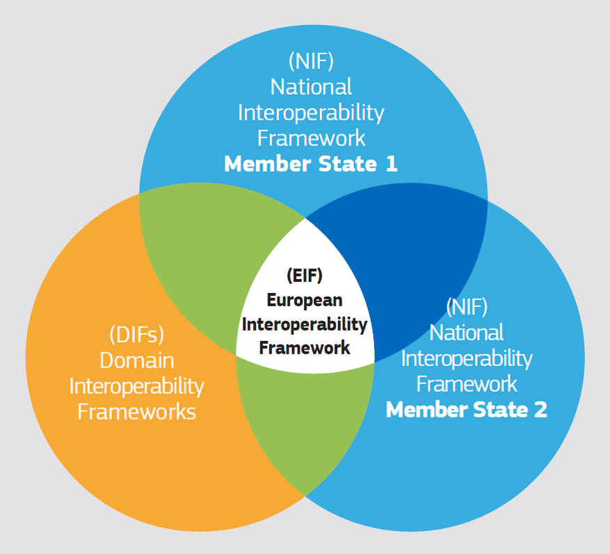

:lang: no
:doctitle: Nasjonal arkitekturplattform
:keywords: nasjonal arkitektur, virksomhetsarkitektur
:audience: alle

include::./felles/includes/commonincludes.adoc[]

//:imagesdir@: ./images

// 

//

//  

////
image:linked-data.png[width=75, height=75]
image:building-1295569_640.png[width=50, height=50] 
////

//image:./felles/images/i-arbeid.png[width=50, height=50]

[.lead] 
Plattform for samproduksjon og deling av arkitekturdokumentasjon på tvers av sektorer og virksomheter i Norge. 

NOTE: _Nasjonal arkitekturplattform_ er inntil videre et eksperiment, som ledd i Difis arbeid med kommunikasjonsløsninger.

 
. link:om-plattformen/[Om plattformen]
+
Denne plattformen er tilrettelagt av Difi, med utgangspunkt i gratis verktøy og åpen kildekode. Plattformen har funksjonalitet for redigering, lagring og publisering av dokumenter og arkitekturmodeller, i tillegg til diskusjonsgrupper m.m.

. link:praktiske-tips/[Praktiske tips] 
+
Praktiske tips for å komme i gang og bidra med innhold, forslag og tilbakemeldinger. 

. link:arkitekturbibliotek/[Nasjonalt arkitekturbibliotek]
+
Rammeverk, standarder, veiledere, føringer, felles behov, felles løsninger, felles arkitekturer, styringsinformasjon og annet av interesse på tvers av sektorer og virksomheter. 

. link:kunnskapsbibliotek/[Kunnskapsbibliotek]
+
Samling av interessant og relevant informasjon fra eksterne kilder, som redskap for felles forståelse og kunnskapsbygging på tvers. Dette kan være lenker og omtale av internasjonale standarder, utvalgte bøker, verktøy, arkitekturrammeverk fra andre land, med videre. Alle oppfordres til å bidra med innhold eller forslag til innhold.

. link:blogg/[Blogger og meningsinnlegg]
+
Personlige innlegg - blogger og meningsinnlegg - for å informere eller påvirke  utviklingen av nasjonal arkitektur og nasjonalt arkitekturbibliotek. Alle oppfordres til å bidra med sine personlige meninger. 

