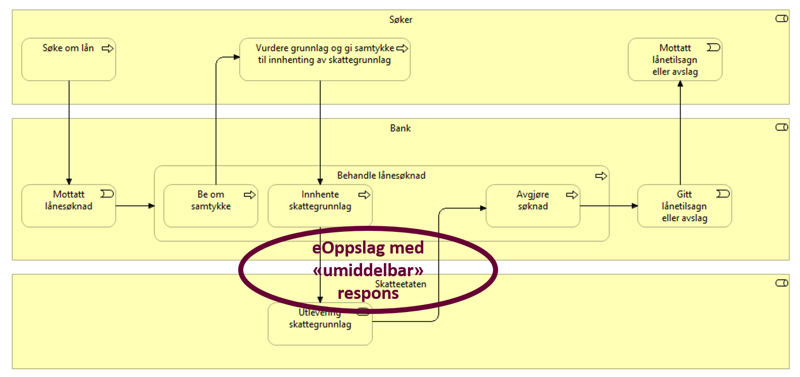
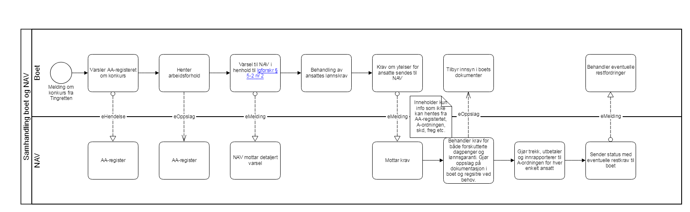

:lang: no
:doctitle: Steg 3 - Identifisere referansearkitektur med fokus på samhandling
:keywords: metodikk

include::../na_felles/includes/commonincludes.adoc[]

Når samhandlingsmønstre er identifisert, se link:./Steg2.adoc[steg 2], så kan man mappe disse mot link:../Referansearkitekturer.adoc[referansearkitektur] for hver enkelt samhandling.

Har man fått til en god enighet om samhandlingsmønstre, så vil ofte prosessen med å mappe mot referansearkitektur være ganske enkel da det under link:../na_arkitekturbibliotek_referanse_arkitekturer_samhandlingsmønstre/samhandlingsmønstre.adoc[samhandlingsmønstre] er angitt hvilken referansearkitektur som gjelder for et bestemt samhandlingsmønster.

Mapping til referansearkitektur for lånesøknad vil da se slik ut:

Mapping til referansearkitektur for  konkurs og lønnsgaranti vil da se slik ut:

Når referansearkitektur er identifisert for hver enkelt samhandling, så blir neste steg å identifisere løsningsarkitektur med tilhørende løsningskomponenter, se link:./Steg4.adoc[steg 4].
