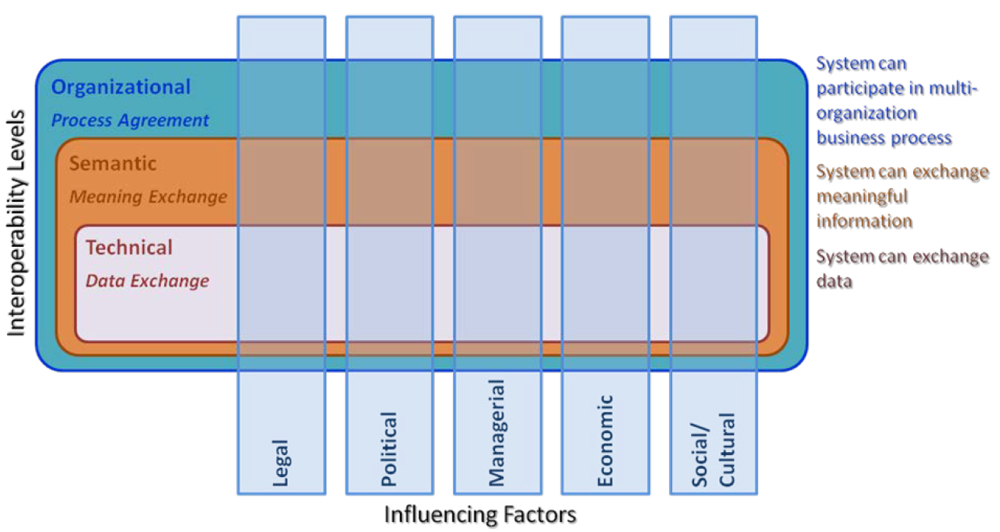
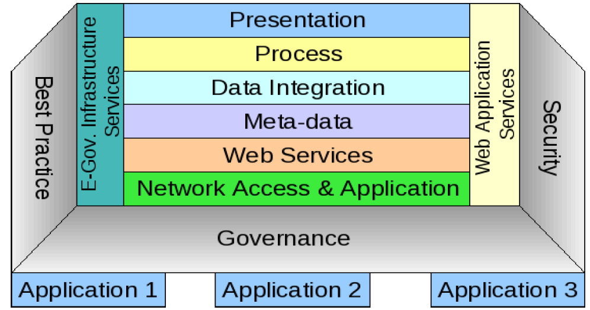

= Integration Reference Model (interoperabilitet)

Konseptet rundt interoperabilitet handler om det samme som EU-s EIF, men det framstilles på en litt annen måte, der det skilles mellom interoperabilitet som sådan og faktorer som påvirker interoperabilitet (eller _samhandlingsevne_, som vi i Norge har introdusert som et "snillere" og litt større ord).

Indisk definisjon: _Interoperability in e-Governance is defined as “the ability of different systems from various stakeholders of e-Governance to work together, by communicating, interpreting and exchanging the information in a meaningful way”. The interactions between all stake-holders are achieved, by sharing of information and knowledge through the business processes they support._

Interoperabilitet som begrep omfatter her altså utelukkende organisatoriske, semanatiske og tekniske aspekter.

Interoperability Framework for e-Governance (IFEG) tar for seg hvert av disse aspektene og kan sies å gå mer i dybden enn f.eks. EIF. 

Følgende figur viser en interessant lagdeling av _teknisk interoperabilitet_:

NOTE: Denne lagdelingen likner på link:https://no.wikipedia.org/wiki/OSI-modellen[OSI-modellen], som mange kjenner fra arbeid med datakommunikasjon i telekom-sammenheng helt tilbake fra 1980-tallet (og fremdeles aktuell), men konseptet er noe annerledes. De ulike _lagene_ er her mer å regne som _domener_, med en mer omtrentlig sammeheng enn i OSI-modellen, der hvert underliggende lag klart tjener laget over. I Indias rammverk kan en f.eks. IKKE si at Web Services tjener Metadata.

Hva som ligger i de ulike lagene i modellen (utvalg):

* Process: This domain deals with standardisation of business and software processes. It is necessary that the business processes of the Government are aligned with the overall objectives of ICT based good governance. At the same time the technological (software) solutions also need to be developed with a view to promote integration and inter-operation among processes. This consists of set of processes followed to get desired output from given inputs. For example, a process describing how to file income tax return in batch processing using web services provided by income tax department website. 

* ##Data Integration##: This domain covers standards that allow data exchange between homogeneous and heterogeneous systems. This relates to integrating data from different systems to provide consolidated view of the data. Data integrity and consistency is to be maintained. It includes standards and technologies for storage, retrieval, the discovery & location of resources and management government information. 
* Meta Data: This domain deals with the core standards required for describing the data structures and their mapping to real-world entities...

* Web Services/##Data Interchange##: This domain covers standards that allow data interchange _services_ which support the exchange of data between homogeneous and heterogeneous systems...

NOTE: En slik lagdeling kan være interessant for det pågående arbeidet med  _referansearkitekturer for informasjonsutveklsing_ per 2018 i Norge (Difi og samarbeidspartnere). Hint: _eMelding_ _eOppslag_ og _eNotifikasjon_  kan sies å høre  hjemme under "web services/data interchange", men gir liten mening uten å settes i sammenheng med øvrige lag (som kan beskrives for seg).
