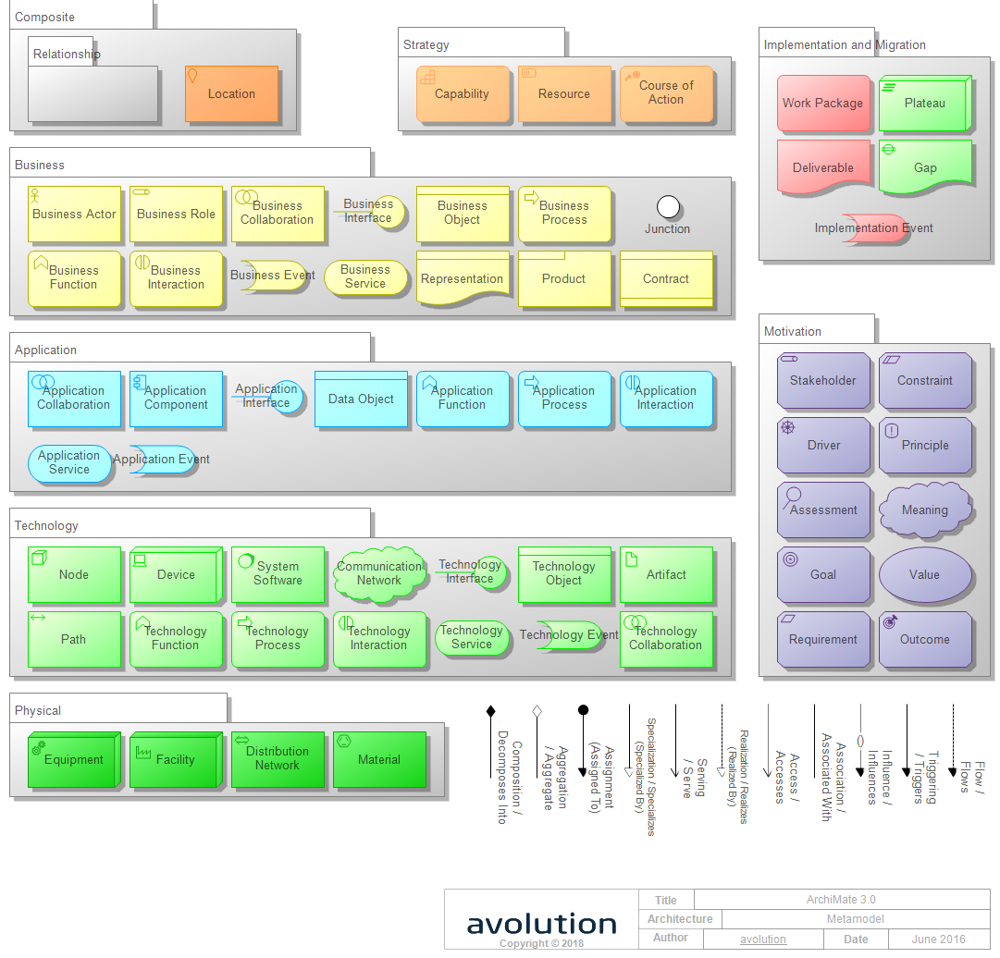
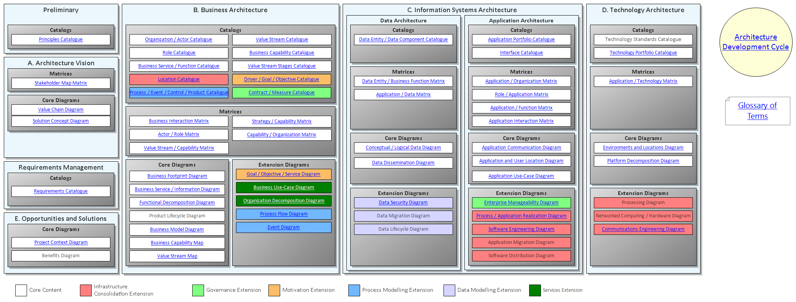
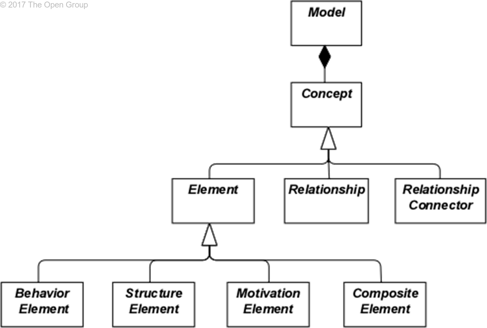
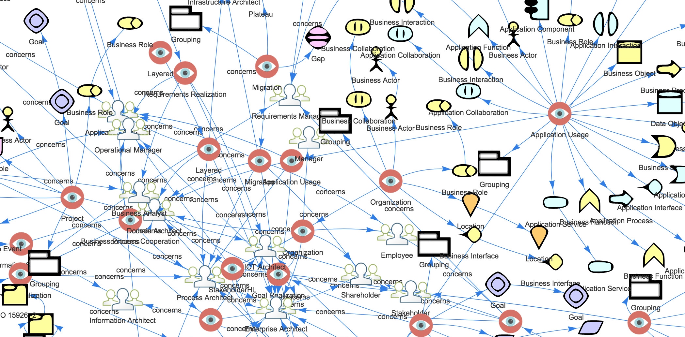
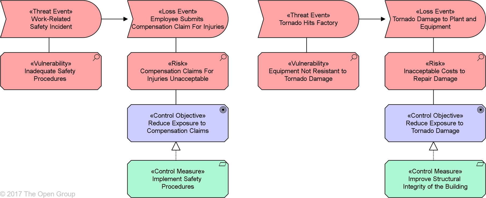

image:archimate-logo.jpg[width= 200]

Kilde: https://www.opengroup.org/archimate-forum

Kilde: Abacus tool

Kilde: Abacus tool

Kilde: Figur 1 i http://pubs.opengroup.org/architecture/archimate3-doc/chap03.html#_Toc489945967

Kilde:
https://www.linkedin.com/pulse/from-archimate-language-web-ontology-dr-nicolas-figay/

Kilde:
http://pubs.opengroup.org/architecture/archimate3-doc/chap15.html#_Toc489946142