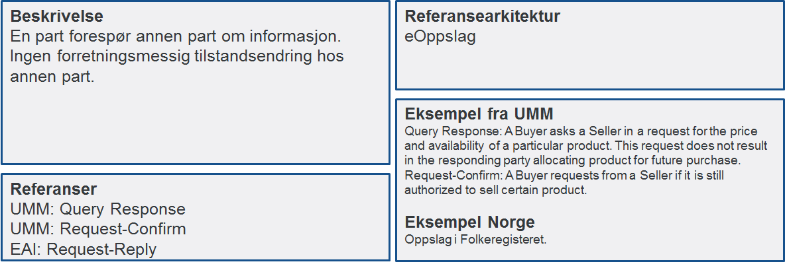

:lang: no
:doctitle: Samhandlingsmønstre
:keywords: samhandlingsmønstre

include::../na_felles/includes/commonincludes.adoc[]

//image:./media/Samhandlingsevne.png[alt="Samhandlingsevne", width=750]

== Generelt om samhandlingsmønstre

Digital samhandling mellom virksomheter kan utføres på et begrenset antall måter sett fra et forretningsståsted. Vi kaller dette samhandlingsmønstre. Samhandlingsmønstre sier ikke noe om hvilken teknologi som skal benyttes, men sier noe om hvilken egenskap samhandlingen skal ha. Det er til nå identifisert 7 forskjellige samhandlingsmønstre, men flere vil bli lagt til når det blir behov for det.

image:./media/Mønstre samhandling.png[alt="alt="missing image", width=750]

Hvert enkelt samhandlingsmønster beskrives i mer detalj under. I beskrivelsen finner man referanse til tilsvarende samhandlingsmønstre (patterns) som er definert av andre:

* UMM Transaction patterns (UN/CEFACT's Modeling Methodology - UMM)
* Enterprise Integration Patterns (EAI) (Gregor Hohpe og Bobby Woolf)

For hvert samhandlingsmønster pekes det på hvilken link:../na_referanse_arkitekturer/main.adoc[referansearkitektur] som skal benyttes for samhandlingen.

== Beskrivelser av samhandlingsmønstre

=== Forretningstransaksjon mellom to parter

image:./media/Forretningstransaksjon_mellom_to_parter.png[alt="image:./media/Forretningstransaksjon mellom to parter", width=750]

=== Oversende informasjonsendring til informasjonseier

image:./media/Oversende informasjonsendring til informasjonseier.png[alt="bad!", width=750]

=== Oversende informasjon mellom to parter
 
image:./media/Oversende informasjon mellom to parter.png[alt="bad!", width=750]

=== Forespørsel om informasjon – "umiddelbar" respons

=== Notifikasjon til identifisert part
 
image:./media/Notifikasjon til identifisert part.png[alt="Notifikasjon til identifisert part", width=750]

=== Notifikasjon til mange
 
image:./media/Notifikasjon til mange.png[alt="bad!", width=750]

=== Forespørsel om informasjon – ikke "umiddelbar" respons

image:./media/Forespørsel om informasjon uten umiddelbar respons.png[alt="bad!", width=750]
