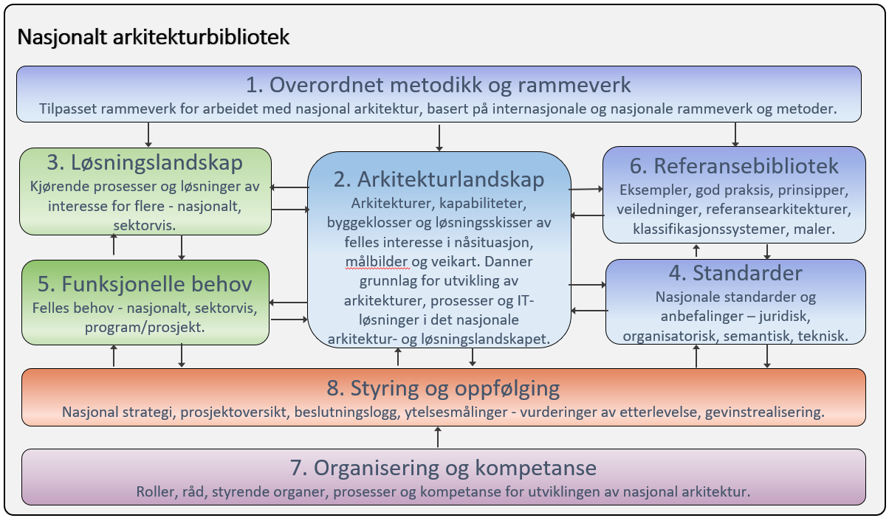

:lang: no
:doctitle: Nasjonalt arkitekturbibliotek
:keywords: Norsk, arkitekturbibliotek, offenlig sektor, virksomhetsarkitektur, NIF, samhandlingsarkitektur, rammeverk, GitHub
//:preamble: 

include::../plattform_felles/includes/commonincludes.adoc[]

[.lead]
Nasjonalt arkitekturbibliotek inneholder arkitekturdokumentasjon - modeller, standarder, referansearkitekturer, veiledninger, anbefalinger, tips, maler og annet av  interesse på tvers av offentlig (og privat) sektor i Norge.

Innholdet i dette arkitekturbiblioteket utvikles løpende i en samarbeidsplattform basert på lagring og versjonsstyring av tekst og modeller i Github. Se også link:../plattform_/[mer om selve plattformen og praktiske tips for å komme igang med Github og verktøy for innholdsproduksjon.]

//

//image:../plattform_felles/media/i-arbeid.png[width=75, height=75]I arbeid

////
== Introduksjon
=== Bakgrunn og formål
Norsk fellesoffentlig arkitekturbibliotek er opprettet av Difi 2018 for å samle dokumentasjon om virksomhetsarkitektur som kan være av felles interesse og bidra til økt samhandling, gjenbruk og innovasjon.

Biblioteket inneholder informasjon om rammeverk, retningslinjer, anbefalinger, tips, maler, felleskomponenter, behov.

Innhold og struktur følger relevante og utbredte standarder, slik som TOGAF fra The Open Group, European Interoperability Framework (EIF) og en norsk tilpasning av dette - Norwegian Interoperability Framework (NIF).

Innholdet kan finnes i flere former og formater, som tekst, multimedia, database, arkitekturmodeller m.m. Standardbaserte innholdsformater foretrekkes og foreskrives. 

Originalinnhold produseres og lagres primært på GitHub, men det benyttes et sett av standard kildeformater som gjør at en likevel ikke er avhengig av GitHub. Disse kildeformatene kan konverteres til html, pdf og en  rekke andre presentasjonsformater, ut fra behovet. #Referansekatalogen ... html...#

=== Visjon
Det er et siktemål at alle virksomheter i offentlig sektor følger et sett av konvensjoner for arkitekturdokumentasjon som gjør det enkelt å referere og integrere innhold på tvers.

Se også:

1. {link_visjoner_for_biblioteket}
2. {link_grunnleggende_prinsipper_for_biblioteket}

=== Avgrensing og sammenheng

I tillegg til innholdet i dette biblioteket, vil det finnes stoff i tilsvarende (git-baserte) biblioteker i de enkelte virksomhetene som også kan være av felles interesse, og som en kan lenke til fra dette biblioteket og vice versa.

Det vil også finnes informasjon og data som ikke per i dag (2018) egner seg godt for innholdsproduksjon og lagring på GitHub, slik som f.eks. regneark og databaser.

=== Hvordan finne fram
Mappestrukturen i biblioteket er bygget opp etter mønster av {url_togaf_92} og {url_norsk_arkitekturrammeverk_for_samhandling}.

Her er en overordnet kapittelinndeling: #TBD#

NOTE: Det er også lagt opp til å tagge innhold med metadata, for å støtte søk og alternative navigeringsmåter.

NOTE: Lenke til komplett innholdsfortegnelse: ...

=== Ditt bidrag er ønsket
Det legges opp til utstrakt samarbeid på tvers av av offentlig sektor for å etablere og vedlikeholde det fellesoffentlige arkitekturbiblioteket.

Terskelen for å publisere innhold skal ikke være for høy. Eksempler og praksis må deles for å få fram god praksis, anbefalinger, retningslinjer og standarder.

//Gi beskjed via e-post til nasjonalarkitektur@difi.no om du ønsker å bidra og vil ha skrivetilgang. Oppgi da ditt brukernavn på GitHub (se eventuelt {url_hvordan_opprette_github_bruker}).

////

Oppbyggingen av arkitekturbiblioteket forøvrig følger i grove trekk strukturen som angitt i link:http://pubs.opengroup.org/architecture/togaf9-doc/arch/[TOGAF 9.2] og link:https://www.difi.no/fagomrader-og-tjenester/digitalisering-og-samordning/nasjonal-arkitektur/arkitekturrammeverk-samhandling[Norsk arkitekturrammeverk for samhandling]:

. link:../nab_rammeverk/[Rammeverk og overordnet informasjon]
. link:../nab_arkitekturlandskap/[Arkitekturlandskap]
. link:../nab_løsningslandskap/[Løsningslandskap]
. link:../nab_standard/[Standarder]
. link:../nab_kravbibliotek/[Funksjonelle behov (kravbibliotek)]
. link:../nab_referanse_/[Referansebibliotek]
. link:../nab_organisering/[Organisering og kompetanse]
. link:../nab_styring/[Styring og oppfølging]

I tillegg denne inndelingen, finnes en egen mappestruktur for innhold i link:../nab_modeller/[det nasjonale biblioteket for arkitekturmodeller]. 

Tilsvarende bilde fra TOGAF 9.2:
image:./media/togaf92-architecture-repository.png[width=900]

        