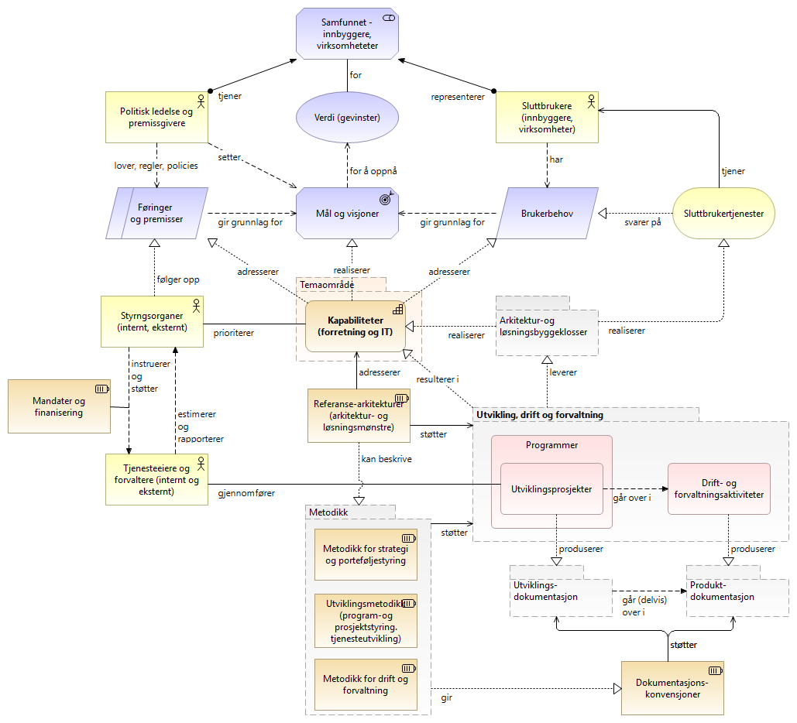
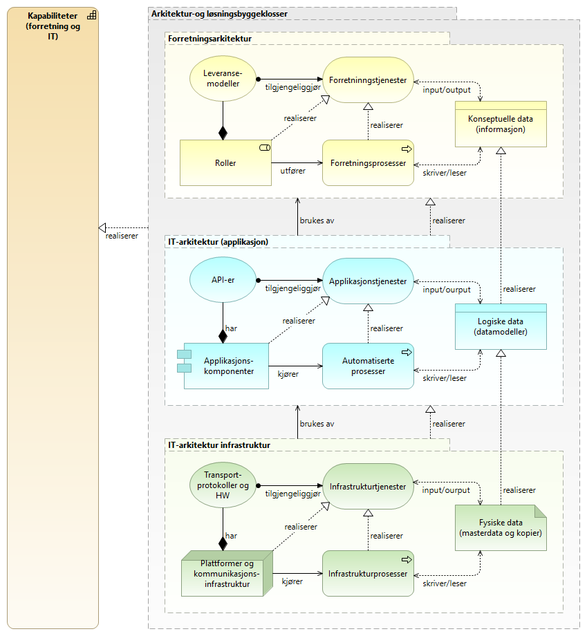

:lang: no
:doctitle: Kapabilitetetsbasert arkitekturstyring i offentlig sektor
:keywords: Kapabilitet, arkitekturstyring
//:preamble: 

include::../plattform_felles/includes/commonincludes.adoc[]

== Grunnleggende konsept for kapabilitetsbasert planlegging  
image:../plattform_felles/media/i-arbeid.png[width=45, height=45] Foreløpig innhold

Følgende figur illustrerer noen grunnleggende konsepter rundt en mulig måte å gjøre arkitekturstyring i offentlig sektor.   

.Overordnet konsept for kapabilitetsbasert arkitekturstyring i offentlig sektor

Her ses det på offentlig sektor i stort, men det er lite som skiller dette bildet fra tilsvarende for enkeltvirksomheter, enten i offentlig eller privat sektor. For en virksomhet i privat sektor ville en gjerne ha kalt de viktigste interessentene for _kunder_, i stedet for _innbyggere_.

Arkitekturen for realisering av kapabiliteter  er angitt (Arkitektur- og løsningsbyggeklosser), men ikke detaljert i figuren over. Dette er med hensikt, både fordi figuren som sådan ville blitt for stor og fordi bildet ville blitt unødig komplekst å forholde seg til. Det er ikke nødvendig at beslutningstakere i _styringsorganene_ kjenner til detaljene i hvordan aktuelle  kapabiliteter er realisert dersom de får informasjon om betydning, sammenhenger og status ut fra kapabilitetskart.

NOTE: Beslutningstakere bør støttes av virksomhetsarkitekter og andre i arbeidet med porteføljestyring for å få informasjon og analysere sammenhenger og konsekvenser ved endringer. Dette er ikke vist i figuren. 

== Realisering av kapabiliteter i arkitekturlagene

De viktigste konseptene og konvensjonene for modellering av arkitekturer og løsninger vist i figuren nedenfor. 

Her vises noen av de viktigste arkitekturbegrepene og sammenhengene, slik som sammenhengen mellom API og Applikajonstjeneste og forskjellen på logiske datamodeller og fysiske data.  

For de som skal prioritere og samordne utviklingen, vil denne typen arkitekturmodeller fort blir for vanskelige.
Nettopp dette er en viktig grunn for at det er hensiktsmessig å fokusere på kapabilitene, som handler om _hva_ og ikke _hvordan_.

NOTE: Felles begrepsapparat rundt arkitektur er en forutsetning for å få til samordnet utvikling av _sammenhengende tjenester_. Som et ledd i dette, dokumenteres felles modelleringskonvensjoner som del av Nasjonalt arkitekturbibliotek; under referansebiblioteket.

.Figur: Realisering av kapabiliteter gjennom forretnings- og IT-arkitektur.   

