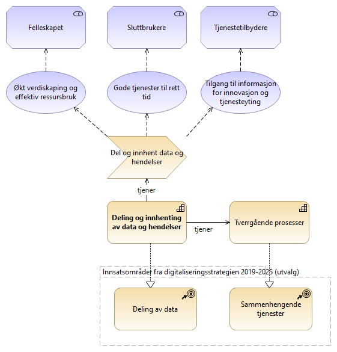
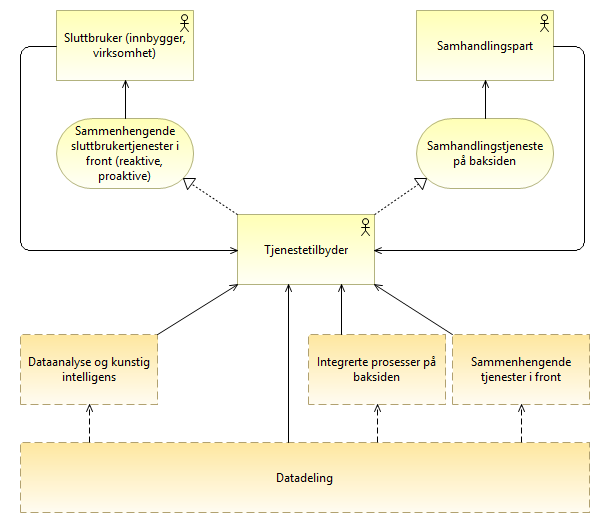
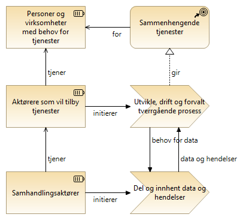
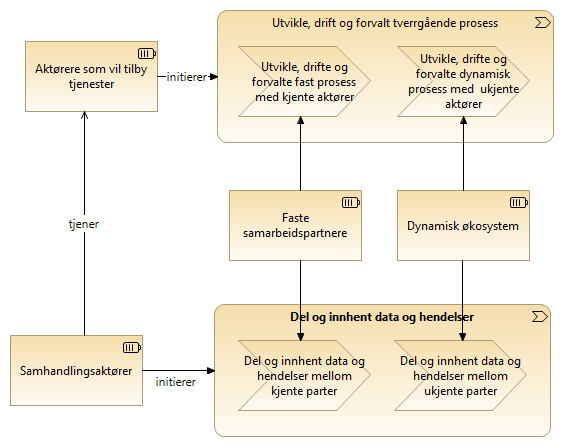
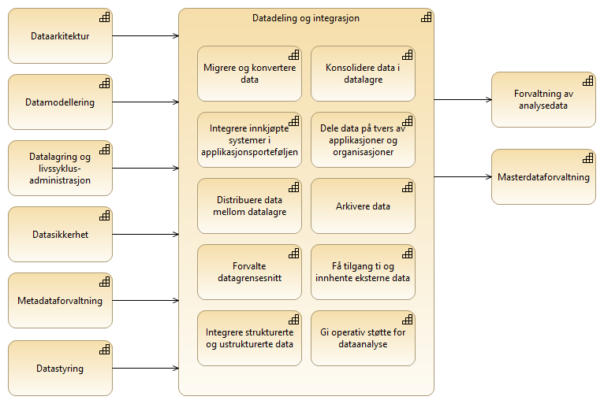
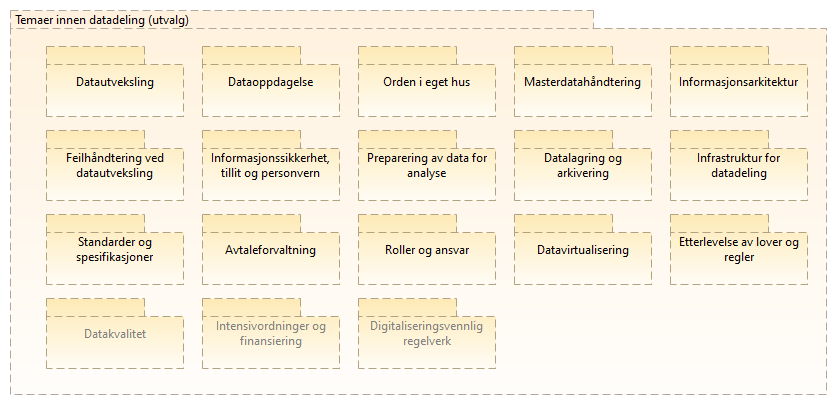
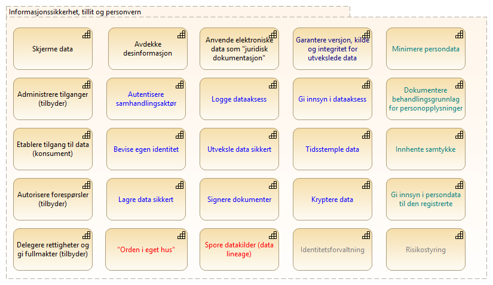

:lang: no
:doctitle: Temaområde Datadeling 
:keywords: TBD

:toclevels: 2

include::../plattform_felles/includes/commonincludes.adoc[]

image:../nasjonal_arkitektur\nab_arkitekturlandskap_segmentarkitektur_datadeling/media/datadeling-logo.png[width=300]

[.lead]
_Datadeling_ er et prioritert område innen nasjonal arkitektur. 

== Generelt

=== Motivasjon for deling av data
Deling av data er definert som et insatsområde i regjeringens digitaliseringsstrategi for 2019-2025, i tillegg til sammenhengende tjenester og enkelte andre områder.

Bakgrunnen for dette ligger i verdien for ulike interessenter, slik dette er antydet i følgende figur.

.Motivasjon for deling av data

Verdien av deling av data kan sies å komme gjennom følgende typer av datadeling:

1. Generell tilgang til data for tredjeparter for formål som dataanalyse, verdiøkende tjenester og oppgaveløsning; frikoplet fra den som deler data.

2. Samhandling mellom samhandlingsaktører i tverrgående prosesser "på baksiden" av aktuelle (sammenhengende) sluttbrukertjenester. Avhengig av type prosess og valt løsning, er tilbydere og konsumenter på forhånd kjent for hverandre, helt frikoplet, eller det etableres løpende kontakt i mer dynamiske økosystemer.     

=== Datadeling i kontekst

image:../plattform_felles/media/i-arbeid.png[width=45, height=45] _I arbeid (høst 2019)_

//Godt fungerende datadeling inngår som et viktig element i å nå målene i regjeringens digitaliseringsstrategi. Et overordnet mål er sammenhengende tjenester for personer og virksomheter. 

Datadeling handler grovt sett om å forsyne forretningsprosesser og dataanalyse med nødvendig datagrunnlag.
Figuren under illustrerer dette.  

.Datadeling i kontekst med sammenhengende tjenester

.Sammenheng - datadeling og  tverrgående prosesser

.Sammenheng - datadeling og faste vs. dynamiske prosesser

=== Omfang og avgrensing
Området datadeling kan ses som del av link:../nab_arkitekturlandskap_segmentarkitektur_informasjonsforvaltning[informasjonsforvaltning] som et større område.

image:../plattform_felles/media/i-arbeid.png[width=45, height=45] _I arbeid (høst 2019)_

////
En foreløpig nedbryting av området _Datadeling_ er vist i figuren nedenfor, her med utgangspunkt i områder som omtales i link:../kunnskap_bok-dmbok2[Data Management Book Of Knowledge (DMBOK2)], også omtalt under temaområdet link:../nab_arkitekturlandskap_segmentarkitektur_informasjonsforvaltning[informasjonsforvaltning]. Dette er en anerkjent og mye brukt kilde til kunnskap om _informasjonsforvaltning_. 

NOTE: Overskriften _Datadeling og integrasjon_ er en norsk oversettelse fra link:../kunnskap_bok-dmbok2[DMBOK2], og benyttes her synomymt med _datadeling_ (i mangel av andre definisjoner). 

.Datadeling og integrasjon (DMBOK2)

Legg merke til at det finnes  avhengigheter til en rekke andre områder. _Datadeling og integrasjon_ omfatter her i utgangspunktet ikke f.eks. området _datasikkerhet_, men forutsetter at dette er på plass.

Det mangler foreløpig (2019) noe på at "alt" annet er på plass. Difi kjører for tiden (2019) et prosjekt ved navn Deling av data, der en starter med å se på noen utvalgte områder. 
////

Som en pragmatisk tilnærming, gis her et forslag til temaområder innen datadeling der avgrensingen mot tilsvarende områder innen informasjonsforvaltning ikke er spesifisert. Dette er temaer som uansett må dekkes.

Foreløpig oversikt over prioriterte temaområder innen datadeling: 

.Prioriterte temaer innen datadeling (2019)

Hvert av disse områdene adresseres i separate avsnitt nedenfor.

NOTE: Beskrivelsene bygges ut og oppdateres  i tilknytning til løpende prosjektarbeid.

:leveloffset: +1

= Verdistrømmer for datadeling

include::../nab_arkitekturlandskap_segmentarkitektur_datadeling_verdistrømmer/book_datadeling_verdistrømmer.adoc[]

= Datautveksling

//#Problem med include nedenfor?# Se link:../nab_arkitekturlandskap_segmentarkitektur_datadeling_datautveklsing\[temaområde datautveksling].

include::../nab_arkitekturlandskap_segmentarkitektur_datadeling_datautveklsing/book-datautveksling.adoc[]

:leveloffset: -1

= Informasjonssikkerhet, tillit og personvern

Se under link:../nab_arkitekturlandskap_segmentarkitektur_datadeling_datasikkerhet[informasjonssikkerhet for datautveksling].

////
Kapabilitetskart for temaområdet Informasjonssikkerhet, tillit og personvern:

.Informasjonssikkerhet, tillit og personvern

////

= Roller og ansvar for datadeling

//include::./roller-datadeling.adoc[]

Se link:../nab_referanse_arkitekturer_datautveksling/[roller involvert i datautveksling].

Se også link:../nab_arkitekturlandskap_segmentarkitektur_datadeling_avtaleforvaltning/[avtaleforvaltning].

= Orden i eget hus
Se link:https://www.difi.no/fagomrader-og-tjenester/digitalisering-og-samordning/nasjonal-arkitektur/informasjonsforvaltning/veileder-orden-i-eget-hus[Veileder for orden i eget hus] fra Difi.

= Juridisk interoperabilitet
TBD.

= Datakvalitet
TBD.

= Standardisering og spesifikasjoner
TBD.

= Avtaleforvaltning
//Se link:../nab_arkitekturlandskap_segmentarkitektur_datadeling_avtaleforvaltning/[Avtaleforvaltning]

include::../nab_arkitekturlandskap_segmentarkitektur_datadeling_avtaleforvaltning/book-avtaleforvaltning.adoc[]

= Oppdagelse, søk og gjenfinning
TBD.

= Masterdatahåndtering
TBD.

= Innhenting og preparering av data for analyse
TBD.

= Feilhåndtering
TBD.

NOTE: Se også om feilhåndtering i tilknytning til respektive utvekslingsmønstre under link:../nab_referanse_arkitekturer_datautveksling[referansearkitekturer for datautveksling].

= Datalagring
TBD.

= Etterlevelse av lover og regler
TBD.

//== Kapabilitetskart for datautveksling
////
Området _datautveksling_ er brutt ned i delområder som vist i følgende figur.

.Områder innen Datautveksling

image::../nab_arkitekturlandskap_segmentarkitektur_datadeling\media\Kapabilitetsområder, datautveksling.png[alt="BKapabilitetsområder, datautveksling"]

Hvert av disse områdene er adressert gjennom referansearkitekturer... #lenke#....
////

////
== Tverrgående temaer innen datautveklsing
.Tverrgående temaer innen datautveksling
image::../nab_arkitekturlandskap_segmentarkitektur_datadeling/media/Tverrgående temaer innen datautveksling.png[alt=Tverrgående temaer innen datautveksling image]
////

////
= Fokusområder innen Datadeling
include::./temaområde-datadeling.adoc[]

= Roller og ansvar
include::./roller-datadeling.adoc[]
////

:leveloffset: -1    