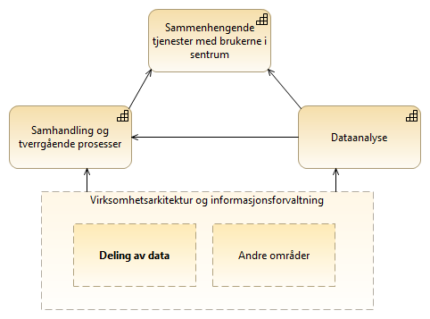

:lang: no
:doctitle: Temaområde Datadeling 
:keywords: TBD

:toclevels: 3

include::../plattform_felles/includes/commonincludes.adoc[]

[.lead]
Datadeling er et prioritert område innen nasjonal arkitektur. 

== Generelt

Godt fungerende datadeling inngår som et viktig element i for å nå målene i regjeringens digitaliseringsstrategi. Et overordnet mål er sammenhengende tjenester for personer og virksomheter. Datadeling handler om å forsyne forretningsprosesser og dataanalyse med nødvendig datagrunnlag. Figuren under illustrerer dette.  

.Forretningsmessig kontekst for datadeling

:leveloffset: +1

= Fokusområder innen Datadeling
include::./temaområde-datadeling.adoc[]

= Rollekart for Datadeling
include::./roller-datadeling.adoc[]

= Arkitekturbyggeklosser for Datadeling
TBD 

:leveloffset: -1