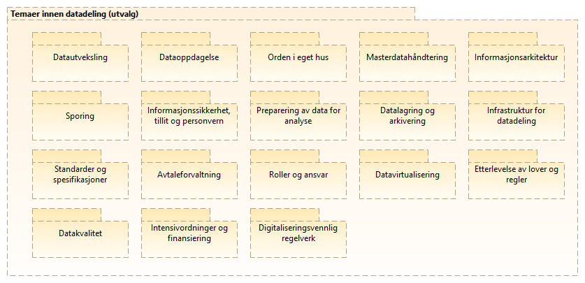

:lang: no
:doctitle: Temaområde Datadeling 
:keywords: TBD

:toclevels: 3

include::../plattform_felles/includes/commonincludes.adoc[]

[.lead]
Datadeling er et prioritert område innen nasjonal arkitektur. 

== Generelt

=== Datadeling for et formål - sammenhengende tjenester

Godt fungerende datadeling inngår som et viktig element i for å nå målene i regjeringens digitaliseringsstrategi. Et overordnet mål er sammenhengende tjenester for personer og virksomheter. Datadeling handler om å forsyne forretningsprosesser og dataanalyse med nødvendig datagrunnlag. Figuren under illustrerer dette.  

//.Forretningsmessig kontekst for datadeling
//image::../nab_arkitekturlandskap_segmentarkitektur_datadeling/media/Forretningsmessig kontekst for datadeling.png[alt=Forretningsmessig kontekst for datadeling image]

.Datadeling i kontekst med sammenhengende tjenester
image::../nab_arkitekturlandskap_segmentarkitektur_datadeling/media/Datadeling i kontekst med sammenhengende tjenester.png[alt=Datadeling i kontekst med sammenhengende tjenester image]

=== Omfang og avgrensing
    
==== Områder ref. DMBOK 
DMBOK (Data Management Book Of Knowledge) er en anerkjent og mye brukt kilde til kunnskap om dataforvaltning (eller _informasjonsforvaltning_). 

Nedbryting av området _Datadeling og integrasjon_ er vist i figuren nedenfor, her med utgangspunkt i områder som omtales i #DMBOK2#.

Legg merke til at det finnes  avhengigheter til en rekke andre områder. _Datadeling og integrasjon_ omfatter i utgangspunktet ikke f.eks. området _datasikkerhet_, men forutsetter at dette er på plass. 

.Datadeling og integrasjon (DMBOK2)

==== Pragmatisk tilnærming
Difi kjører for tiden (2019) et prosjekt ved navn Deling av data, der en starter med å se på noen utvalgte områder. 

En foreløpig oversikt over prioriterte temaer er vist her:

.Prioriterte temaer innen datadeling (2019)

Hvert av disse områdene adresseres i separate avsnitt nedenfor.

NOTE: Beskrivelsene bygges ut og oppdateres  i tilknytning til løpende prosjektarbeid.

:leveloffset: +1

= Datautveksling
include::./temaområde-datautveksling.adoc[]

= Informasjonssikkerhet, tillit og personvern

Kapabilitetskart for temaområdet Informasjonssikkerhet, tillit og personvern:

.Informasjonssikkerhet, tillit og personvern
image::../nab_arkitekturlandskap_segmentarkitektur_datadeling/media/Informasjonssikkerhet, tillit og personvern.png[alt=Informasjonssikkerhet, tillit og personvern image]

= Roller og ansvar
include::./roller-datadeling.adoc[]

= Orden i eget hus
TBD.

= Juridisk interoperabilitet
TBD.

= Datakvalitet
TBD.

= Standardisering og spesifikasjoner
TBD.

= Avtaleforvaltning
//Se link:../nab_arkitekturlandskap_segmentarkitektur_datadeling_avtaleforvaltning/[Avtaleforvaltning]

include::../nab_arkitekturlandskap_segmentarkitektur_datadeling_avtaleforvaltning/book-avtaleforvaltning.adoc[]

= Oppdagelse, søk og gjenfinning
TBD.

= Masterdatahåndtering
TBD.

= Innhenting og preparering av data for analyse
TBD.

= Feilhåndtering
TBD.

= Datalagring
TBD.

= Etterlevelse av lover og regler
TBD.

//== Kapabilitetskart for datautveksling
////
Området _datautveksling_ er brutt ned i delområder som vist i følgende figur.

.Områder innen Datautveksling

image::../nab_arkitekturlandskap_segmentarkitektur_datadeling\media\Kapabilitetsområder, datautveksling.png[alt="BKapabilitetsområder, datautveksling"]

Hvert av disse områdene er adressert gjennom referansearkitekturer... #lenke#....
////

////
== Tverrgående temaer innen datautveklsing
.Tverrgående temaer innen datautveksling
image::../nab_arkitekturlandskap_segmentarkitektur_datadeling/media/Tverrgående temaer innen datautveksling.png[alt=Tverrgående temaer innen datautveksling image]
////

////
= Fokusområder innen Datadeling
include::./temaområde-datadeling.adoc[]

= Roller og ansvar
include::./roller-datadeling.adoc[]
////

:leveloffset: -1