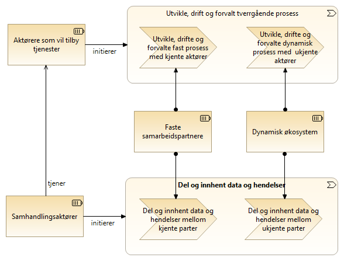

:lang: no
:doctitle: Temaområde Datadeling 
:keywords: TBD

:toclevels: 2

include::../plattform_felles/includes/commonincludes.adoc[]

[.lead]
_Datadeling_ er et prioritert område innen nasjonal arkitektur. 

== Generelt

=== Hva er "datadeling"?

Datadeling handler om å forsyne forretningsprosesser og dataanalyse med nødvendig datagrunnlag. 

De fleste aktører sitter på begge sider i dette bildet, og må kunne både _dele_ og _innhente_ data og hendelser. I beskrivelsene skilles det likevel gjerne på rollene som _tilbyder_ og _konsument_.

Begrepet _datadeling_ er ut fra dette å oppfatte som kortform for **__deling og innhenting av data og hendelser__**.

I noen sammenhenger skilles det også  mellom _data_ og _hendelser_. En hendelse kan f.eks. være at det er gjort et vedtak i en sak, noe som utløser behov for å informere andre. Dette gjøres typisk gjennom meldinger som gir varsel (notifikasjon) om hva som har skjedd, der konsumentene så eventuelt må tilbake til tilbyder for å ta rede på detaljene.

Begrepet _datadeling" omfatter her dessuten den type meldingsutveksling som skjer mellom de ulike delprosessene i tverrgående prosesser, dvs. prosesser som går på tvers av ulike organisasjonsenheter eller virksomheter.

=== Motivasjon for deling av data
Deling av data er definert som et insatsområde i regjeringens digitaliseringsstrategi for 2019-2025.

Bakgrunnen for dette ligger i verdien for ulike interessenter, enten det dreier seg om egen oppgaveløsning, verdiøkende tjenester eller sekundær bruk i form av dataanalyse.

Grovt sett, kan en si at det finnes følgende formål for "datadeling":  
 
1. Generell deling av data, for vilkårlige tredjeparter og deres formål. Dette kan være primærbruk i egen oppgaveløsning, eller sekundær bruk i form av verdiøkende tjenester eller dataanalyse.

2. Samhandling mellom samhandlingsaktører i tverrgående prosesser. 

//NOTE: Avhengig av type prosess og løsning, er tilbydere og konsumenter på forhånd kjent for hverandre, helt frikoplet, eller det etableres løpende kontakt i mer dynamiske økosystemer.     

For den som skal dele data, kan motivasjonen for "generell deling av data" være vanskelig å få øye på. Det kreves effektive virkemidler og gode fellesløsninger for at dette skal prioriteres på bekostning av egen oppgaveløsning, spesielt der det følger med risiko for å trå feil med tanke på informasjonssikkerhet (kompromittering av taushetsbelagte opplysninger).      

////
.Motivasjon for deling av data

////

=== Datadeling i kontekst

Datadeling gir ikke verdi uten at data benyttes   i oppgaveløsning og tjenesteproduksjon.

Aktuelle mål om sammenhengende tjenester for personer og virksomheter, krever fungerende arbeidsprosesser på tvers av forvaltningen. Dette omtales gjerne som _tverrgående prosesser_.   

////
.Datadeling i kontekst med sammenhengende tjenester
image::../nab_arkitekturlandskap_segmentarkitektur_datadeling/media/Datadeling i kontekst med sammenhengende tjenester.png[alt=Datadeling i kontekst med sammenhengende tjenester image]
////

////
.Sammenheng - datadeling og  tverrgående prosesser
image::../nab_arkitekturlandskap_segmentarkitektur_datadeling/media/Sammenheng - datadeling og  tverrgående prosesser.png[alt=Sammenheng - datadeling og  tverrgående prosesser image]
////

Tverrgående prosesser finnes i flere former. 

De enkleste prosessene kan kartlegges og standardiseres. Slike prosesser kan typisk automatiseres - så langt det er mulig å definere reglene for dette (eventuelt med kunstig intelligens)

For mer komplekse oppgaver kreves andre tilnærminger. De mest komplekse oppgavene løses av kunnskapsmedarbeidere i økosystemer på tvers av forvaltningen. Arbeidsprosessene kan ikke da på forhånd kartlegges eller automatiseres i sin helhet, men en kan støtte saksbehandlere med verktøy for dynamisk saksbehandling og enkelte deler av prosessene kan kanskje uansett automatiseres.     

.Sammenheng - datadeling og faste vs. dynamiske prosesser

=== Omfang og avgrensing for området datadeling
Området datadeling kan ses som del av link:../nab_arkitekturlandskap_segmentarkitektur_informasjonsforvaltning[informasjonsforvaltning] som et større område.

image:../plattform_felles/media/i-arbeid.png[width=45, height=45] _I arbeid (høst 2019)_

////
En foreløpig nedbryting av området _Datadeling_ er vist i figuren nedenfor, her med utgangspunkt i områder som omtales i link:../kunnskap_bok-dmbok2[Data Management Book Of Knowledge (DMBOK2)], også omtalt under temaområdet link:../nab_arkitekturlandskap_segmentarkitektur_informasjonsforvaltning[informasjonsforvaltning]. Dette er en anerkjent og mye brukt kilde til kunnskap om _informasjonsforvaltning_. 

NOTE: Overskriften _Datadeling og integrasjon_ er en norsk oversettelse fra link:../kunnskap_bok-dmbok2[DMBOK2], og benyttes her synomymt med _datadeling_ (i mangel av andre definisjoner). 

.Datadeling og integrasjon (DMBOK2)
image::../nab_arkitekturlandskap_segmentarkitektur_datadeling/media/Datadeling og integrasjon (DMBOK2).png[alt=Datadeling og integrasjon (DMBOK2) image]

Legg merke til at det finnes  avhengigheter til en rekke andre områder. _Datadeling og integrasjon_ omfatter her i utgangspunktet ikke f.eks. området _datasikkerhet_, men forutsetter at dette er på plass.

Det mangler foreløpig (2019) noe på at "alt" annet er på plass. Difi kjører for tiden (2019) et prosjekt ved navn Deling av data, der en starter med å se på noen utvalgte områder. 
////

Som en pragmatisk tilnærming, gis her et forslag til temaområder innen datadeling der avgrensingen mot tilsvarende områder innen informasjonsforvaltning ikke er spesifisert. Dette er temaer som uansett må dekkes.

Foreløpig oversikt over prioriterte temaområder innen datadeling: 

.Prioriterte temaer innen datadeling (2019)
image::../nab_arkitekturlandskap_segmentarkitektur_datadeling/media/Prioriterte temaer innen datadeling (2019).png[alt=Prioriterte temaer innen datadeling (2019) image]

Hvert av disse områdene adresseres i separate avsnitt nedenfor.

NOTE: Beskrivelsene bygges ut og oppdateres  i tilknytning til løpende prosjektarbeid.

:leveloffset: +1

= Felles referansemodeller for datadeling

include::../nab_arkitekturlandskap_segmentarkitektur_datadeling_verdistrømmer/book_datadeling_verdistrømmer.adoc[]

= Datautveksling

//#Problem med include nedenfor?# Se link:../nab_arkitekturlandskap_segmentarkitektur_datadeling_datautveklsing\[temaområde datautveksling].

include::../nab_arkitekturlandskap_segmentarkitektur_datadeling_datautveklsing/book-datautveksling.adoc[]

:leveloffset: -1

= Informasjonssikkerhet, tillit og personvern

include::../nab_arkitekturlandskap_segmentarkitektur_datadeling_datasikkerhet/book-datasikkerhet-tillit-personvern.adoc[]

////
Kapabilitetskart for temaområdet Informasjonssikkerhet, tillit og personvern:

.Informasjonssikkerhet, tillit og personvern
image::../nab_arkitekturlandskap_segmentarkitektur_datadeling/media/Informasjonssikkerhet, tillit og personvern.png[alt=Informasjonssikkerhet, tillit og personvern image]
////

= Roller og ansvar for datadeling

//include::./roller-datadeling.adoc[]

Se link:../nab_referanse_arkitekturer_datautveksling/[roller involvert i datautveksling].

Se også link:../nab_arkitekturlandskap_segmentarkitektur_datadeling_avtaleforvaltning/[avtaleforvaltning].

= Orden i eget hus
Se link:https://www.difi.no/fagomrader-og-tjenester/digitalisering-og-samordning/nasjonal-arkitektur/informasjonsforvaltning/veileder-orden-i-eget-hus[Veileder for orden i eget hus] fra Difi.

= Juridisk interoperabilitet
TBD.

= Datakvalitet
TBD.

= Standardisering og spesifikasjoner
TBD.

= Avtaleforvaltning
//Se link:../nab_arkitekturlandskap_segmentarkitektur_datadeling_avtaleforvaltning/[Avtaleforvaltning]

include::../nab_arkitekturlandskap_segmentarkitektur_datadeling_avtaleforvaltning/book-avtaleforvaltning.adoc[]

= Oppdagelse, søk og gjenfinning
TBD.

= Masterdatahåndtering
TBD.

= Innhenting og preparering av data for analyse
TBD.

= Feilhåndtering
TBD.

NOTE: Se også om feilhåndtering i tilknytning til respektive utvekslingsmønstre under link:../nab_referanse_arkitekturer_datautveksling[referansearkitekturer for datautveksling].

= Datalagring
TBD.

= Etterlevelse av lover og regler
TBD.

//== Kapabilitetskart for datautveksling
////
Området _datautveksling_ er brutt ned i delområder som vist i følgende figur.

.Områder innen Datautveksling

image::../nab_arkitekturlandskap_segmentarkitektur_datadeling\media\Kapabilitetsområder, datautveksling.png[alt="BKapabilitetsområder, datautveksling"]

Hvert av disse områdene er adressert gjennom referansearkitekturer... #lenke#....
////

////
== Tverrgående temaer innen datautveklsing
.Tverrgående temaer innen datautveksling
image::../nab_arkitekturlandskap_segmentarkitektur_datadeling/media/Tverrgående temaer innen datautveksling.png[alt=Tverrgående temaer innen datautveksling image]
////

////
= Fokusområder innen Datadeling
include::./temaområde-datadeling.adoc[]

= Roller og ansvar
include::./roller-datadeling.adoc[]
////

:leveloffset: -1    