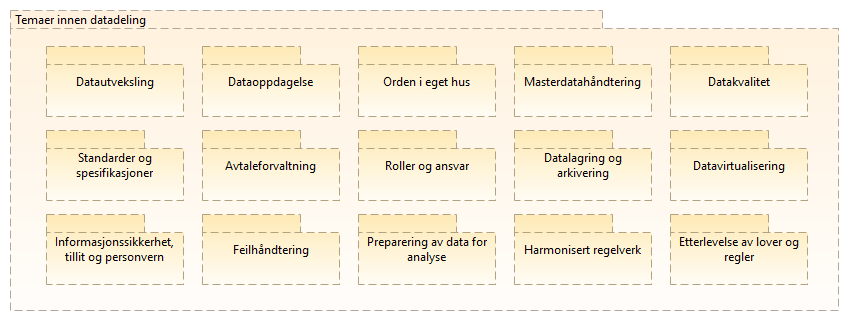
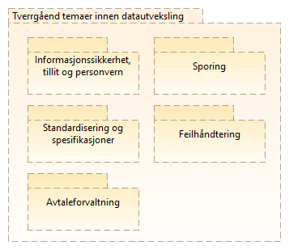
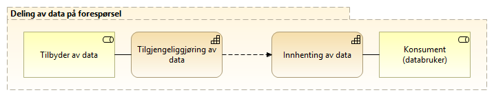
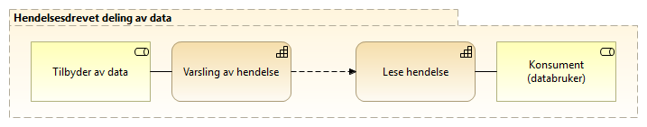

:lang: no
:doctitle: Temaområde datadeling
:keywords: eMelding
:toclevels: 5
include::../plattform_felles/includes/commonincludes.adoc[]

== Overordnede områder innen _deling av data_

//Nedbryting av området _Data Integration and Interoperability_ i DMBOK2 er vist i figuren nedenfor. Her er det også vist sammenhengen med andre områder.

// .DMBOK2 Data Integration and Interoperability
//image::../nab_arkitekturlandskap_segmentarkitektur_informasjonsforvaltning/media/DMBOK2 Data Integration and Interoperability.png[alt=DMBOK2 Data Integration and Interoperability image]

// image:../plattform_felles/media/i-arbeid.png[width=45, height=45] _Denne nedbrytingen er under arbeid våren 2019._

Følgende figur viser en foreløpig nedbryting av temaområdet Datadeling, slik dette tidligere er gjort i tilknytning til arbeid med aktuelle referansearkitekturer våren 2019.  

//.Foreløpig inndeling av temaområdet Datadeling i delområder
//image::../nab_arkitekturlandskap_segmentarkitektur_datadeling\media\kapabilitetsområder-datadeling.png[alt="Bilde mangler"]

.Tverrgående temaer innen datadeling

//.Temaområde deling av data
//image::../nab_arkitekturlandskap_segmentarkitektur_datadeling/media/Temaområde deling av data.png[alt=Temaområde deling av data image]

== Delområde Datautveksling

=== Kapabilitetskart for datautveksling
Området _datautveksling_ er brutt ned i delområder som vist i følgende figur.

.Områder innen Datautveksling

image::../nab_arkitekturlandskap_segmentarkitektur_datadeling\media\Kapabilitetsområder, datautveksling.png[alt="BKapabilitetsområder, datautveksling"]

Hvert av disse områdene er adressert gjennom referansearkitekturer... #lenke#....

=== Tverrgående temaer innen datautveklsing
.Tverrgående temaer innen datautveksling

////

==== Deling av data ved forsendelse
Dette er deling av informasjon og data initiert av avsender. Det vil normalt være behov og/eller forventning om oppfølging fra mottaker. Eksempler kan være å sende en faktura hvor det forventes at mottaker behandler denne, eller en henvisning i helsesektoren hvor det forventes at mottaker tar ansvar for videre oppfølging av pasienten det gjelder. 

Ved deling av data ved forsendelse må avsender ha visshet om at mottaker kan motta og behandle meldingen/informasjonen som sendes.

.Kapabiliteter innen området Deling av data ved forsendelse
image::../nab_arkitekturlandskap_strategisk-arkitektur\media/kapabiliteter-datautveksling-forsendelse.png[alt="Bilde mangler", width=750]

NOTE: Deling av data ved forsendelse er beskrevet i Nasjonal referansearkitektur og strategi for eMelding; se https://www.difi.no/fagomrader-og-tjenester/digitalisering-og-samordning/nasjonal-arkitektur/referansearkitekturer/referansearkitektur-meldingsutveksling-emelding.

==== Deling av data på forespørsel
//:leveloffset: +4
//include::../nab_arkitekturlandskap_segmentarkitektur_datadeling/deling-av-data-på-forspørsel.adoc[]
//:leveloffset!:

Dette kan være å spørre om data gjennom et API eller å lese åpne, publiserte data. Ved å lese publiserte data menes for eksempel åpne data på data.norge.no eller datasett som legges fritt tilgjengelig på nettet. Et eksempel på det siste er valutakurser fra Norges bank.

.Kapabiliteter innen området Deling av data på forespørsel

Oppslag av data gjennom API kan gi mer avanserte muligheter for spørring i datasett med ulike metoder og tilgangsnivåer. Dette vil være måten å dele data nært opp til sanntid for bruk i saksbehandlingsprosesser og liknende når tilgang skal gis etter hvilke rettigheter den enkelte bruker har til dataene. Et eksempel på dette er oppslag i folkeregisteret hvor ulike brukere kan ha ulike tilganger etter hva de har av hjemler og behov.

NOTE: En  videre nedbryting av kapabiliteterer spesielt for innhenting av data ved oppslag mot API er gjort i tilnytning til link:../nab_referanse_arkitekturer_eoppslag/[referansearkitektur for eOppslag] og er videre beskrevt der.
    
==== Hendelsesdrevet deling av data
Med hendelsesdrevet deling av data menes det deling som er initiert av en tilstandsendring i dataene som deles. Databruker leser eller abonnerer på hendelseslister og dette trigger eventuell videre oppfølging. Databruker må vurdere om endringen skal følges opp og lese data på forespørsel. 

Et eksempel er modernisert folkeregister hvor brukere kan abonnere på endringer og således kun få vite at det har skjedd en endring på en person, og dersom dette kan være relevant for brukeren hentes detaljene om endringen som igjen kan sette i gang en handling hos bruker.

.Kapabiliteter innen området Hendelsesdrevet deling av data

//Det er foreløpig ikke startet arbeid med referansearkitektur for hendelsesdrevet deling av data.

== Alternativt utkast til kapabilitetskart for Datadeling basert på The Open Group SOA RA

Behovet for et mer detaljert bilde enn det som så langt er gitt, er til utredning (våren 2019). Som ledd i dette har en sett på kapabilitetskart i The Open Group SOA RA.

Følgende figur presenterer et utvalg av temaområdene i det totale kapbilitetskartet i The Open Group SOA RA som anses spesielt relevant:

.Utvalgte temaområder fra The Open Group-s SOA RA
image::../nab_arkitekturlandskap_segmentarkitektur_datadeling/media/SOA_RA_Kapabilitetsområder.png[]

For videre nedbryting og detaljer om dette kartet, se

* The Open Group SOA RA
* #Publiserte Archi-modeller for The Open Group SOA RA (Difi)#

== Mapping til EIRA
#Mapping til EIRA kommer her.#

////