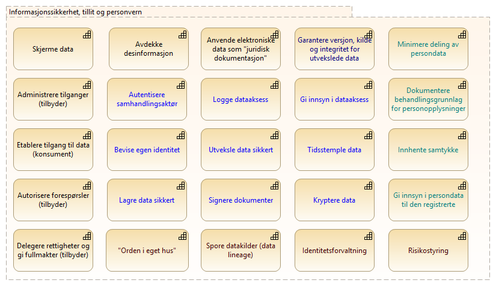

:lang: no
:doctitle: Informasjonssikkerhet, tillit og personvern
:keywords: TBD

:toclevels: 3

include::../plattform_felles/includes/commonincludes.adoc[]

//[.lead]
//Informasjonssikkerhet, tillit og personvern... 

== Introduksjon
Det finnes ulik praksis når det gjelder hva som omfattes av begrepene _informasjonssikkerhet_ og _tillit_.  _Personvern_ forutsetter god informasjonssikkerhet, og introduserer noen egne temaer.

Siden begrepene kan gli over i hverandre, opereres det her med en felles overskrift, med ulike grader av detaljer og avhengigheter i underliggende temaområder.

== Omfang og avgrensing

Følgende figur gir en oversikt over aktuelle delområder (her formulert som kapabiliteter med infitiv form).

.Informasjonssikkerhet, tillit og personvern

Området _Informasjonssikkerhet, tillit og personvern_ er totalt sett svært omfattende. Beskrivelsene vil bygges ut etterhvert.

== Nærmere beskrivelser av utvalgte temaer

== Andre overordnede føringer
image:../plattform_felles/media/i-arbeid.png[width=45, height=45] _I arbeid_

NOTE: Noen av temaområdene er adressert i referansearkitekturer for datautveksling
