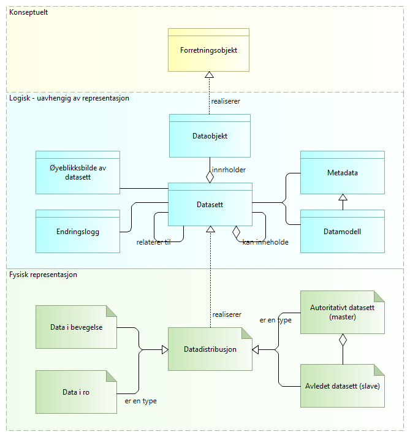
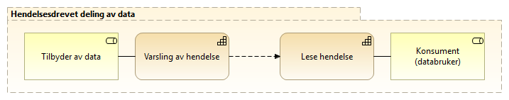

:lang: no
:doctitle: Temaområde datautveksling
:keywords: 
:toclevels: 3
include::../plattform_felles/includes/commonincludes.adoc[]

:leveloffset: +1

= Introduksjon
== Hva menes med datautveksling?
I sammenheng med nasjonale referansearkitekturer for datautveksling omfatter begrepet datautveksling alle former for dataflyt mellom tilbydere og konsumenter, enten det er internt i en virksomhet, mellom virksomheter eller mellom virksomheter og personer. Begrepet omfatter også  

== Hva er _data_ for _datautveksling_?

Det finnes ulike definisjoner av data i forhold til informasjon. 

//I utbredte modelleringsstandarder skilles det også mellom forretningsobjekter og dataobjekter - og det kan videre skilles mellom informasjon og begreper som kunnskap og visdom. Dette kan være forvirrende for mange (også arkitekter).  

I tilknytning til _datautveksling_ er ikke alle distinksjonene nødvendigvis relevante. Så langt det gir mening,   benyttes begrepet _data_ heller enn _informasjon_.

Figuren nedenfor introduserer noen  begreper som anses som nyttige og nødvendige i sammenheng med aktuelle  referansearkitekturer for datautveksling.

// .Hva er data - overordnet konsept
// image::../nab_referanse_arkitekturer_datautveksling/media/Hva er data - overordnet konsept.png[alt=Hva er data - overordnet konsept image]

.Hva er data - grunnleggende konsepter ifm. datautveksling

At det gjøres en forskjell på _Forretningsobjekt_ og _Dataobjekt_ følger av aktuelle modlleringsstandarder, men kan ses som mindre viktig her. Spesielt interesserte kan finne mer om temaet under #[underline]##Modelleringskonvensjoner##.#

Data kan samles i _datasett_, som beskrives i form av metadata og datamodeller. 

Data og datasett er å oppfatte som "logiske" definisjoner, uten binding til  representasjon, teknisk løsning eller fysiske forekomster.

Innholdet i datasett ("selve dataene") kan redegjøres for i form av tidsstemplede _øyeblikksbilder_ eller ved  _endringslogger_ ut fra gitte øyeblikksbilder.

Begrepet _datadistrubusjon_ tilsvarer begrepet https://www.w3.org/TR/vocab-dcat/#Class:_Distribution[_distribution_] i DCAT-standarden. Dette kan f.eks. være dokumenter i et dokumentarkiv eller tabeller i en database.

Det er den fysiske forekomsten av data i ulike systemer som må sikres, enten det dreier seg om data som er lagret over tid (data at rest) eller data som finnes midlertidig mellom systemer i en datautveksling (data in motion).

Datautveksling kan skje gjennom felles datalager, men vil uansett omfatte en form for meldingsutveksling (synkront eller asynkront).

Det skilles videre mellom autoritative datasett (masterdata) og avledete data (slavedata). 

NOTE: Det er vanlig å skille mellom mellom data, informasjon og kunnskap. Det gir f.eks. mening å si _informasjonssikkerhet_, mens en snakker om _sikring av data_ for å oppnå _informasjonssikkerhet_. En skiller også gjerne mellom konseptuelle, logiske og fysiske data.

NOTE: Data kan finnes med større eller mindre grad av struktur, og det er en flytende overgang mellom ustrukturerte, semistrukturerte og strukturerte data. Med nyere teknologier innen maskinlæring kan en også tolke og gi struktur og mening til data som en tidligere har definert som ustrukturerte.

NOTE: Det finnes ulik praksis for bruk av begrepet _dokument_. Dette begrepet brukes derfor ikke her, dvs. i sammenheng med referansearkitekturer for datautveksling.  

== Omfang og avgrensing

Datautveksling kan brytes ned i et sett av isolerte områder og kapabiliteter. På øverste nivå skilles det mellom:

* Deling av data på forespørsel: Innhenting av data ved forespørsel til en eller flere datakilder.

* Deling av data ved forsendelse: Forsendelse av data fra en avsender til en eller flere kjente mottakere.

* Deling av data ved publisering: Publisering av data eller hendelser med løs kopling mellom avsendere og mottakere.  

Dette er illustrert i følgende figur.

.Kapabilitetsområder, datautveksling
image::../nab_arkitekturlandskap_segmentarkitektur_datadeling/media/Kapabilitetsområder, datautveksling.png[alt=Kapabilitetsområder, datautveksling image]

Det skille videre mellom operative og forvaltningsmessige kapabiliteter, dvs. selve datautvekslingen og det som går på tilrettelegging og vedlikehold.

Følgende figur viser en oversikt over de viktigste temaene og kapabilitetene inndelt i operativt og forvaltningsmessig og om de tilhører datatilbyder eller datakonsument. Nederst i figuren er også listet opp tverrgeånde temaer som vurderes som viktige inn i datautveksling og må ivaretas på tvers av roller og kapabiliteter.

//Videre nedbryting i detaljerte kapabiliteter og mønstre gjøres i tilknytning til beskrivelsene av referansearkitekturer for datautveksling.

// Her følger en overordnet oversikt over overordnede kapabiliteter og tverrgående temaer som sorterer under området datautveksling. 

//NOTE: Noen av de temaene som nevnes her er også aktuelle i andre sammenhenger, og beskrives ved behov i ulike kontekster.   

.Datautveksling - overordnet oversikt over kapabiliteter og temaer 
image::../nab_arkitekturlandskap_segmentarkitektur_datadeling_datautveklsing/media/Datautveksling - overordnet oversikt over kapabiliteter og temaer .png[alt=Datautveksling - overordnet oversikt over kapabiliteter og temaer  image]

=== Tverrgående temaer
De tverrgående temaene beskriver områder som må ivaretas, eller være på plass, for å utveksle data på en tillitsvekkende måte i tråd med regelverk og god praksis. Dette er ikke en uttømmende liste og temaene er heller ikke beskrevet i sin helhet, men tatt med siden det er viktige områder som må vurderes og som utfyller og støtter de øvrige beskrivelsene.

Temaene vil normalt favne langt videre enn datautveksling som beskrevet i referansearkitekturene for datautveksling og kan også selv være gjenstand for egen referansearkitekturer.

==== Standarder og spesifikasjoner
Temaområdet beskriver...

==== Avtaleforvaltning
Temaområdet omhandler bl.a. formaliseringen av datautvekslingen mellom to eller flere parter. 

==== Roller og ansvar
Temaområdet omhandler og definerer roller involvert i datautveksling og hvilket ansvar som følger med rollene og grenseoppgangen for når en aktør har eller får ansvaret for dataene som håndteres.

==== Informasjonssikkerhet, tillit og personvern
Temaområdet omhandler bl.a.

* Integritet, konfidensialitet, tilgjengelighet
* Tillitskjeder
* Innsyn og transparens
* m.m.

==== Feilhåndtering ved datautveksling
Temaområdet feilhåndtering ved datautveksling omhandler hvordan feil og avvik håndteres. Dette vil være svært forskjellig fra mellom mønstrene og hva avviket gjelder. 

==== Sporing
Temaområdet sporing omfatter bl.a.

* Sporing av dataaksess
* Sporing av kilder 
* Sporing for etterlevelse
* Sporing for dokumentasjon tilknyttet vedtak 

////
= Brukstilfeller
== Generelt
== Deling av data på forespørsel
Innhenting av data ved forespørsel til en eller flere datakilder.
== Deling av data ved forsendelse
Forsendelse av data fra en avsender til en eller flere kjente mottakere.

== Deling av data ved publisering
Publisering av data eller hendelser med løs kopling mellom avsendere og mottakere. 
////
    
= Referansearkitekturer for datautveksling

Se link:../nab_referanse_arkitekturer_datautveksling[Referansearkitekturer for datautveksling]

= Tverrgående temaområder innen datautveksling

NOTE: Se også tverrgående temaer under det større området link:../nab_arkitekturlandskap_segmentarkitektur_datadeling[datadeling].

:leveloffset: +1

= Aktuelle arkitekturprinsipper

NOTE: Prinsipper for datautveksling vil bygge på felles  nasjonale arkitekturprinsipper, som er under revidering høsten 2019

= Roller involvert i datautveksling
include::../nab_referanse_arkitekturer_datautveksling/roller-ra-datautveksling.adoc[]

= Avtaleforvaltning for datautveksling
include::../nab_arkitekturlandskap_segmentarkitektur_datadeling_avtaleforvaltning/book-avtaleforvaltning.adoc[]

//Se link:../nab_arkitekturlandskap_segmentarkitektur_datadeling_avtaleforvaltning/[Avtaleforvaltning]

= Informasjonssikkerhet

// Se link:../nab_arkitekturlandskap_segmentarkitektur_datadeling_datasikkerhet[Informasjonssikkerhet, tillit og personvern]

include::../nab_arkitekturlandskap_segmentarkitektur_datadeling_datasikkerhet/book-datasikkerhet-tillit-personvern.adoc[]

:leveloffset: -1

////
Merk: Disse temaene er også adressert under det større området _Datadeling_. Her omtales det som gjelder spesielt for _Datautveksling_.

=== Roller involvert i datautveksling

=== Feilhåndtering
TBD.

=== Informasjonssikkerhet, tillit og personvern
Se ...

=== Standardisering og spesifikasjoner
TBD.

=== Avtaleforvaltning

Se  link:../nab_arkitekturlandskap_segmentarkitektur_datadeling_avtaleforvaltning/[Avtaleforvaltning]

* Standardisering og spesifikasjoner
TBD.

////

////

==== Deling av data ved forsendelse
Dette er deling av informasjon og data initiert av avsender. Det vil normalt være behov og/eller forventning om oppfølging fra mottaker. Eksempler kan være å sende en faktura hvor det forventes at mottaker behandler denne, eller en henvisning i helsesektoren hvor det forventes at mottaker tar ansvar for videre oppfølging av pasienten det gjelder. 

Ved deling av data ved forsendelse må avsender ha visshet om at mottaker kan motta og behandle meldingen/informasjonen som sendes.

.Kapabiliteter innen området Deling av data ved forsendelse
image::../nab_arkitekturlandskap_strategisk-arkitektur\media/kapabiliteter-datautveksling-forsendelse.png[alt="Bilde mangler", width=750]

NOTE: Deling av data ved forsendelse er beskrevet i Nasjonal referansearkitektur og strategi for eMelding; se https://www.difi.no/fagomrader-og-tjenester/digitalisering-og-samordning/nasjonal-arkitektur/referansearkitekturer/referansearkitektur-meldingsutveksling-emelding.

==== Deling av data på forespørsel
//:leveloffset: +4
//include::../nab_arkitekturlandskap_segmentarkitektur_datadeling/deling-av-data-på-forspørsel.adoc[]
//:leveloffset!:

Dette kan være å spørre om data gjennom et API eller å lese åpne, publiserte data. Ved å lese publiserte data menes for eksempel åpne data på data.norge.no eller datasett som legges fritt tilgjengelig på nettet. Et eksempel på det siste er valutakurser fra Norges bank.

.Kapabiliteter innen området Deling av data på forespørsel
image::../nab_arkitekturlandskap_segmentarkitektur_datadeling/media/kapabiliteter-datautveksling-forespørsel.png[alt="Bilde mangler", width=750]

Oppslag av data gjennom API kan gi mer avanserte muligheter for spørring i datasett med ulike metoder og tilgangsnivåer. Dette vil være måten å dele data nært opp til sanntid for bruk i saksbehandlingsprosesser og liknende når tilgang skal gis etter hvilke rettigheter den enkelte bruker har til dataene. Et eksempel på dette er oppslag i folkeregisteret hvor ulike brukere kan ha ulike tilganger etter hva de har av hjemler og behov.

NOTE: En  videre nedbryting av kapabiliteterer spesielt for innhenting av data ved oppslag mot API er gjort i tilnytning til link:../nab_referanse_arkitekturer_eoppslag/[referansearkitektur for eOppslag] og er videre beskrevt der.
    
==== Hendelsesdrevet deling av data
Med hendelsesdrevet deling av data menes det deling som er initiert av en tilstandsendring i dataene som deles. Databruker leser eller abonnerer på hendelseslister og dette trigger eventuell videre oppfølging. Databruker må vurdere om endringen skal følges opp og lese data på forespørsel. 

Et eksempel er modernisert folkeregister hvor brukere kan abonnere på endringer og således kun få vite at det har skjedd en endring på en person, og dersom dette kan være relevant for brukeren hentes detaljene om endringen som igjen kan sette i gang en handling hos bruker.

.Kapabiliteter innen området Hendelsesdrevet deling av data

//Det er foreløpig ikke startet arbeid med referansearkitektur for hendelsesdrevet deling av data.

////

////
== Alternativt utkast til kapabilitetskart for Datadeling basert på The Open Group SOA RA

Behovet for et mer detaljert bilde enn det som så langt er gitt, er til utredning (våren 2019). Som ledd i dette har en sett på kapabilitetskart i The Open Group SOA RA.

Følgende figur presenterer et utvalg av temaområdene i det totale kapbilitetskartet i The Open Group SOA RA som anses spesielt relevant:

.Utvalgte temaområder fra The Open Group-s SOA RA
image::../nab_arkitekturlandskap_segmentarkitektur_datadeling/media/SOA_RA_Kapabilitetsområder.png[]

For videre nedbryting og detaljer om dette kartet, se

* The Open Group SOA RA
* #Publiserte Archi-modeller for The Open Group SOA RA (Difi)#

////

////

== Mapping til EIRA
#Mapping til EIRA kommer her.#
////