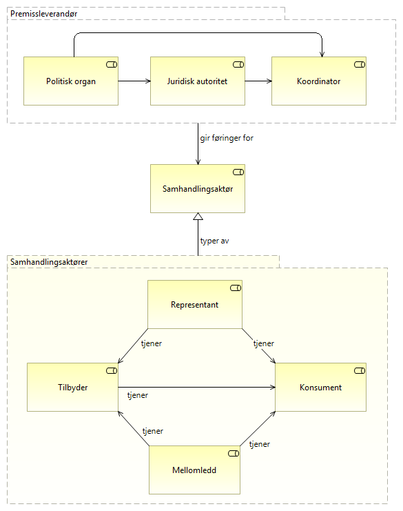
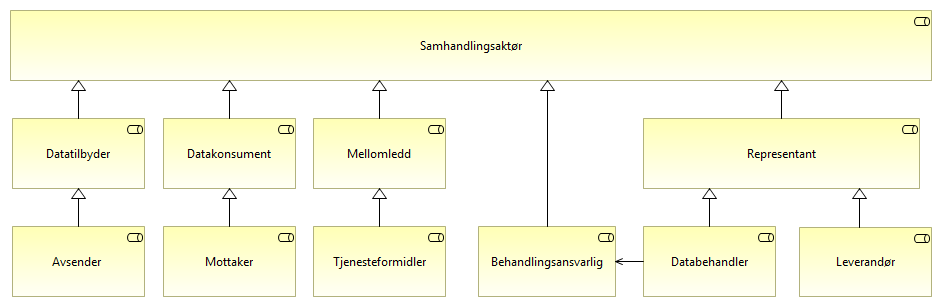
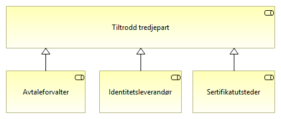

:lang: no
:doctitle: Rollekart for området Datadeling
:keywords: eMelding
:toclevels: 3
include::../plattform_felles/includes/commonincludes.adoc[]

== Introduksjon

Her identifiseres roller som er relevante for temaområdet Datadeling. 

Spesialisering av generelle roller er gjort for å gi mer presise,kontekstspesifikke definisjoner. Eksempel: _Avsender_ er en _datatilbyder_ som sender meldinger. 

Rollene er definert med utgangspunkt i følgende standarder og andre, eksterne kilder:

* EIRA
* The Open Group SOA RA
* OASIS SOA RAF
* Begreper fra Datatilsynet

////
== Overordnede roller og relasjoner

.Overordnede roller og relasjoner

////

include::./roller-ra-datautveksling.adoc[]

////
== Samhandlingsaktører
        
.Samhandlingsaktører

== Tiltrodde tredjeparter

.Tiltrodde tredjeparter

////