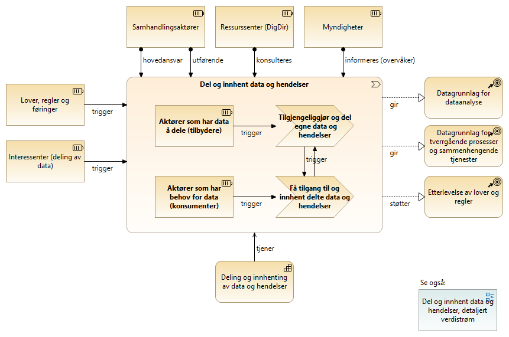
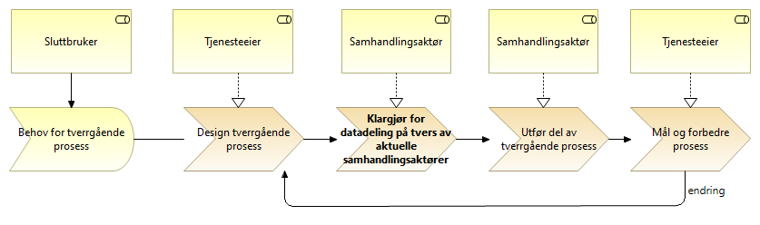
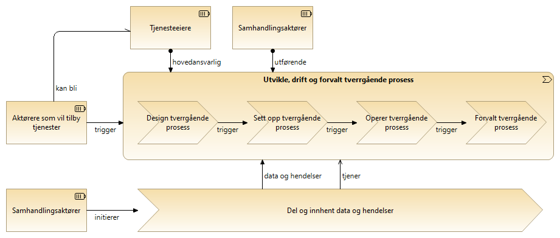
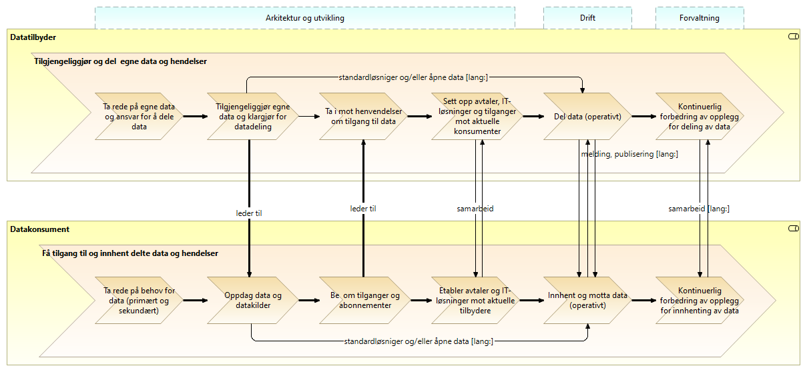
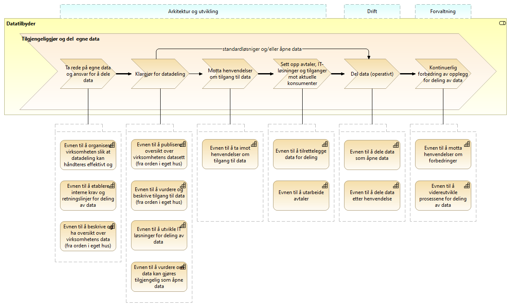
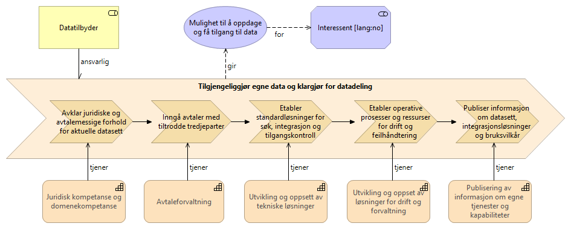

////
Guide to the below header attributes:

    lang: en; no
    difi_orig_language: en; no
    difi_translation_status: -; missing; incomplete; OK 
    keywords_en: comma separated list of english keywords (no controlled vocabulary); TBD
    keywords_no: comma separated list of Norwegian keywords (no controlled vocabulary); TBD  
    
Note: The _lang_ value may be overridden by a command line parameter.
////

:lang: no
:difi_orig_language: no
:doctitle_en: English Document Title
:doctitle_no: Felles referansemodeller for deling av data 
:difi_translation_status: -
:keywords_en: TBD
:keywords_no: TBD
:toclevels: 4
:difi_doctype: Basic Book Template

// The above parameters are processed by scripts included by the following statement
include::../plattform_felles/includes/commonincludes.adoc[]

// ****************
// NORWEGIAN
// ****************
ifeval::["{lang}" == "no"]

[.lead]
_Disse modellene er tatt fram for å gi felles referanse og rammer for beskrivelser i ulike sammenhenger._

NOTE: Se link:../nab_referanse_modelleringskonvensjoner[modelleringskonvensjoner] om gjeldende modelleringskonvensjoner (_verdistrømmer_).

////
== Introduksjon

Se link:../kunnskap_tema_value_streams[kunnskapsbiblioteket om verdistrømmer] for generell bakgrunn, samt link:../nab_referanse_modelleringskonvensjoner[modelleringskovensjoner] om gjeldende modelleringskonvensjoner.
////

////
Brukstilfeller og scenarier

Konsument:

* Behov for data
* Behov for periodisk oppdatering av data
* Behov for å trigge neste ledd i en dynamisk prosess med kjente parter
* ...

Produsent:

* Nye datasett av interesse for andre
* Forespørsel om nye eller endrede tilganger og abonnementer
* Endrede datasett, løsninger eller vilkår som berører etablerte konsumenter
* Forespørsel om enkeltstående utlevering av data 
* Forespørsel om abonnement på  hendelsesbaserte notifikasjoner
* ...

////

////
== Overordnet modell

En overordnet modell er vist i følgende figur, der det skilles mellom aktører som har data å dele (potensielle datatilbydere) og aktører som har behov for data (potensielle datakonsumenter), og deres respektive verdistrømmer.

.Del og innhent data og hendelser

I dette bildet er *involverte samhandlingsaktører kollektivt _hovedansvarlige_* for deling og innhenting av data og hendelser.

Interessenter kan være:

* Samhandlingsaktører
* Tjenesteeiere
* Sluttbrukere

Videre kommentarer til figuren over: TBD.

////

== Ende-til-ende verdistrøm for datadeling (overordnet)

image:../plattform_felles/media/i-arbeid.png[width=45, height=45, alt="Figur: i-arbeid.png?"]I arbeid

////
Datadeling inngår saksbehandling og tverrgående prosesser for tjenesteproduksjon. 

Her vises et forenklet bilde av ende-til-ende verdistrøm for tverrgående prosesser, der _datadeling_ inngår.   

.Ende-til-ende verdistrøm, tverrgående prosess

[red]#__Merk: Se også link:../nab_arkitekturlandskap_segmentarkitektur[mer utfyllende dekning av  temaområdet Tverrgående prosesser og saksbehandling.__]#
////
Datadeling inngår saksbehandling og tverrgående prosesser for tjenesteproduksjon. 

//== Saksbehandling og tverrgående prosesser

.Utvikle, drift og forvalt tverrgående prosess

Ende-til-ende verdistrømmer for både datatilbydere og datakonsumenter er vist i følgende figur.

.Del og innhent data og hendelser, detaljert verdistrøm

=== Del og innhent data og hendelser, detaljert verdistrøm med kapabiliteter

Forklaring:
Datatilbyder må evne å bestemme hvilken teknisk løsning som skal benyttes når dataene gjøres tilgjengelig som åpne data

Datatilbyder må evne å velge hvor og hvordan dataene skal gjøres tilgjengelig, hvor skal datakonsument finne dataene og på hvilket format skal dataene deles 

Datatilbyder må videre evne å bestemme detaljeringsgrad på dataene

Krav til personvern må kunne ivaretas, samt eventuelle krav i forhold til andre skjermingsverdige opplysninger  

Løsning:
Prosesser for å dele data som åpne data

.Del og innhent data og hendelser, detaljert verdistrøm med kapabiliteter

[cols ="1,3", options="header"]
.Elementer i view for Del og innhent data og hendelser, detaljert verdistrøm med kapabiliteter
|===

| Element
| Beskrivelse

| Evnen til å tilrettelegge data for deling
| Forklaring:
Datatilbyder må evne å utvikle eller bruke tekniske løsninger for deling av data med konsumenten. Eventuell tilgangsstyring må tilrettelegges

Forklaring:
Virksomheten bør ha prosesser for hvordan data skal tilrettelegges

Teknisk løsning for datadeling bør være på plass slik at data effektivt kan tilrettelegges for å konsumentens behov

| Evnen til å publisere oversikt over virksomhetens datasett (fra orden i eget hus)
| Forklaring:
Datatilbyder må evne å tilby datakonsument oversikt over data som virksomheten produserer slik at datakonsument enkelt kan oppdage data som tilbys. Videre bør det være opplyst hvordan datakonsument kan få tilgang til dataene

Løsning:
Prosesser for hvor og hvordan oversikt og virksomhetens datasett skal publiseres

Legge oversikt over virksomhetens datasett på Felles datakatalog

Eventuelt Intern datakatalog som kan benyttes til å publisere oversikten på Felles datakatalog

Aktuelle IT system for intern publisering av datasett er:
-	CKAN
-	GeoNetwork Open Source
-	Fedora Repository

Publisere oversikt over datatilbyders API’er

| Evnen til å utvikle IT løsninger for deling av data 
| Forklaring:
Løsningene må kunne håndtere både åpne data og data som deles etter henvendelse

IT løsningene bør kunne gjenbrukes slik at det ikke er nødvendig å utvikle løsninger hver gang det skal deles data

Ved utvikling av nye IT løsninger til annen bruk i virksomhetene bør det tas høyde for at løsningene skal støtte deling av data

Løsning:
Prosesser som beskriver hvilke vurderinger som skal gjøres rundt valg av IT løsninger. Prosesser for utvikling av IT løsninger, samt implementering av disse

| Evnen til å ta imot henvendelser om tilgang til data
| Forklaring:
Datatilbyder må ha rutiner/prosesser for å håndtere mottak av henvendelser slik at krav til eventuell journalføring, registrering og arkivering blir ivaretatt

Datatilbyder må sørge for at henvendelsen er forstått slik at det ikke er uklarheter omkring konsumentens behov. Dersom tilbyder ikke har forstått hva konsument har behov for, må konsument kontaktes

Det må videre håndteres hvordan henvendelsen skal følges opp videre i virksomheten

Løsning:
Prosess for mottak av henvendelser om tilgang til data for å sikre at henvendelser håndteres effektivt og ensartet

| Datatilbyder
| Tilbyder av data til andre aktører.

| Tilgjengeliggjør og del  egne data
| 

| Klargjør for datadeling
| "Klargjøre for datadeling" handler om å synliggjøre hvilke data virksomheter har og vurder om de kan deles med hensyn på skjerming, verdi etc.
Også teknisk og organisatoriske kapasitet for deling må etableres.

| Del data (operativt)
| "Del data (operativt)" handler om utveksling av data gjennom etablerte kanaler og iht. avtaler. Dette forutsetter også håndtering av avvik og ikke-tilsiktede hendelser.

| Sett opp avtaler, IT-løsninger og tilganger mot aktuelle konsumenter
| "Sett opp avtaler, IT-løsninger og tilganger mot aktuelle konsumenter" handler om å etablere, integrere og konfigurere avtaler og it-løsninger mellom partene så alt er klart for at data kan utveksles. 

Merk: Tilgangsstyring må settes opp i sammenheng med, eller etter, utvikling eller oppsett av løsninger.

| Motta henvendelser om tilgang til data
| "Motta henvendelser om tilgang til data" handler om å ha rutiner og kapasitet for å ta i mot henvendelser og vurdere om tilgang skal gis.

| Kontinuerlig forbedring av opplegg for deling av data
| "Kontinuerlig forbedring av opplegg for deling av data" handler om aktiv forvaltning av operative løsninger for deling av data gjennom kontakt med datakonsumenter og tilpasning til nye behov, krav og teknologi.

Kan også omfatte tilbakemeldinger på kvalitet på data og forbedring av datagrunnlaget.

| Ta rede på egne data og ansvar for å dele data
| "Ta rede på egne data og ansvar for å dele data" handler om å ha oversikt over og forvalte egne data. Virksomheten må også være bevist ansvaret for å dele data og ha informasjonsforvaltningsrutiner som støtter opp om deling.

| Drift
| 

| Forvaltning
| 

| Arkitektur og utvikling
| 

| Evnen til å organisere virksomheten slik at datadeling kan håndteres effektivt og etter gjeldene krav og regelverk
| Forklaring:
Virksomheten må være organisert slik at den har kapasitet til å dele data. Videre må det settes fokus på deling slik at dette ikke blir nedprioritert i forhold til virksomhetens øvrige oppgaver

Løsning:
En mulighet er at virksomheten har ansatte som har datadeling som spesialområde og fått tid og ressurser til å utføre oppgaven 

| Evnen til å etablere interne krav og retningslinjer for deling av data
| Forklaring:
Internt må virksomheten forankre arbeidet med datadeling og det må settes krav til arbeidet og resultatet av virksomhetens deling av data

Løsning:
Krav til datadeling kan tas inn i virksomhetens planer og strategier

| Evnen til å beskrive og ha oversikt over virksomhetens data (fra orden i eget hus)
| Forklaring:
Beskrivelse av offentlige data i Norge skal utføres på en felles, strukturert måte og i en maskinlesbar form

Informasjonsmodeller: Etablere felles begrepsapparat, standardiserte beskrivelser og sammenhengen mellom dataelementene

Datakvaliteten bør være dokumentert, og kjente utfordringer knyttet til datakvalitet bør omtales eksplisitt i beskrivelsen.

Løsning:
Bruke DCAT-AP-NO

https://doc.difi.no/data/veileder-orden-i-eget-hus/#_beskrive_data

| Evnen til å vurdere og beskrive tilgang til data (fra orden i eget hus)
| Forklaring:
Datatilbyder må evne å vurdere egne data med tanke på deling med eksterne konsumenter. Vurderingene som gjøres bør gjøres tilgjengelig for allmennheten

Løsning:
Vurdere om data kan deles ved å klassifisere data som grønn (offentlig), gul (begrenset offentlighet) og rød (unntatt offentlighet)

Vurderingene bør dokumenteres og gjøres tilgjengelig for eventuelle konsumenter

| Evnen til å vurdere om data kan gjøres tilgjengelig som åpne data
| Forklaring:
Hvis data klassifiseres som grønn (eventuelt gule data som kan være aktuelt å dele som åpne data), må det videre vurderes om dataene skal deles som åpne data. Her vil flere forhold kunne spille inn. Eksempel på dette er vurdering av om dataene er interessante for allmennheten, samt vurdering av kostnadene med å dele dataene sett i forhold til samfunnsnytten

Løsning:
Prosess som beskriver vurderingene som skal gjøres før dataene eventuelt gjøres tilgjengelig som åpne data

| Evnen til å utarbeide avtaler
| Forklaring:
I en del tilfeller vil det være behov for utleveringsavtale som regulerer hvordan data utleveres og hvordan dataene brukes av konsument

Dersom konsument skal betale for dataene må pris avklares og tas inn i avtale med konsument

Løsning:
Mal for utleveringsavtale

| Evnen til å dele data som åpne data
| 

| Evnen til å dele data etter henvendelse
| Forklaring:
Datatilbyder må evne å vurdere hvordan dataene skal deles, hvilken teknisk løsning som skal benyttes, hvordan dataene skal tilrettelegges for konsument og hvordan skal tilgang til dataene håndteres. Skal dataen leveres som enkeltleveranse eller skal det være en fast leveranse 

Kompetanse på hvordan prising av leveransene skal håndteres, samt hvilke kostnader til datatilbyder skal eventuelt dekkes av konsument

Datatilbyder må evne å bestemme detaljeringsgrad på dataene

Krav til sikkerhet ved deling av data må kunne ivaretas

Krav til personvern må ivaretas, samt eventuelle krav i forhold til andre skjermingsverdige opplysninger  

Løsning:
Prosesser for å dele data etter henvendelse

| Evnen til å motta henvendelser om forbedringer
| Forklaring:
Det bør være enkelt for datakonsument å gi tilbakemelding til virksomheten om hvordan datakonsument opplever datatilbyders tilbud av data. Datatilbyder må evne å motta og behandle tilbakemeldinger på en profesjonell måte.

Løsning:
Løsning for mottak av henvendelser. Kan eksempelvis være mottaksapparat i form av felles postkasse eller lignende.

| Evnen til å videreutvikle prosessene for deling av data
| Forklaring:
For at virksomhetens deling av data skal videreutvikles og møte datakonsumentens behov, må virksomheten evne å endre måten datadeling gjennomføres på

Løsning:
Personer som er ansvarlige for virksomhetens prosesser for deling av data må behandle tilbakemeldingene. Det må deretter vurderes om det skal gjøres endringer i prosessene 

|===

== Detaljering av stegene i overordnet verdistrøm

=== Steg: Tilgjengeliggjør egne data og klargjør for datadeling
.Tilgjengeliggjør egne data og klargjør for datadeling

=== Detaljering av andre steg i overodnet verdistrøm
TBD.

// ****************
endif::[]
// ****************

// ****************
// ENGLISH
ifeval::["{lang}" == "en"]
// ****************

[.lead]
Preamble goes here...

== Introduction
include::./intro_ra_datadeling.adoc[]

== Chapter 2 
// Further chapters to go here - include files or  write directly here 

.Figure: Sample figure
image:../nab_arkitekturlandskap_segmentarkitektur_datadeling_verdistrømmer/media/sample-image.png[]

// ****************
endif::[]
// ****************
