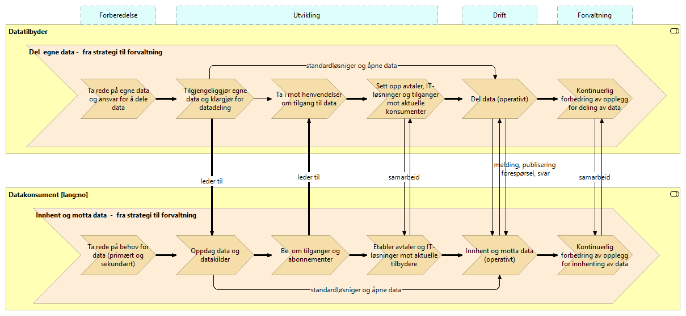

////
Guide to the below header attributes:

    lang: en; no
    difi_orig_language: en; no
    difi_translation_status: -; missing; incomplete; OK 
    keywords_en: comma separated list of english keywords (no controlled vocabulary); TBD
    keywords_no: comma separated list of Norwegian keywords (no controlled vocabulary); TBD  
    
Note: The _lang_ value may be overridden by a command line parameter.
////

:lang: no
:difi_orig_language: no
:doctitle_en: English Document Title
:doctitle_no: Verdistrømmer for deling av data 
:difi_translation_status: -
:keywords_en: TBD
:keywords_no: TBD
:toclevels: 4
:difi_doctype: Basic Book Template

// The above parameters are processed by scripts included by the following statement
include::../plattform_felles/includes/commonincludes.adoc[]

image:../nab_arkitekturlandskap_segmentarkitektur_datadeling_verdistrømmer/media/datadeling-logo.png[width=300]

// ****************
// NORWEGIAN
// ****************
ifeval::["{lang}" == "no"]

[.lead]
_Kort, innledende tekst for denne boken_

== Introduksjon
include::./intro_ra_datadeling.adoc[]

== Brukstilfeller og scenarier

#*** I ARBEID! ***#

Konsument:

* Behov for data
* Behov for periodisk oppdatering av data
* Behov for å trigge neste ledd i en dynamisk prosess med kjente parter
* ...

Produsent:

* Nye datasett av interesse for andre
* Forespørsel om nye eller endrede tilganger og abonnementer
* Endrede datasett, løsninger eller vilkår som berører etablerte konsumenter
* Forespørsel om enkeltstående utlevering av data 
* Forespørsel om abonnement på  hendelsesbaserte notifikasjoner
* ...

== Verdistrømmer

=== Generell deling av data  

.Overordnet verdistrøm for deling av data 

==== Tilgjengeliggjør egne data og klargjør for datadeling
.Tilgjengeliggjør egne data og klargjør for datadeling
image::../nab_arkitekturlandskap_segmentarkitektur_datadeling_verdistrømmer/media/Tilgjengeliggjør egne data og klargjør for datadeling.png[alt=Tilgjengeliggjør egne data og klargjør for datadeling image]

// ****************
endif::[]
// ****************

// ****************
// ENGLISH
ifeval::["{lang}" == "en"]
// ****************

[.lead]
Preamble goes here...

== Introduction
include::./intro_ra_datadeling.adoc[]

== Chapter 2 
// Further chapters to go here - include files or  write directly here 

.Figure: Sample figure
image:../nab_arkitekturlandskap_segmentarkitektur_datadeling_verdistrømmer/media/sample-image.png[]

// ****************
endif::[]
// ****************
