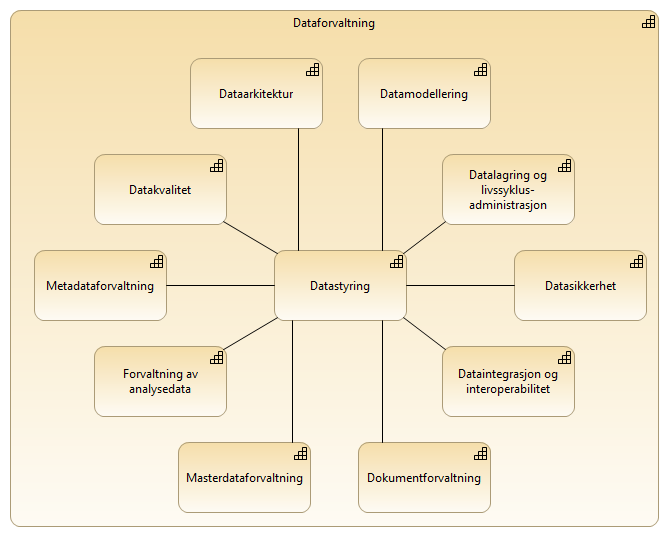
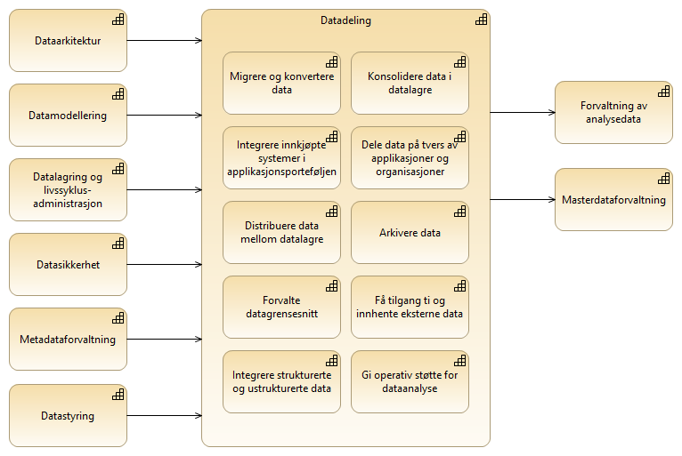

:lang: no
:doctitle: Temaområde informasjonsforvaltning
:keywords:
:toclevels: 4
include::../plattform_felles/includes/commonincludes.adoc[]

//[.lead]
//Informasjonsforvaltning

== Overordnede områder innen informasjonsforvaltning
Det tas [underline]#inntil videre# her utgangspunkt i nedbrytning av området _Data Management_ slik dette gjøres i link:../kunnskap_bok-dmbok2[Data Management Body of Knowledge (DMBOK2)].

.Områder innen informasjonsforvaltning (DMBOK)

I link:../kunnskap_bok-dmbok2[DMBOK2)] finnes en videre nedbrytning for hvert område. 

////
Nedbryting av området _Datadeling_ (oversatt fra _Data Integration and Interoperability_ i DMBOK2) er vist i figuren nedenfor. Her er det også angitt at det er sammenhenger med andre områder.

.Datadeling (DMBOK2)

////

//Vi betrakter ut fra dette <<datadeling,temaområdet Datadeling>> som en del av et større bilde som handler om informasjonforvaltning, både internt i hver enkelt virksomhet og på tvers av virksomheter.

:leveloffset: +1
[#datadeling]
= Temaområde datadeling
Datadeling
link:../nab_arkitekturlandskap_segmentarkitektur_datadeling[datadeling]

//include::../nab_arkitekturlandskap_segmentarkitektur_datadeling/main.adoc[]
:leveloffset!:

= Andre områder innen informasjonsforvaltning
Andre områder innen informasjonsforvaltning dekkes inntil videre under link:../nab_arkitekturlandskap_segmentarkitektur_datadeling[datadeling].
 
