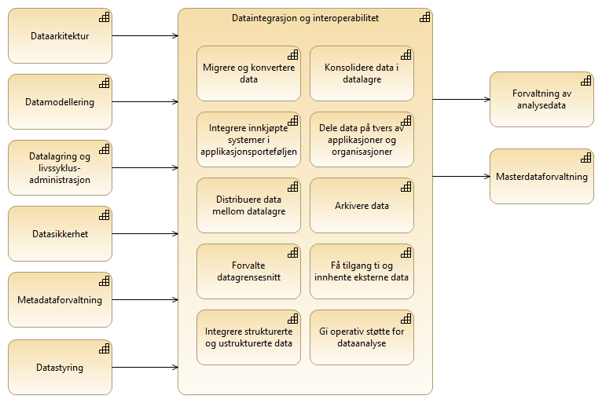

:lang: no
:doctitle: Temaområde informasjonsforvaltning
:keywords:
:toclevels: 4
include::../plattform_felles/includes/commonincludes.adoc[]

//[.lead]
//Informasjonsforvaltning

== Overordnede områder innen informasjonsforvaltning
Det tas [underline]#inntil videre# her utgangspunkt i nedbrytning av området _Data Management_ slik dette gjøres i DAMA DMBOK2.

.Områder innen informasjonsforvaltning (DMBOK)
image::../nab_arkitekturlandskap_segmentarkitektur_informasjonsforvaltning/media/Områder innen informasjonsforvaltning (DMBOK).png[alt=Områder innen informasjonsforvaltning (DMBOK) image]

I DMBOK2 finnes en videre nedbrytning for hvert område. 

== Data integration and interoperability (_deling av data_)

Nedbryting av området _Data Integration and Interoperability_ i DMBOK2 er vist i figuren nedenfor. Her er det også vist sammenhengen med andre områder.

 

.DMBOK2 Data Integration and Interoperability

//Vi betrakter ut fra dette <<datadeling,temaområdet Datadeling>> som en del av et større bilde som handler om informasjonforvaltning, både internt i hver enkelt virksomhet og på tvers av virksomheter.

:leveloffset: +1
[#datadeling]
= Datadeling
include::../nab_arkitekturlandskap_segmentarkitektur_datadeling/main.adoc[]
:leveloffset!:
