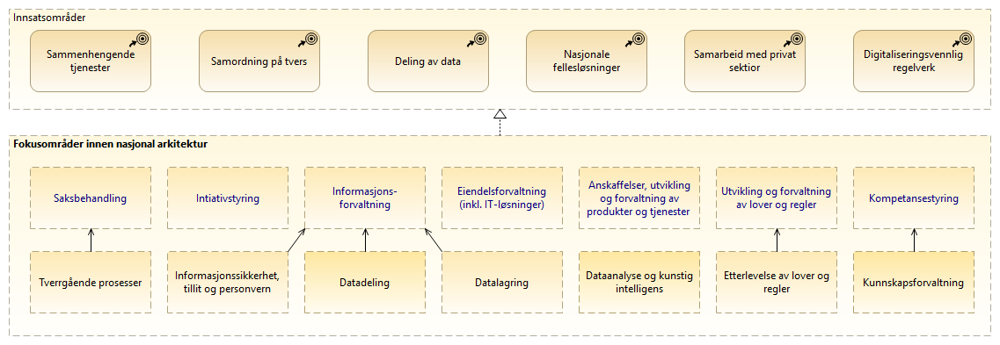

:lang: no
:doctitle: Strategiske arkitekturer
:keywords: Norsk, arkitekturbibliotek, offenlig sektor, virksomhetsarkitektur, NIF, samhandlingsarkitektur, rammeverk, GitHub
:keywords_en: Norwegian, Architecture Repository, Public sector, Enterprise Architecture, NIF, Architecture Interoperability Framework, GitHub,
:toclevels: 4
include::../plattform_felles/includes/commonincludes.adoc[]

//[.lead]
//Strategiske arkitekturer

== Generelt

Strategiske arkitekturer baseres på strategiske føringer; ref. 
link:../nab_styring/[Styring]

== Overordnet kapabilitetskart for offentlig sektor
image:../plattform_felles/media/i-arbeid.png[width=45, height=45] _I arbeid (høst 2019)_

Det presenteres her et foreløpig kapabilitetskart for offentlig sektor basert på arbeid med tilsvarende i link:https://www.businessarchitectureguild.org/[Business Architecture Guild]. Dette kan inntil videre ses på som et eksperiment og en  indikasjon på hva en ønsker å få på plass som et overbygg for videre nedbryting i områder og kapabiliteter for arbeidet med nasjonal arkitektur. 

Et slikt kapabilitetskart kan fungere på tvers av alle forvaltningsnivåer og sektorer, og bidra til samordnet innsats.

NOTE: Det finnes kapabilitetskart med nedbryting i flere nivåer fra link:https://www.businessarchitectureguild.org/[Business Architecture Guild], både generisk og sektorvis. Disse finnes omtalt i BIZBOK® Guide v8.0, og er tilgjengelige link:https://www.businessarchitectureguild.org/store/ListProducts.aspx?catid=677483[her]. Videre anvendelse av disse og andre referansemodeller vurderes fortløpende (høst 2019).

Legg merke til at en her opererer med et "rendyrket" konsept for hva som regnes som kapabiliteter i forhold til prosesser eller tjenester. Det finnes f.eks. en (på øverste nivå) generisk kapabilitet for _saksbehandling_ som er relevant på tvers av "alle" typer saker. På denne måten legges grunnen for å utforme felles løsninger og rasjonalisere utvalget av IT-løsninger som gjør mye det samme.       

.Overordnet kapabilitetskart for offentlig sektor
image::../nab_arkitekturlandskap_strategisk-arkitektur/media/Kapabilitetskart for offentlig sektor, nivå 1.png[alt=Overordnet kapabilitetskart for offentlig sektor image]

== Fokusområder i arbeidet med nasjonal arkitektur
image:../plattform_felles/media/i-arbeid.png[width=45, height=45] _Forslag i arbeid (høst 2019)_

Det tas her utgangspunkt i de definerte satsingsområde i  Regjeringens digitaliseringsstrategi 2019-2025.

Følgende figur viser  _overordnede temaområder_ innen nasjonal arkitektur som en ut fra dette ønsker å prioritere.

NOTE: Områdene er her navngitt ut fra tilsvarende områder i _Overordnet kapabilitetskart for offentlig sektor_ (blå tekst). I tillegg vises noen utvalgte, underliggende områder.

.Fokusområder innen nasjonal arkitektur (overordnet)

Disse områdene adresseres under felles overskrift link:../nab_arkitekturlandskap_segmentarkitektur[segmentarkitekturer].

////

* Intiativstyring og samordning

* Informasjonsforvaltning - datadeling, datalagring og informasjonssikkerhet

* Eiendelsforvaltning -  fellesløsninger

* Saksbehandling og tverrgående prosesser

* Anskaffelser, utvikling og forvaltning av produkter og tjenester 

* Utvikling og forvaltning av lover og regler

* Dataanalyse og kunstig intelligens

* Kompetansestyring

////