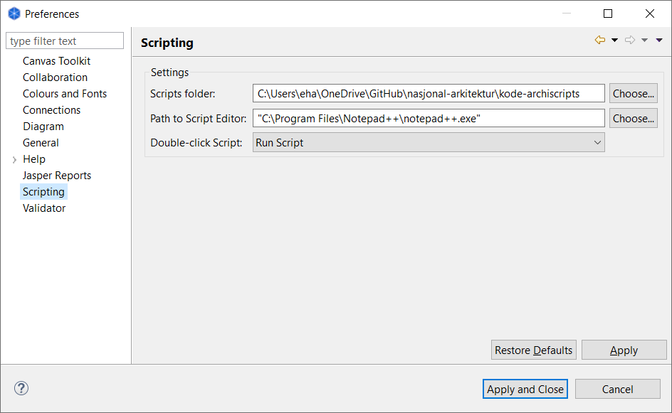
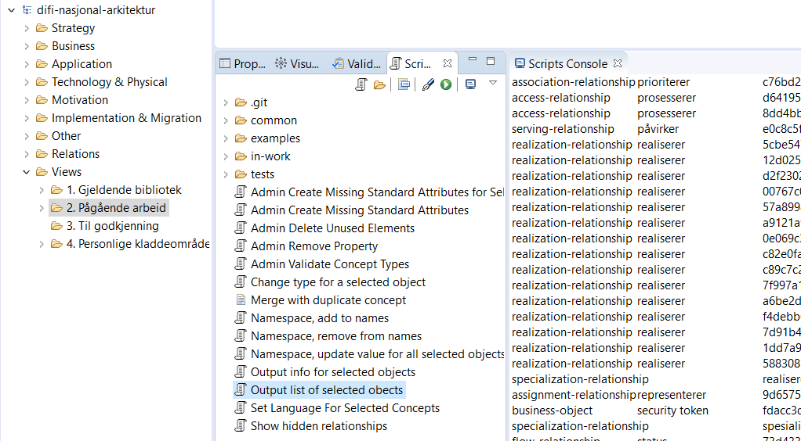
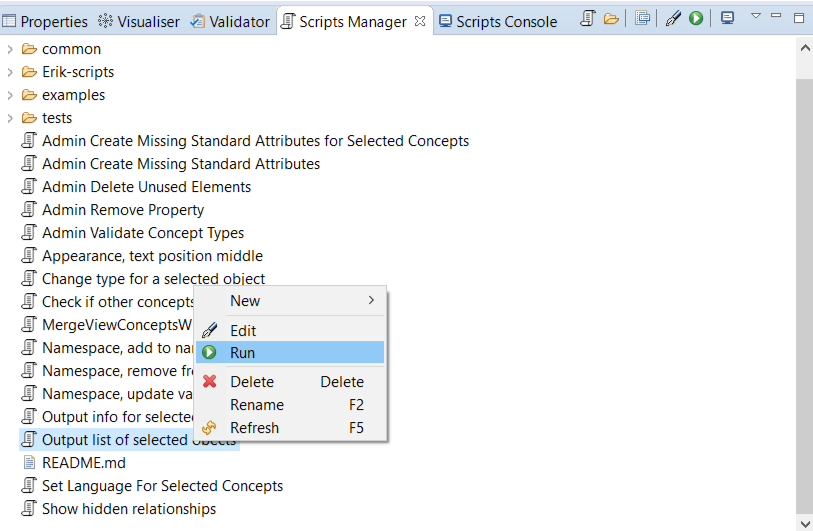

:lang: no
:doctitle: Archi-scipts
:keywords: Archi

include::../plattform_felles/includes/commonincludes.adoc[]

[.lead]
Archi er et gratis og open-source samarbeidsverktøy som støtter Archimate-standarden for arkitekturdokumentasjon. Difi har utviklet scripts for å lette arbeidet med Archi.        

image:../plattform_praktiske-tips_archi/media/archi-logo.png[]
 
//image:../plattform_felles/media/i-arbeid.png[width=75, height=75] Uferdig innhold

== Generelt
Difi har utviklet noen scripts for å effektivisere modellering og administrasjon av arkitekturbibliotek. Disse scriptene er gjort i jArchi med bruk av Archi-s Scripting Plugin, og krever installasjon av Archi-s Scripting Plugin for å kunne kjøres.

NOTE: Scriptene utvikles for å dekke løpende behov i påvente av at tilsvarende funksjonalitet (eventuelt) kommer i selve Archi-verktøyet. Kvaliteten på scriptene vil kunne variere, selv om de fleste er noenlunde grundig testet.

Produktdokumentasjon for jArchi finnes på  https://github.com/archimatetool/archi-scripting-plugin/wiki.

I tillegg  finnes noe dokumentasjon i tilknytning til Difis scipts i det følgende. 

=== Installering av jArchi plugin

Kun Patreon-medlemmer får tilgang til nedlasting og installasjon av Archi-s Scripting Plugin. For å bli medlem kreves en mindre, månedlig bidrag. Se mer om dette under https://www.archimatetool.com/plugins/.

=== Installering av aktuelle scripts 

Når du først har installert jArchi, kan du installere sciptene slik:

1. Klon GitHub repo https://github.com/nasjonal-arkitektur/kode-archiscripts til lokalt filområde.

2. Editer Archi scripting preferences (Edit|Preferences|Scripting) og oppdater _Scripts Folder_ (angi filsti til klonet repo) ) og _Path to Scrips Editor_ (f.eks. Notepad++). 

.Figur: Eksempel på utfylling av scripting Preferences  

=== Grunnleggende begrepsapparat i jArchi
jArchi skiller i utgangspunktet mellom ulike typer objekter:

* Modell (Model): Alle objekter i filen (eller prosjektet) 
* Konsepter (Concepts: Disse finnes i mappestruykturen under hver modell (Outline).
* Elementer (Elements): Forekomster av _element-konsepter_ i views..
* Relasjoner (Relationships): Forekomster av _relasjons-konsepter_ i views.
* Egenskaper (Properties): Attributter for hvert objekt. Alle objekter har noen standardegenskaper, slik som Name og Documentation. Flere standardegenskaper finnes i Archi som produkt. I tillegg har Difi definert et sett av egne egenskaper.

=== Kjøring av scipts - generelt
Typisk framgangsmåte er å gjøre et utvalg av objekter, for deretter å velge og kjøre et script. Noen scripts vil uansett ta utgangspunkt i hele modellen, andre kan operere på utvalgte views, konsepter eller forekomster.

Script-konsollet viser feilmeldinger og annen informasjon som kan være nyttig. I det eksemplet som vises nedenfor, kan listingen av konsepter f.eks. tas inn i Excel gjennom copy&paste i Windows utklippstavle.  

Kjøring av script kan f.eks. gjøres ved å høyreklikke en _selection_ eller ved å dobbeltklikke et script i  Scripts Manager (flere muligheter finnes).

.Figur: Eksempel på utvalg (her i mappestrukturen), valg av script og output i script-konsollet.

//.Figur: Start av script ved å høyreklikke script i Scripts Manager   
//

=== Introduksjon til de viktigste jArchi-scriptene (Difi)
Her gis en introduksjon til den mest vesentlige funksjonaliten i  på norsk. Mer utførlig dokumentasjon på engelsk er under utarbeidelse.

. * Grunnleggende funksjonalitet - _selection_*
+
Archi mangler noe funksjonalitet for å velge objekter. Det er ønskelig å kunne velge konsepter i mapper og undermapper (med støtte for multiple selection), views i mapper og undermapper, konsepter i valgte views, elementer (forekomster av konsepter) i valgte views, spesifikt valgte elementer eller relasjoner i views, spesifikt valgte elementer eller relasjoner i mappestrukturen (Outline), m.m. Dette er grunnleggende funksjonalitet for kjøring av flere av de aktuelle scriptene.

. *Språkstøtte*
+
Støtte for å skrive navn og beskrivelser på både norsk og engelsk. Dette gjøres gjennom Properties, samt script for å bytte språk i brukergrensesnittet.

. *Enkel merge-funksjonalitet (sammenslåing)*
+
Et typisk problem når en skal vedlikeholde større modellbiblioteket, er en oppretter nye _konsepter_ med samme navn som eksisterende, i stedet for å gjenbruke eksisterende og bare opprette nye forekomster i hvert enkelt view. For å unngå dette, kan en høyreklikke på et element og kjøre scriptet _Merge with duplicate concept_. Sammenslåing vil kun bli gjort når det finnes eksakt ett annet konsept med samme navn. Sammenslåingen innkluderer både attributter og relasjoner.

. *Navneområder*
+
Selv om en normalt bør tilstrebe entydige navn,finnes flere gode grunner til å  tillate samme navn for ulike konsepter. Dette kan gjøres ved å angi atrributt for namespace (navneområde). En kan så velge å ta inn og vise navneområdet som en del av navnet, samtidig som det originale navnet holdes rede på - slik at en også kan gå tilbake til det originale navnet (utennavneområde).
+ 
TIP: En bedre løsning ville vært å vise navneområde uten å faktisk skifte navn, men dette er ikke mulig gjennom scripting med jArchi alene. _Merk: Dette støttes av EIRA Cartool_.    

. *Administrasjon av repository*
+
Essensiell funksjonalitet for å konfigurere og rydde opp i biblioteket som er støttet gjennom Difi-utviklede scripts, omfatter sletting av ubrukte elementer, opprettelse av manglende standard-attributter, sletting av utdaterte attributter,  validering av angitte konsepttyper, m.m.   

. *Annen _nyttig_ funksjonalitet*
Det finnes videre scipts for visning av skjulte relasjoner, listing av valgte objekter, detaljert informasjon om valgte objekter, m.m. Dette kan være nyttige hjelpemidler redusere behovet for tidkrevende manuelt arbeid. 