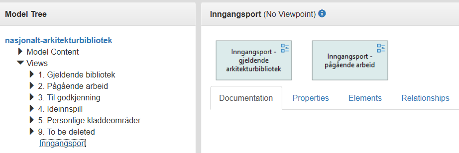

:lang: no
:doctitle: Arkitekturmodeller
:keywords: Arkitekturmodeller

include::../plattform_felles/includes/commonincludes.adoc[]

[.lead] 
Samarbeid om arkitekturmodeller i Nasjonalt arkitekturbibliotek gjøres via filutveksling av standard utvekslingsformater for Archimate, BPMN, UML og DMN, med lagring på Github. Det benyttes også en Collaboration plugin til gratisverktøyet Archi. Modellene publiseres på web.

image:../plattform_felles/media/i-arbeid.png[width=45, height=45]

//:leveloffset: +1

== Felles modellbibliotek på GitHub
Det primære fellesbiblioteket er: https://github.com/nasjonal-arkitektur/archi-collab-nab

Alle kan laste ned innholdet fra dette til lokal Archi-installasjon gjennom Collaoration-plugin til Archi. Om du har skriverettigheter, vil du også kunne gjøre endringer og laste opp disse til Github. Se
link:../plattform_praktiske-tips_archi[Praktiske tips om samarbeid med Archi].

== Web-publisering for lesing 
Publiserte arkitekturmodeller fra _det primære fellesbiblioteket_ kan navigeres via nettleser; se https://nasjonal-arkitektur.github.io/nab_modeller_html_archi.

Navigering kan gjøres gjennom mappestrukturen i _Model Tree_. 

Det er dessuten lagt opp navigasjonsstrukturer som går på tvers av mappestrukturen for å kunne gi enklere navigering for ulike formål og målgrupper. Øverste nivå i denne strukturen er vist i screenshot av skjermbildet over (_Inngangsport_).

WARNING: Det er mulig å lenke direkte til enkeltmodeller, men da mistes mappestrukturen i Model Tree fra skjermbildet. Dette er en svakhet i gjeldende versjon av verktøyet Archi (per 2019). 

== Nedlastbare modellfiler
Se link:../nab_modellsamling/[modellsamling] for mer informasjon om nedlastbare modeller for _det nasjonale biblioteket for arkitekturmodeller_ samt en samling av andre nedlastbare modeller.

