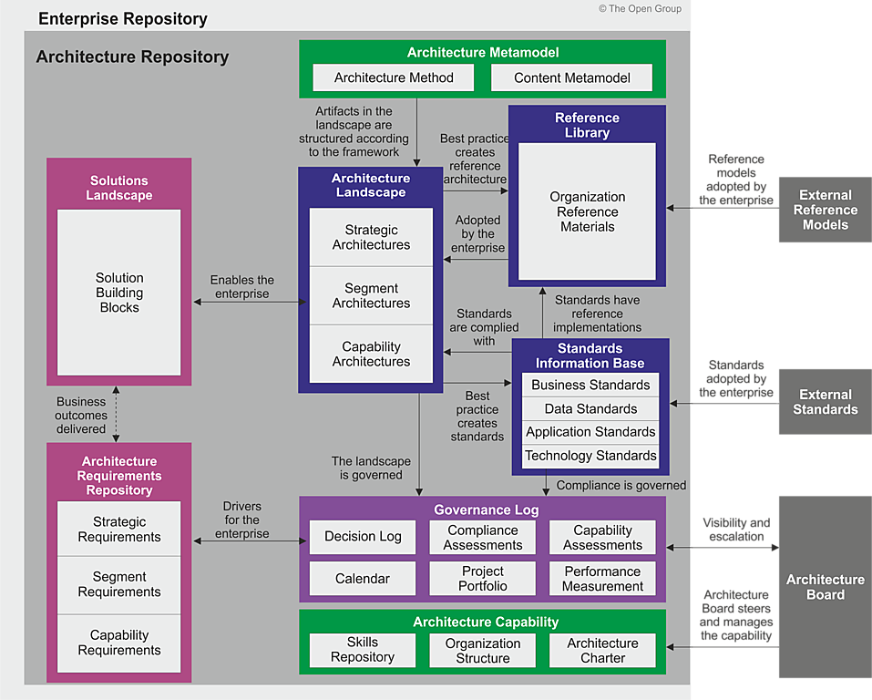

:lang: no
:doctitle: Overordnede rammeverk og metoder
:keywords: Norsk, arkitekturbibliotek, offenlig sektor, virksomhetsarkitektur, NIF, samhandlingsarkitektur, rammeverk, GitHub
//:preamble: 

:toclevels: 3
include::../plattform_felles/includes/commonincludes.adoc[]

[.lead]
Overordnet rammeverk og metode for arbeidet med nasjonal arkitektur

== Generelt
Arbeidet med nasjonal arkitektur i Norge baserer seg på flere metoder og rammeverk, på tvers av flere fagdisipliner.

På nasjonalt nivå omhandles i utgangspunktet "hele bildet", der metoder og arkitekturer for områder som samhandlingsarkitektur, informasjonsforvaltning, dataanalyse, IoT, big data og kunstig intelligens inngår.

_Nasjonalt arkitekturrammeverk for samhandling_ (NIF) er det primære rammeverket; se https://www.difi.no/fagomrader-og-tjenester/digitalisering-og-samordning/nasjonal-arkitektur/arkitekturrammeverk-samhandling[introduksjon til NIF på Difis hjemmesider]. Kort fortalt: _Nasjonalt arkitekturrammeverk for samhandling_ kan ses på som en tilpasning av TOGAF versjon 9.2, med utgangspunkt i EIF - European Interoperability Framework. Ut fra dette kalles også rammeverket NIF - National Interoperability Framework. Nasjonalt arkitekturrammeverk for samhandling (NIF) fokuserer på arkitekturer som støtter utvikling av sammenhengende og tverrgående tjenester. Under dette hører også metoder og rammeverk for tjenestedesign m.m.

_Nasjonalt arkitekturrammeverk for samhandling_ beskriver innholdet i et arkitekturbibliotek for virksomheter generelt. På nasjonalt nivå gjelder tilsvarende, men virksomheten kan da sier å være "nasjonen som virksomhet". Følgende figur er tilpasset fra Nasjonalt arkitekturrammeverk for samhandling (NIF), og angir mer spesifikt innholdet i det nasjonale arkitekturbiblioteket.

.Figur: Innhold i nasjonalt arkitekturbibliotek.
image:../nab_overordnet-metode/media/nasjonalt-arkitekturbibliotek.png[width=900]

Den viste strukturen er med hensikt lagt tett opp til TOGAF-standarden. Selv om dette bildet kan virke komplisert for "ikke-arkitekter", er vurderingen at det gir verdi å holde seg tett opp til et konsistent og veldefinert begrepsapparatet som er kjent av mange gjennom TOGAF. Tilsvarende bilde fra TOGAF 9.2 er vist i figuren nedenfor.

.Figur: TOGAF 9.2 "arkitekturbibliotek"

== Grunnleggende konsepter
:leveloffset: +1
include::grunnleggende-konsepter.adoc[]

