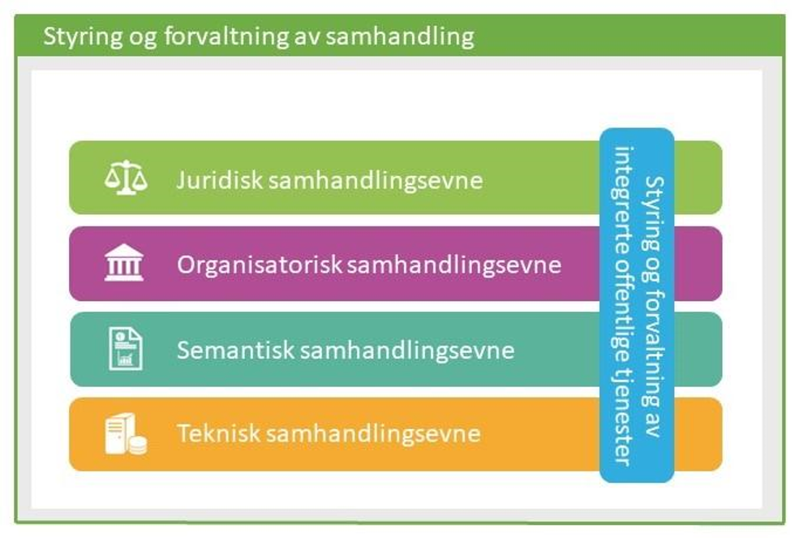
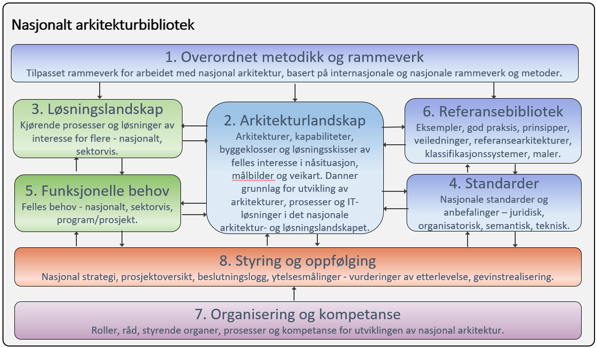

:lang: no
:doctitle: Overordnede rammeverk og metoder
:keywords: Norsk, arkitekturbibliotek, offenlig sektor, virksomhetsarkitektur, NIF, samhandlingsarkitektur, rammeverk, GitHub
//:preamble: 

:toclevels: 3
include::../plattform_felles/includes/commonincludes.adoc[]

[.lead]
Overordnet rammeverk og metode for arbeidet med nasjonal arkitektur

== Generelt
Arbeidet med nasjonal arkitektur i Norge baserer seg på flere metoder og rammeverk, på tvers av flere fagdisipliner.

På nasjonalt nivå omhandles i utgangspunktet "hele bildet", der metoder og arkitekturer for områder som samhandlingsarkitektur, informasjonsforvaltning, dataanalyse, IoT, big data og kunstig intelligens inngår.

I dette bildet er samhandlingsarkitektur det viktigste. Den nasjonale arkitekturen har som hovedoppgave å bidra til samhandling på tvers. Dette gjøres dels gjennom arkitekturer og fellesløsninger på nasjonalt nivå, og dels gjennom veiledning til virksomhetene i form av rammeverk, prinsipper, kataloger, referansearkitekturer m.m. Den interne virksomhetsarkitekturen til enkeltvirksomheter eller sektorer inngår ikke.

== Nasjonalt arkitekturrammeverk for samhandling (NIF)

_Nasjonalt arkitekturrammeverk for samhandling_ (NIF) er det primære rammeverket; se https://www.difi.no/fagomrader-og-tjenester/digitalisering-og-samordning/nasjonal-arkitektur/arkitekturrammeverk-samhandling[introduksjon til NIF på Difis hjemmesider]. 

Kort fortalt: _Nasjonalt arkitekturrammeverk for samhandling_ kan ses på som en tilpasning av TOGAF versjon 9.2, med utgangspunkt i EIF - European Interoperability Framework. Ut fra dette kalles også rammeverket NIF - National Interoperability Framework. Nasjonalt arkitekturrammeverk for samhandling (NIF) fokuserer på arkitekturer som støtter utvikling av sammenhengende og integrerte tjenester. Under dette hører også metoder og rammeverk for tjenestedesign m.m.

.Fokus for nasjonalt arkitekturrammeverk for samhandling (NIF)

_Nasjonalt arkitekturrammeverk for samhandling_ beskriver innholdet i et arkitekturbibliotek for virksomheter generelt. På nasjonalt nivå gjelder tilsvarende, men virksomheten kan da sier å være "nasjonen som virksomhet". Følgende figur er tilpasset fra Nasjonalt arkitekturrammeverk for samhandling (NIF), og angir mer spesifikt innholdet i det nasjonale arkitekturbiblioteket.

.Innhold i nasjonalt arkitekturbibliotek.

Den viste strukturen er med hensikt lagt tett opp til TOGAF-standarden. Selv om dette bildet kan virke komplisert for "ikke-arkitekter", er vurderingen at det gir verdi å holde seg tett opp til et konsistent og veldefinert begrepsapparatet som er kjent av mange gjennom TOGAF. Tilsvarende bilde fra TOGAF 9.2 er vist i figuren nedenfor.

.TOGAF 9.2 "arkitekturbibliotek"
image::../nab_overordnet-metode/media/togaf92-architecture-repository.png[width=900]

== Arkitekturprinsipper
_Under revisjon 2019._

== Grunnleggende konsepter
:leveloffset: +1
include::grunnleggende-konsepter.adoc[]

