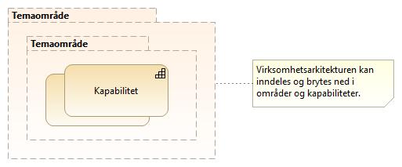
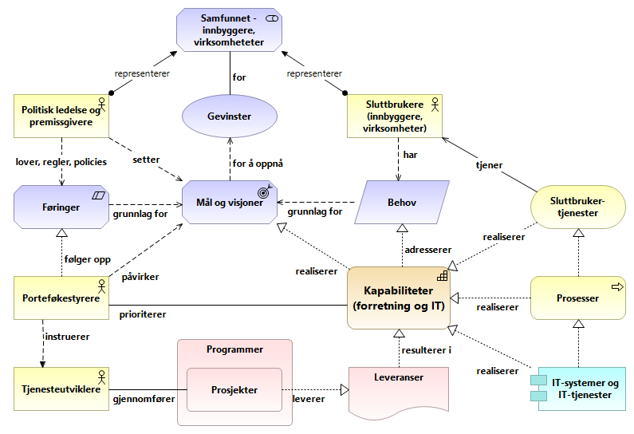
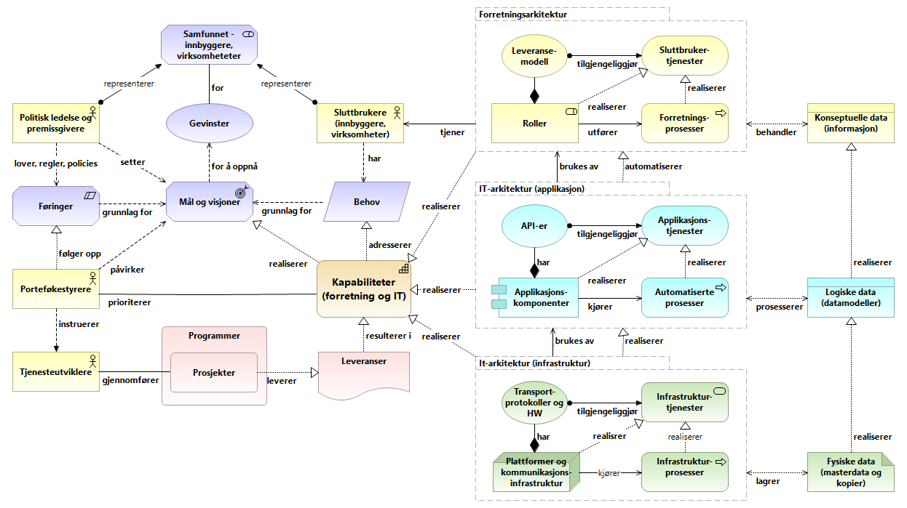
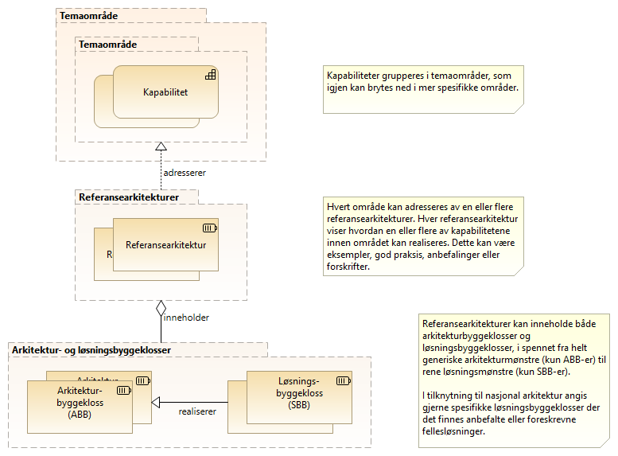
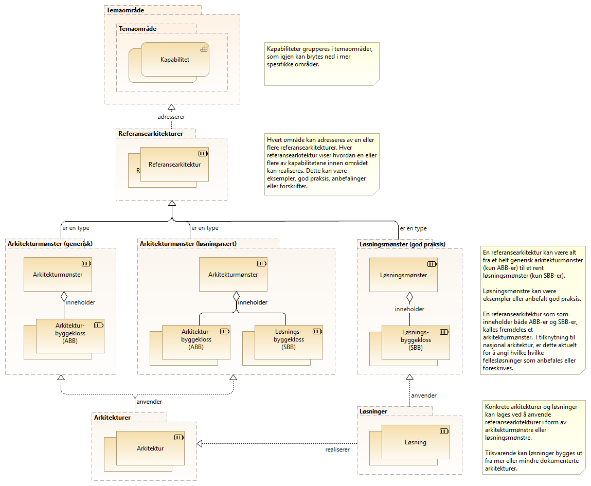

:lang: no
:doctitle: Grunnleggende konsepter for Nasjonalt arkitekturbibliotek
:keywords: Norsk, arkitekturbibliotek, offenlig sektor, virksomhetsarkitektur, NIF, samhandlingsarkitektur, rammeverk, GitHub
//:preamble: 

include::../plattform_felles/includes/commonincludes.adoc[]

[.lead]
Grunnleggende konsepter for arbeidet med Nasjonalt arkitekturbibliotek

== Områder og kapabiliteter
Virksomhetsarkitekturen kan inndeles i _områder_, eller _temaområder_, og videre i kapabiliteter. Dette kan gjøres i flere nivåer, til et hensiktsmessig detaljnivå. Dette er illustrert i følgende figur.

.Figur: Områder og kapabiliteter  

NOTE: Slik områder tilsvarer det som http://pubs.opengroup.org/architecture/togaf9-doc/arch/[TOGAF 9.2] kaller _"subject areas"_ eller _segmenter_. Begrepet _segmentarkitektur_ springer ut fra dette, og handler om å angripe et område i virksomheten med arkitektur og planlegging. 

Med _kapabilitet_ menes en _evne_ som er forbundet med en rolle eller en aktør. Slike aktører kan være organisasjoner, personer eller tekniske systemer. Realiseringen av en kapabilitet gjøres igjen typisk gjennom organisasjoner, mennesker, prosesser og teknologier, gjerne i kombinasjon.

NOTE: Begrepet _kapabilitetsarkitektur_ benyttes om realiseringen av kapabiliteter. 

Se eventuelt også link:../kunnskap_tema_kapabilitetsmodellering/[videre bakgrunnsinformasjon om kapabiliteteter, kapabilitetsmodellering,m.v.] i _kunnskapsbiblioteket_.

//image:../plattform_felles/media/i-arbeid.png[width=45, height=45] Et første kapabilitetskart for nasjonal arkitektur er planlagt vår 2019.

== Kapabilitetetsbasert planlegging for offentlig sektor?
Følgende figur illustrerer noen grunnleggende konsepter rundt en mulig måte å gjøre arkitekturstyring i offentlig sektor.   

.Figur: Overordnet konsept for kapabilitetsbasert arkitekturstyring i offentlig sektor  

Her ses det på offentlig sektor i stort, men det er lite som skiller dette bildet fra tilsvarende for enkeltvirksomheter, enten i offentlig eller privat sektor. For en virksomhet i privat sektor ville en gjerne ha kalt de viktigste interessentene for _kunder_, i stedet for _innbyggere_

I figuren over er arkitekturen for realisering av kapabiliteter fornenklet framstilt.

En noe mer komplekst bilde er gitt i figuren nedenfor. 
Her vises noen av de viktigste arkitekturbegrepene og sammenhengene, slik som sammenhengen mellom API og Applikajonstjeneste og forskjellen på logiske datamodeller og fysiske data.  

For de som skal prioritere og samordne utviklingen, vil denne typen arkitekturmodeller fort blir for vanskelige.
Nettopp dette er en viktig grunn til at det er hensiktsmessig å fokusere på kapabilitene, som handler om _hva_ og ikke _hvordan_.

NOTE: Felles begrepsapparat rundt arkitektur er en forutsetning for å få til samordnet utvikling av integrerte tjenester. Som et ledd i dette, dokumenteres felles modelleringskonvensjoner som del av Nasjonalt arkitekturbibliotek; under referansebiblioteket.

.Figur: Realisering av kapabilteter gjennom forretnings- og IT-arkitektur.   

== Referansearkitekturer, løsningsmønstre, arkitekturer og løsninger

Referansearkitekturer gir mønstre og veiledning til utforming av arkitekturer og løsninger innen avgrensede områder.

Hvert _område_ kan adresseres av en eller flere _referansearkitekturer_. Formålet med å ha flere referansearkitekturer for samme område, kan være å gi ulike visninger for ulike målgrupper eller å bryte opp et komplekst bilde i enklere deler.   

Referansearkitekturer kan inneholde både _arkitekturbyggeklosser_ og __løsningsbyggeklosser__, ut fra hva som er aktuelt. Helt generiske referansearkitekturer inneholder typisk bare generiske arkitekturbyggeklosser, mens mer løsningsorienterte referansearkitekturer gjerne også angir spesifikke løsningsbygeklosser. Det siste er f.eks. aktuelt for å angi anbefalt eller obligatorisk bruk av nasjonale fellesløsninger.

Dette er illustrert i følgende figur. 

.Figur: Referansearkitektur som hjelpemiddel til realisering av kapabiliteter  

Følgende figur viser sammenhengene rundt referansearkitekturer i mer detalj.
Her vises også arkitekturmønstre og løsningsmønstre, som hjelpemiddel tli å¨ utarbeide mer spesifkke arkitekturer og konkrete løsninger.  

.Figur: Fra kapabiliteter til arkitekturer og løsninger  

== Abstraksjonsnivåer

Aritekturer og referansearkitekturer kan beskrives på ulike abstraksjonsnivåer. Omfangsrike og altomfattende arkitekturer kan være til hinder for innovasjon. Hvis ensartet samhandling er viktig, bør kravene som stilles på den annen side være detaljerte nok til å sikre interoperabilitet. Det er viktig å finne en god balanse med tanke på dette.

Arkitekturer kan også klassifiseres slik TOGAF-rammeverket beskriver det rundt begrepet arkitektur-kontinuum.

.Klassifisering i grunnleggende, felles (nasjonale), industri- (sektorspesifikke) og organisasjonsspesifikke arkitekturer
image:../kunnskap_standard_togaf/media/togaf-architecture-continuum.png[width=600]

NOTE: Se også link:../kunnskap_standard_togaf/[egen omtale av TOGAF og arkitektur-kontinuum].

image:../plattform_felles/media/i-arbeid.png[width=45, height=45] I arbeid

