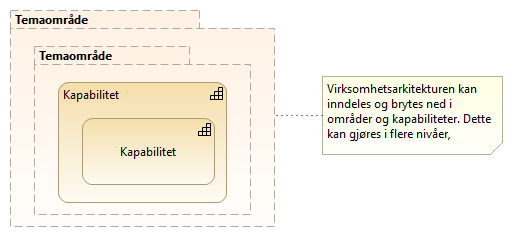

:lang: no
:doctitle: Grunnleggende konsepter for Nasjonalt arkitekturbibliotek
:keywords: Norsk, arkitekturbibliotek, offenlig sektor, virksomhetsarkitektur, NIF, samhandlingsarkitektur, rammeverk, GitHub
//:preamble: 

include::../plattform_felles/includes/commonincludes.adoc[]

[.lead]
Grunnleggende konsepter for arbeidet med Nasjonalt arkitekturbibliotek

:leveloffset: +1

[#om_områder_og_kapabilitetskart]
= Om områder og kapabilitetskart
Virksomhetsarkitekturen kan inndeles i _områder_, eller _temaområder_, og videre i kapabiliteter. Dette kan gjøres i flere nivåer, til et hensiktsmessig detaljnivå. Dette er illustrert i følgende figur.

.Figur: Områder og kapabiliteter  

NOTE: Slike temaområder tilsvarer det som http://pubs.opengroup.org/architecture/togaf9-doc/arch/[TOGAF 9.2] kaller _"subject areas"_ eller _segmenter_. Begrepet _segmentarkitektur_ springer ut fra dette, og handler om å angripe et område i virksomheten med arkitektur og planlegging. Begrepet _kapabilitetsarkitektur_ benyttes tilsvarende om realiseringen av kapabiliteter. 

Med _kapabilitet_ menes en _evne_ som er forbundet med en rolle eller en aktør. Slike aktører kan være organisasjoner, personer eller tekniske systemer.
Realiseringen av en kapabilitet gjøres igjen typisk gjennom organisasjoner, mennesker, prosesser og teknologier, gjerne i kombinasjon. 

Se også link:../kunnskap_tema_kapabilitetsmodellering/[videre bakgrunnsinformasjon om kapabiliteteter, kapabilitetsmodellering,m.v.] i _kunnskapsverkstedet_.

//image:../plattform_felles/media/i-arbeid.png[width=45, height=45] Et første kapabilitetskart for nasjonal arkitektur er planlagt vår 2019.

= Om abstraksjonsnivåer for arkitekturer og referansearkitekturer

include::../nab_overordnet-metode/abstraksjonsnivaer.adoc[]

//image:../plattform_felles/media/i-arbeid.png[width=45, height=45] I arbeid

= Begrepsapparat
== Generelt

Det tas utgangspunkt i utbredt begrepsapparat for virksomhetsarkitektur og de mest aktuelle rammeverkene og standardene, herunder TOGAF og Archimate. 
#SKRIVING PÅGÅR#

== Om forholdet til utbredt begrepsapparat hos "forretningssiden" og digital transformasjon  
#SKRIVING PÅGÅR#

== Om forholdet til utbredte begreper blant løsningsarkitekter og utviklere

For at utviklere og løsningsarkitekter skal kunne forstå modeller og begreper... #SKRIVING PÅGÅR#...  

= Om referansearkitekturer, løsningsmønstre, arkitekturer og løsninger
include::../nab_overordnet-metode-om-referansearkitekturer/book-om-referansearkitekturer.adoc[]

