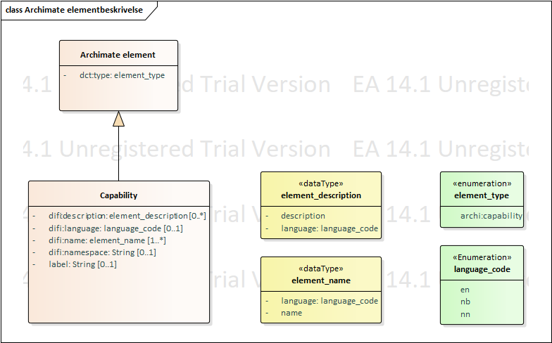

:lang: no
:doctitle: Grunnleggende konsepter for Nasjonalt arkitekturbibliotek
:keywords: Norsk, arkitekturbibliotek, offenlig sektor, virksomhetsarkitektur, NIF, samhandlingsarkitektur, rammeverk, GitHub
//:preamble: 

include::../plattform_felles/includes/commonincludes.adoc[]

[.lead]
Grunnleggende konsepter for arbeidet med Nasjonalt arkitekturbibliotek

:leveloffset: +1

= Om områder og kapabilitetskart
Virksomhetsarkitekturen kan inndeles i _områder_, eller _temaområder_, og videre i kapabiliteter. Dette kan gjøres i flere nivåer, til et hensiktsmessig detaljnivå. Dette er illustrert i følgende figur.

.Figur: Områder og kapabiliteter  
image:../nab_overordnet-metode/media/områder-og-kapabiliteter.png[]

NOTE: Slik områder tilsvarer det som http://pubs.opengroup.org/architecture/togaf9-doc/arch/[TOGAF 9.2] kaller _"subject areas"_ eller _segmenter_. Begrepet _segmentarkitektur_ springer ut fra dette, og handler om å angripe et område i virksomheten med arkitektur og planlegging. Begrepet _kapabilitetsarkitektur_ benyttes tilsvarende om realiseringen av kapabiliteter. 

Med _kapabilitet_ menes en _evne_ som er forbundet med en rolle eller en aktør. Slike aktører kan være organisasjoner, personer eller tekniske systemer.
Realiseringen av en kapabilitet gjøres igjen typisk gjennom organisasjoner, mennesker, prosesser og teknologier, gjerne i kombinasjon. 

//Henrik: legge inn beskrivelse av kapabilitet her
Kapabiliteter beskrives hovedsakelig som Archimate-elementer. For å beskrive kapabilitetene har vi definert et sett med attributter som kan inngå i elementene. Dette er synliggjort i figuren under. Kapabiliteter kan også beskrives i tekst eller i tabeller, noe som kan være hensiktsmessig i visse tilfeller, men det tas utgangspunkt i at modellene er de som er styrende. 

Vi har valgt å åpne for både norsk og engelsk beskrivelse av kapabiliteten. Dette for enklere å kunne knytte arbeidet opp mot referanser og modeller fra andre land og særlig EIRA og TOOP referansearkitektur fra EU.

[cols ="3,3,7,1", options="header"]
.Attributter i beskrivelsen av en kapabilitet i Arci
|===
|Attributt
|
|Beskrivelse
|Kardinalitet

|Type
|dct:type
|Type element, for kapabilitet vil dette være av typen capability
|1

|Navn
|difi:name
|Navn på kapabiliteten. Det kan oppgis navn på norsk og engelsk
|1..*
|Beskrivelse
|difi:description
|Beskrivelse av kapabiliteten, kan være på norsk og engelsk.
|0..*

|Visningsspråk
|difi:language
|Det språket navnet på kapabiliteten skal vises. Default språk er norsk dersom visningsspråk ikke er oppgitt og det er oppgitt flere språk.
|0..1

|Namespace
|difi:namespace
|Attributt for å gi elementet en unik identifikator eller tilhørighet. F.eks. at det er innenfor Difis domene, eller er hentet fra EIRA.
|0..1

|Label
|label
|Attributt for å sette på informasjon som f.eks. viser hvem som har laget det eller hvor det kommer fra. Benyttes friere enn namespace. 
|0..1

|===

Hvordan realiseringen av kapabiliteter er gjort eller planlegges, finnes i beskrivelser av arkitekturer og løsninger. 
Det kan også tas fram referansearkitekturersom for å gi veiledning til hvordan realiseringen kan gjøres.

Se eventuelt også link:../kunnskap_tema_kapabilitetsmodellering/[videre bakgrunnsinformasjon om kapabiliteteter, kapabilitetsmodellering,m.v.] i _kunnskapsbiblioteket_.

//image:../plattform_felles/media/i-arbeid.png[width=45, height=45] Et første kapabilitetskart for nasjonal arkitektur er planlagt vår 2019.

= Om referansearkitekturer, løsningsmønstre, arkitekturer og løsninger
include::../nab_overordnet-metode/konsepter-referansearkitekturer.adoc[]

= Om abstraksjonsnivåer for arkitekturer og referansearkitekturer

include::../nab_overordnet-metode/abstraksjonsnivaer.adoc[]

//image:../plattform_felles/media/i-arbeid.png[width=45, height=45] I arbeid

= Om kapabilitetetsbasert planlegging for arkitekturstyring i offentlig sektor

image:../plattform_felles/media/i-arbeid.png[width=45, height=45] Foreløpig innhold

include::../nab_overordnet-metode/konsepter-kapabilitetsbasert-arkitekturstyring.adoc[]
