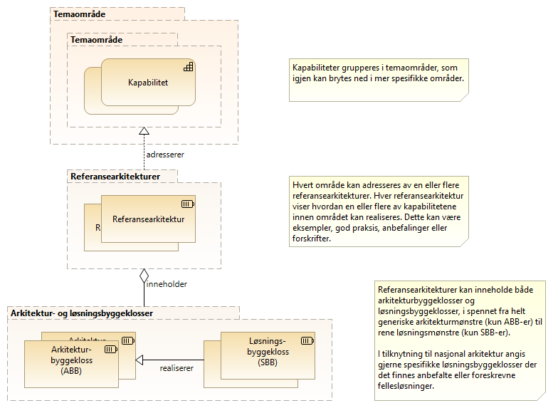

:lang: no
:doctitle: Referansearkitekturer, løsningsmønstre, arkitekturer og løsninger
:keywords: Referansearkitekturer, løsningsmønstre, arkitekturer, løsninger
//:preamble: 

include::../plattform_felles/includes/commonincludes.adoc[]

== Introduksjon til begrepet _referansearkitektur_

Det finnes flere definisjoner av begrepet _referansearkitektur_, og det finnes fleremer eller mindre overlappende begreper. Her gjøres presiseringer som gjelder forNasjonalt arkitekturbibliotek i Norge. Det redegjøres også for sammehenger med andre begreper og annen praksis. 

Referansearkitekturer gir mønstre og veiledning til utforming av arkitekturer og løsninger innen avgrensede områder.

Hvert _område_ kan adresseres av en eller flere _referansearkitekturer_. Formålet med å ha flere referansearkitekturer for samme område, kan være å gi ulike visninger for ulike målgrupper eller å bryte opp et komplekst bilde i enklere deler.   

Referansearkitekturer kan inneholde både _arkitekturbyggeklosser_ og __løsningsbyggeklosser__, ut fra hva som er aktuelt. Helt generiske referansearkitekturer inneholder typisk bare generiske arkitekturbyggeklosser, mens mer løsningsorienterte referansearkitekturer gjerne også angir spesifikke løsningsbygeklosser. Det siste er f.eks. aktuelt for å angi anbefalt eller obligatorisk bruk av nasjonale fellesløsninger.

Dette er illustrert i følgende figur. 

.Figur: Referansearkitektur som hjelpemiddel til realisering av kapabiliteter  

== Referansearkitekturer som mønstre for arkitekturer og løsninger

Følgende figur viser sammenhengene rundt referansearkitekturer i mer detalj.
Her vises også arkitekturmønstre og løsningsmønstre, som hjelpemiddel til å utarbeide mer spesifkke arkitekturer og konkrete løsninger.  

.Figur: Fra kapabiliteter til arkitekturer og løsninger  
image::../nab_overordnet-metode/media/referansearkitektur-definisjon-komplett.png[]

== Forholdet til andre begreper og praksiser
TOGAF skiller mellom referansearkitekturer, referansemodeller og arkitekturmønstre (Architecture Patterns).

EU og EIRA benytter begrepet _Solution Architceture Template_ med følgende betydning: A Solution Architecture Template (SAT) is a specification extending the EIRA©providing support to solution architects in a specific solution domainin the form of a template that can be used to design related solutions.

== Hvor stor er en referansearkitektur?
I Danmark benyttes begrepet referansearkitektur om relativt store områder, som det så gis "løsningsmønstre" for.

I det norske rammeverket (dette), kan referansearkitekturer finnes på ulike nivåer. Det gjøres en nedbryting i områder, der hvert område kan adresseres av en eller flere referansearkitekturer, som eventuelt kan inkludere .... TEKST I ARBEID ...

