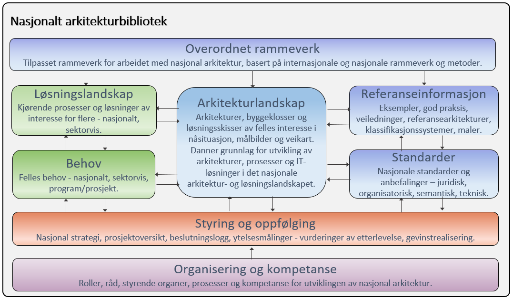
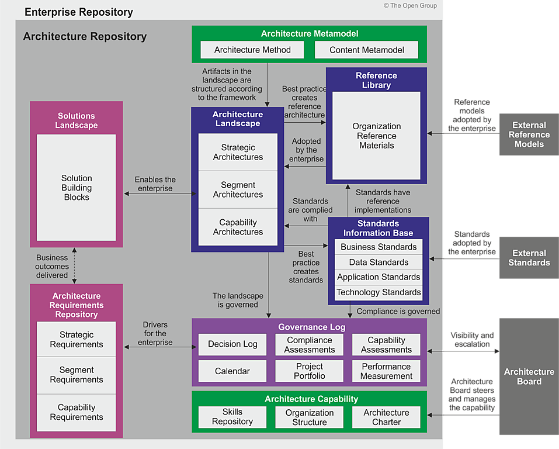
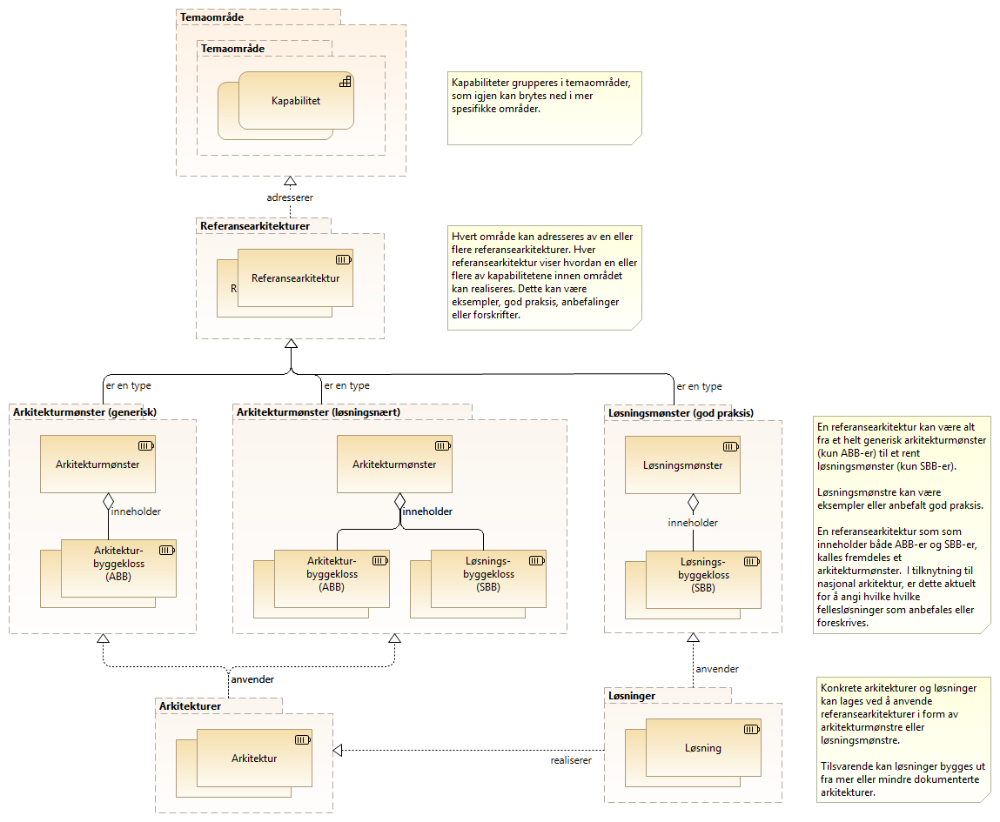

:lang: no
:doctitle: Rammeverk og overordnet informasjon
:keywords: Norsk, arkitekturbibliotek, offenlig sektor, virksomhetsarkitektur, NIF, samhandlingsarkitektur, rammeverk, GitHub
//:preamble: 

include::../plattform_felles/includes/commonincludes.adoc[]

[.lead]
Overordnet informasjon om arbeidet med nasjonal arkitektur

== Generelt
Arbeidet med nasjonal arkitektur i Norge baserer seg på flere metoder og rammeverk, på tvers av flere fagdisipliner.

På nasjonalt nivå omhandles i utgangspunktet "hele bildet", der metoder og arkitekturer for områder som samhandlingsarkitektur, informasjonsforvaltning, dataanalyse, IoT, big data og kunstig intelligens inngår.

_Nasjonalt arkitekturrammeverk for samhandling_ (NIF) er det primære rammeverket; se https://www.difi.no/fagomrader-og-tjenester/digitalisering-og-samordning/nasjonal-arkitektur/arkitekturrammeverk-samhandling[introduksjon til NIF på Difis hjemmesider]. Kort fortalt: _Nasjonalt arkitekturrammeverk for samhandling_ kan ses på som en tilpasning av TOGAF versjon 9.2, med utgangspunkt i EIF - European Interoperability Framework. Ut fra dette kalles også rammeverket NIF - National Interoperability Framework. Nasjonalt arkitekturrammeverk for samhandling (NIF) fokuserer på arkitekturer som støtter utvikling av sammenhengende og tverrgående tjenester. Under dette hører også metoder og rammeverk for tjenestedesign m.m.

== Om innholdet i Nasjonalt arkitekturbibliotek
_Nasjonalt arkitekturrammeverk for samhandling_ beskriver innholdet i et arkitekturbibliotek for virksomheter generelt. På nasjonalt nivå gjelder tilsvarende, men virksomheten kan da sier å være "nasjonen som virksomhet". Følgende figur er tilpasset fra Nasjonalt arkitekturrammeverk for samhandling (NIF), og angir mer spesifikt innholdet i det nasjonale arkitekturbiblioteket.

.Figur: Innhold i nasjonalt arkitekturbibliotek.

Den viste strukturen er med hensikt lagt tett opp til TOGAF-standarden. Selv om dette bildet kan virke komplisert for "ikke-arkitekter", er vurderingen at det gir verdi å holde seg tett opp til et konsistent og veldefinert begrepsapparatet som er kjent av mange gjennom TOGAF. Tilsvarende bilde fra TOGAF 9.2 er vist i figuren nedenfor.

.Figur: TOGAF 9.2 "arkitekturbibliotek"

Videre detaljer om metodikk, veiledninger, dokumentasjonskonvensjoner og metamodeller finnes under under link:../nab_referanse_[referansebibliotek].

I det følgende introduseres noen grunnleggende konsepter for arbeidet med nasjonalarkitektur. Deler av dette følger direkte av gjeldende standarder og rammeverk, men her finnes også presiseringer og vinklinger inn mot det som er spesielt relevant i tilknytning til nasjonalt arkitekturbbliotek.   

== Grunnleggende konsepter

=== Temaområder og kapabiliteter
Inndeling i _temaområder_ tilsvarer det som http://pubs.opengroup.org/architecture/togaf9-doc/arch/[TOGAF 9.2] kaller _"subject areas"_ eller _segmenter_. Hvert slikt område kan ses på som en gruppering av kapabiliteter som en ønsker å adressere samlet.

NOTE: Difi arbeider i 2019 med å ta fram en helhetlig oversikt over kapabilitetsområder i nasjonal arkitektur. Se link:../kunnskap_tema_kapabilitetsmodellering/[egen omtale av kapabilitetsmodellering].

.Figur: Temaområder og kapabiliteter  
image:../nab_rammeverk\media\temaområder-og-kapabiliteter.png[]

=== Strategiske arkitekturer, segmentarkitekturer og kapabilitetetsarkitekturer

Dette er vanskelige begreper fra TOGAF-standarden som gjerne brukes ulikt. 
I sammenheng mednasjonal arkitektur, kan en si at _strategiske arkitekturer_ handler om

Strategic Architecture
A summary formal description of the enterprise, providing an organizing framework for
operational and change activity, and an executive-level, long-term view for direction setting.

Segment Architecture
A detailed, formal description of areas within an enterprise, used at the program or portfolio
level to organize and align change activity.

Capability Architecture
A highly detailed description of the architectural approach to realize a particular solution or
solution aspect.

=== Realisering av kapabiliteter
TBD.

=== Referansearkitekturer, arkitekturer og løsninger

Følgende figur viser sammenhenger mellom sentrale arkitekturbegreper, slik dette omtales i tilknytning til Nasjonalt arkitekturbibliotek.

.Figur: Fra kapabiliteter til arkitekturer og løsninger  

Forklaring til figuren over:

Inndeling i _temaområder_ tilsvarer det som http://pubs.opengroup.org/architecture/togaf9-doc/arch/[TOGAF 9.2] kaller _"subject areas"_ eller _segmenter_. Hvert slikt område kan ses på som en gruppering av kapabiliteter som en ønsker å adressere samlet.

NOTE: Difi arbeider i 2019 med å ta fram en helhetlig oversikt over kapabilitetsområder i nasjonal arkitektur. Se link:../kunnskap_tema_kapabilitetsmodellering/[egen omtale av kapabilitetsmodellering].

Hvert _temaområde_ kan adresseres av en eller flere _referansearkitekturer_. Formålet med å ha flere referansearkitekturer for samme område, kan være å gi ulike visninger for ulike målgrupper eller å bryte opp et komplekst bilde i enklere deler.   

Referansearkitekturer kan inneholde både _arkitekturbyggeklosser_ og __løsningsbyggeklosser__, ut fra hva som er aktuelt. Helt generiske referansearkitekturer inneholder typisk bare generiske arkitekturbyggeklosser, mens mer løsningsorienterte referansearkitekturer gjerne også angir spesifikke løsningsbygeklosser. Det siste er f.eks. aktuelt for å angi anbefalt eller obligatorisk bruk av nasjonale fellesløsninger.

Referansearkitekturer kan beskrives på ulike abstraksjonsnivåer. Omfangsrike og altomfattende arkitekturer kan være til hinder for innovasjon. Hvis ensartet samhandling er viktig, bør kravene som stilles på den annen side være detaljerte nok til å sikre interoperabilitet. Det er viktig å finne en god balanse med tanke på dette.

Ulike referansearkitekturer kan også klassifiseres slik TOGAF-rammeverket beskriver rundt begrepet arkitektur-kontinuum.

.Klassifisering i grunnleggende, felles (nasjonale), industri- (sektorspesifikke) og organisasjonsspesifikke arkitekturer
image:../kunnskap_standard_togaf/media/togaf-architecture-continuum.png[width=600]

NOTE: Se også link:../kunnskap_standard_togaf/[egen omtale av TOGAF og arkitektur-kontinuum].

image:../plattform_felles/media/i-arbeid.png[width=45, height=45] I arbeid