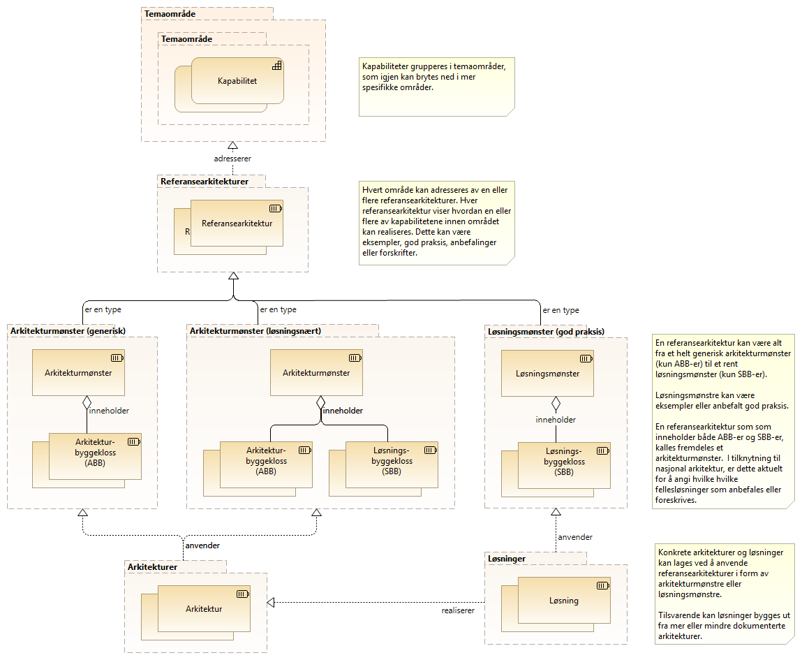

:lang: no
:doctitle: Grunnleggende konsepter for Nasjonalt arkitekturbibliotek
:keywords: Norsk, arkitekturbibliotek, offenlig sektor, virksomhetsarkitektur, NIF, samhandlingsarkitektur, rammeverk, GitHub
//:preamble: 

include::../plattform_felles/includes/commonincludes.adoc[]

[.lead]
Grunnleggende konsepter for arbeidet med Nasjonalt arkitekturbibliotek

== Temaområder og kapabiliteter
Inndeling i _temaområder_ tilsvarer det som http://pubs.opengroup.org/architecture/togaf9-doc/arch/[TOGAF 9.2] kaller _"subject areas"_ eller _segmenter_. Hvert slikt område kan ses på som en gruppering av kapabiliteter som en ønsker å adressere samlet.

NOTE: Difi arbeider i 2019 med å ta fram en helhetlig oversikt over kapabilitetsområder i nasjonal arkitektur. Se link:../kunnskap_tema_kapabilitetsmodellering/[egen omtale av kapabilitetsmodellering].

== Realisering av kapabiliteter
Kapabiliterer realiseres gjennom organisasjoner, mennesker, prosesser og teknologier, gjerne i kombinasjon.

== Referansearkitekturer, arkitekturer og løsninger

Følgende figur viser sammenhenger mellom sentrale arkitekturbegreper, slik dette omtales i tilknytning til Nasjonalt arkitekturbibliotek.

.Figur: Fra kapabiliteter til arkitekturer og løsninger  

Forklaring til figuren over:

Inndeling i _temaområder_ tilsvarer det som http://pubs.opengroup.org/architecture/togaf9-doc/arch/[TOGAF 9.2] kaller _"subject areas"_ eller _segmenter_. Hvert slikt område kan ses på som en gruppering av kapabiliteter som en ønsker å adressere samlet.

NOTE: Difi arbeider i 2019 med å ta fram en helhetlig oversikt over kapabilitetsområder i nasjonal arkitektur. Se link:../kunnskap_tema_kapabilitetsmodellering/[egen omtale av kapabilitetsmodellering].

Hvert _temaområde_ kan adresseres av en eller flere _referansearkitekturer_. Formålet med å ha flere referansearkitekturer for samme område, kan være å gi ulike visninger for ulike målgrupper eller å bryte opp et komplekst bilde i enklere deler.   

Referansearkitekturer kan inneholde både _arkitekturbyggeklosser_ og __løsningsbyggeklosser__, ut fra hva som er aktuelt. Helt generiske referansearkitekturer inneholder typisk bare generiske arkitekturbyggeklosser, mens mer løsningsorienterte referansearkitekturer gjerne også angir spesifikke løsningsbygeklosser. Det siste er f.eks. aktuelt for å angi anbefalt eller obligatorisk bruk av nasjonale fellesløsninger.

== Abstraksjonsnivåer

Aritekturer og referansearkitekturer kan beskrives på ulike abstraksjonsnivåer. Omfangsrike og altomfattende arkitekturer kan være til hinder for innovasjon. Hvis ensartet samhandling er viktig, bør kravene som stilles på den annen side være detaljerte nok til å sikre interoperabilitet. Det er viktig å finne en god balanse med tanke på dette.

Arkitekturer kan også klassifiseres slik TOGAF-rammeverket beskriver rundt begrepet arkitektur-kontinuum.

.Klassifisering i grunnleggende, felles (nasjonale), industri- (sektorspesifikke) og organisasjonsspesifikke arkitekturer
image:../kunnskap_standard_togaf/media/togaf-architecture-continuum.png[width=600]

NOTE: Se også link:../kunnskap_standard_togaf/[egen omtale av TOGAF og arkitektur-kontinuum].

image:../plattform_felles/media/i-arbeid.png[width=45, height=45] I arbeid

== Kapabilitetetsbasert planlegging for offentlig sektor?

.Figur:

