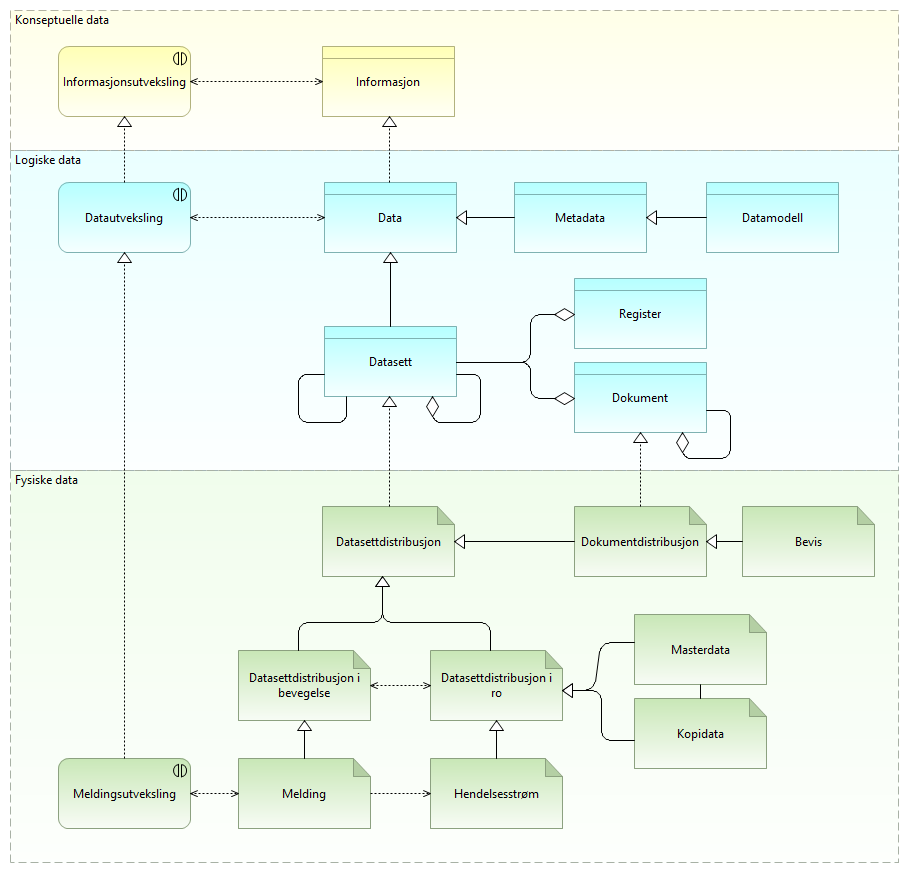

:lang: no
:doctitle: Referansearkitekturer
:keywords: Referansearkitekturer

:toclevels: 3

include::../plattform_felles/includes/commonincludes.adoc[]

[.lead]
Arbeid med prioriterte nasjonale referansearkitekturer er et pågående samarbeid mellom Difi og flere andre virksomheter innen offentlig og privat sektor.

:leveloffset: +1
= Om referansearkitekturer
== Hva er referansearkitekturer?

Referansearkitekturer gir mønstre og veiledning til utforming av arkitekturer og løsninger innen avgrensede områder.

Det legges vekt på å få fram nyttig veiledning, med alt fra gode eksempler til beste praksis og konkrete anbefalinger. 

Prioritering av arbeidet og utarbeidelsen av referansearkitekturer gjøres i samarbeid med aktører på tvers av offentlig og privat sektor nasjonalt og internasjonalt. 

Relatert informasjon:
//1. <<../nab_overordnet-metode/book-nab-overordnet-metode.adoc#_grunnleggende_konsepter,Mer bakgrunnsinformasjon om referansearkitekturer>>

1. link:../nab_overordnet-metode[Overordnet metode, bakgrunnsinformasjon]

//1. link:../nab_overordnet-metode/grunnleggende-konsepter.adoc[Overordnet metode, bakgrunnsinformasjon]

2. link:../nab_arkitekturlandskap[Arkitekturlandskap, temaområder og kapabiliteter]

//include::../nab_referanse_arkitekturer/om-referansearkitekturer.adoc[]

////
= Tilnærming til arbeidet med referansearkitekturer
include::../nab_referanse_arkitekturer/tilnærming-til-arbeidet-med-referansearkitekturer.adoc[]
////

////
= Funksjonsområder for referansearkitekturer (kapabiliteter)
include::../nab_referanse_arkitekturer/kapabilitetsområder.adoc[]
////

== Om nasjonale referansearkitekturer
Nasjonale referansearkitekturer identifiseres ut fra en link:../nab_arkitekturlandskap[nedbrytning av nasjonal arkitektur i temaområder og kapabiliteter i arkitekturlandskapet]. Både kapabilitetskart og prioriterte referansearkitekurer innen hvert område vil utvikles over tid, etterhvert som en går inn på nye områder. 

Følgende figur viser en foreløpig oversikt over aktuelle referansearkitekturer innen respektive områder.

image:../plattform_felles/media/i-arbeid.png[width=45, height=45] _Denne oversikten er i arbeid (vår 2019)_

.Figur: Katalog over referansearkitekturer innen aktuelle områder i Nasjonal arkitektur
image:../nab_referanse_arkitekturer/media/katalog-referansearkitekturer.png[]

= Referansearkitekturer for Datautveksling
include::../nab_referanse_arkitekturer/generisk_datautveksling.adoc[]

== Hva er data?

== Overgripende modell for datautveksling

== Brukstilfeller

== Introduksjon til tverrgående temaer

=== Logging

=== Tidsstempling

=== Fellesskapsforvaltning

=== Informasjonssikkerhet

=== Identitetsforvaltning

=== Tilgangsstyring

=== Informasjonssikkerhet

=== Tillitstjenester

=== Informasjonsforvaltning

=== Avtalehåndtering

=== Lover og regler

=== Semantikk

Tverrgående temaer innen datautveksling

include::../nab_referanse_arkitekturer_tverrgående_tema/book-tverrgående-tema.adoc[]

= Spesifikke referansearkitekturer 

include::../nab_referanse_arkitekturer/spesifikke-referansearkitekturer.adoc[]

//== Informasjonssikkerhet (felles)

//include::../nab_referanse_arkitekturer_informasjonssikkerhet/main.adoc[]

////
= Beskrivelse av referansearkitektur for deling av data på forespørsel 
include::deling_forespørsel.adoc[]
//// 

:leveloffset!:

== Grunnleggende referansearkitekturer og andre utvalgte eksterne referanser
:leveloffset: +1

include::../nab_referanse_arkitekturer/grunnleggende-referansearkitekturer.adoc[]

= Informasjonssikkerhet
include::../nab_referanse_arkitekturer/informasjonssikkerhet.adoc[]

= Veiledning til valg av referansearkitekturer
//image:../plattform_felles/media/i-arbeid.png[width=45, height=45,link] #I arbeid (opprydding ogomskriving)#

include::../nab_referanse_veiledning_valg-av-referansearkitekturer/book-valg-av-referansearkitektur.adoc[]

//Se . link:../nab_referanse_arkitekturer_veiledning_valg-av-referansearkitekturer[Veiledning til valg av referansearkitekturer]

== Hva er data

Hva er data? Hva er data i forhold til informasjon? Hva er forholdet mellom data dokumenter? 

Kort definisjon: Data er ... informasjon; ref. ...

I tilknytning til referansearkitekturer for datautveksling benyttes begrepet _data_ heller enn _informasjon_, der det gir mening.

Det skilles likevel mellom data og informasjon i visse sammenhenger. Det gir f.eks. mening å si informasjonssikkerhet, mens en snakker om sikring av data for å oppnå informasjonssikkerhet.

Tilsvarende brukes begrepet _datakvalitet_ om noe av det som er viktig for å forstå informasjonen.

Det skilles ikke på _data_ og _dokument_. Data kan finnes med større eller mindre grad av struktur, og det kan sies å være en flytende overgang mellom f.eks. ustrukturerte dokumenter i tradisjonell forstand til strukturerte data i en database. 

Begrepet _datasett_ kan tilsvarende dreie seg om både dokumenter og registerdata.

Vi skiller videre på den logiske og fysiske representasjonen av datasett. Det er den fysiske forekomsten av data i ulike systemer som vi må sikre og ha oversikt over, enten det dreier seg om data som er lagret over tif eller data som er på vei mellom systemer i form av meldinger.

Meldingsutveksling er en viktig mekanisme for  datautveksling.

Meldinger består grovt sett av _meldingshode_ og _nyttelast_. Nyttelasten kan krypteres og sikres ende-til-ende mellom kommunikasjonspartene, mens meldingshodet inneholder adresseinformasjon og annet som må kunne inspiseres i kommunikasjonssystemene underveis. . 

.Hva er data

[cols ="1,1,3", options="header"]
.Elementer i view for Hva er data
|===

| Datasett
| data-object
| A collection of data, published or curated by a single agent, and available for access or download in one or more representations. Ref. https://w3c.github.io/dxwg/dcat/#Class:Dataset

| Informasjon
| business-object
| 

| Structured information
| data-object
| 

| Semistructured information
| data-object
| 

| Unstructured information
| data-object
| 

| Register
| data-object
| 

| Dataentitet
| data-object
| 

| Informasjonselement
| business-object
| 

| Information record (evidence)
| business-object
| https://en.wikipedia.org/wiki/Records_management: The ISO 15489-1:2016 defines records as "information created, received, and maintained as evidence and as an asset by an organization or person, in pursuit of legal obligations or in the transaction of business"

| Dokument
| data-object
| 

| Metadata
| data-object
| 

| Data i ro
| data-object
| 

| Data i bevegelse
| data-object
| 

| Datasettdistribusjon
| data-object
| Synomym to dcat:Distribution ref.  https://w3c.github.io/dxwg/dcat/#Class:Distribution

Definition: A specific representation of a dataset. A dataset might be available in multiple serializations that may differ in various ways, including natural language, media-type or format, schematic organization, temporal and spatial resolution, level of detail or profiles (which might specify any or all of the above)

| Nyttelast i melding
| data-object
| 

| Melding
| data-object
| 

| Meldingshode
| data-object
| 

| Data
| data-object
| DESCRIPTION:
Data is a reinterpretable representation of information in a formalized manner suitable for communication, interpretation, or processing 
This ABB is a key interoperability enabler (*) enabling for sharing/PROVISIONING and reusing/CONSUMING Data.

Source: ISO-IEC-2382-1 * 1993 * 
https://www.iso.org/obp/ui/#iso:std:iso-iec:2382:ed-1:v1:en

(*)DECISION (EU) 2015/2240 OF THE EUROPEAN PARLIAMENT AND OF THE COUNCIL of 25 November 2015  establishing a programme on interoperability solutions and common frameworks for European public administrations, businesses and citizens (ISA2 programme) as a means for modernising the public sector

Syn. Information

INTEROPERABILITY SALIENCY:
The Data ABB is salient for semantic interoperability because it represents the most important mean of interaction between ICT systems of organisations in order to ensure interoperability as stated in the EIF recommendation n° 30: "Perceive data and information as a public asset that should be appropriately generated, collected, managed, shared, protected and preserved."

EXAMPLES:
The following implementation is an example on how this specific Architecture Building Block (ABB) can be instantiated as a Solution Building Block (SBB):

ETS - Aggregated data
The EU ETS data viewer provides an easy access to emission trading data contained in the European Union Transaction Log (EUTL). The EUTL is a central transaction log, run by the European Commission, which checks and records all transactions taking place within the trading system. The EU ETS data viewer provides aggregated data by country, by main activity type and by year on the verified emissions, allowances and surrendered units of the more than 12 000 stationary installations reporting under the EU emission trading system, as well as 1400 aircraft operators.
https://www.eea.europa.eu/data-and-maps/dashboards/emissions-trading-viewer-1 

| Datamodell
| data-object
| 

| Datakvalitet
| requirement
| 

| Informasjonssikkerhet
| requirement
| 
|===