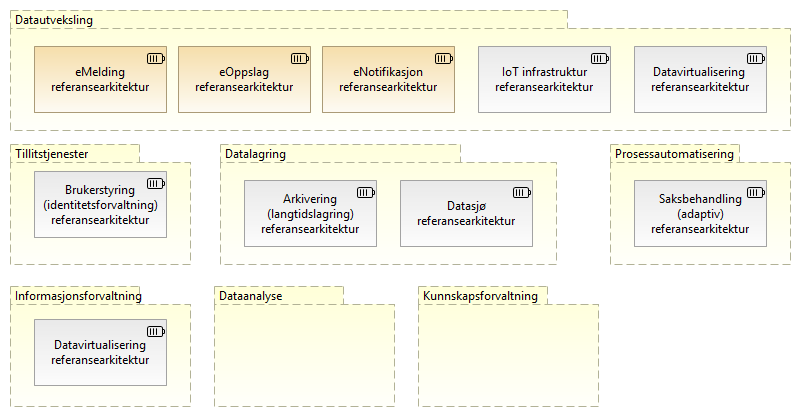

:lang: no
:doctitle: Referansearkitekturer
:keywords: Referansearkitekturer

:toclevels: 3

include::../plattform_felles/includes/commonincludes.adoc[]

[.lead]
Arbeid med prioriterte nasjonale referansearkitekturer er et pågående samarbeid mellom Difi og flere andre virksomheter innen offentlig og privat sektor.

:leveloffset: +1
= Generelt om referansearkitekturer

Referansearkitekturer gir mønstre og veiledning til utforming av arkitekturer og løsninger innen avgrensede områder.

Nasjonale referansearkitekturer identifiseres ut fra en link:../nab_arkitekturlandskap[nedbrytning av nasjonal arkitektur i temaområder og kapabiliteter i arkitekturlandskapet]. Både kapabilitetskart og prioriterte referansearkitekurer innen hvert område vil utvikles over tid, etterhvert som en går inn på nye områder. 

Det legges vekt på å få fram nyttig veiledning, med alt fra gode eksempler til beste praksis og konkrete anbefalinger. 

Prioritering av arbeidet og utarbeidelsen av referansearkitekturer gjøres i samarbeid med aktører på tvers av offentlig og privat sektor nasjonalt og internasjonalt. 

Relatert informasjon:
//1. <<../nab_overordnet-metode/book-nab-overordnet-metode.adoc#_grunnleggende_konsepter,Mer bakgrunnsinformasjon om referansearkitekturer>>

1. link:../nab_overordnet-metode[Overordnet metode, bakgrunnsinformasjon]
2. link:../nab_arkitekturlandskap[Arkitekturlandskap, temaområder og kapabiliteter]

//image:../plattform_felles/media/i-arbeid.png[width=45, height=45] #I arbeid (deler av innholdet flyttes)#

//include::../nab_referanse_arkitekturer/om-referansearkitekturer.adoc[]

//= Tilnærming til arbeidet med referansearkitekturer
//include::../nab_referanse_arkitekturer/tilnærming-til-arbeidet-med-referansearkitekturer .adoc[]

////
= Funksjonsområder for referansearkitekturer (kapabiliteter)
include::../nab_referanse_arkitekturer/kapabilitetsområder.adoc[]
////

= Nasjonale referansearkitekturer

== Identifiserte referansearkitekturer

Følgende figur viser en foreløpig oversikt over aktuelle referansearkitekturer innen respektive områder.

image:../plattform_felles/media/i-arbeid.png[width=45, height=45] _Denne oversikten er i arbeid (vår 2019)_

.Figur: Katalog over referansearkitekturer innen aktuelle områder i Nasjonal arkitektur

include::../nab_referanse_arkitekturer/spesifikke-referansearkitekturer.adoc[]

//== Informasjonssikkerhet (felles)

//include::../nab_referanse_arkitekturer_informasjonssikkerhet/main.adoc[]

////
= Beskrivelse av referansearkitektur for deling av data på forespørsel 
include::deling_forespørsel.adoc[]
//// 

:leveloffset!:

== Grunnleggende referansearkitekturer og andre utvalgte eksterne referanser
:leveloffset: +1

include::../nab_referanse_arkitekturer/grunnleggende-referansearkitekturer.adoc[]

= Informasjonssikkerhet
include::../nab_referanse_arkitekturer/informasjonssikkerhet.adoc[]

= Veiledning til valg av referansearkitekturer
//image:../plattform_felles/media/i-arbeid.png[width=45, height=45,link] #I arbeid (opprydding ogomskriving)#

include::../nab_referanse_veiledning_valg-av-referansearkitekturer/book-valg-av-referansearkitektur.adoc[]

//Se . link:../nab_referanse_arkitekturer_veiledning_valg-av-referansearkitekturer[Veiledning til valg av referansearkitekturer]
